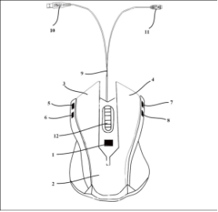

# 一分钟速览新闻点！

- 比亚迪公布“多功能鼠标”专利：可替代键盘
- 腾讯宣布正式成立腾讯云音视频品牌
- 搜狗发布全球首个手语 AI 合成主播，可达 90% 以上识别
- 因利用虚假价格手段诱骗消费者进行交易，饿了么被罚 50 万元
- iOS 微信 8.0.6 版本更新：状态新增时效提醒、朋友圈可转发视频号
- 苹果正在研发新款 Beats Studio 无线耳机
- 突破 1nm！台积电祭出“半金属”取代硅材料
- 苹果日本公司请求政府允许 5G iPhone 12 系列打折
- 消息称亚马逊拟以 90 亿美元收购电影公司米高梅
- Cosmopolitan Libc 1.0 发布
- 数据库中间件 ShardingSphere 组建商业公司 SphereEx 并完成天使轮融资

# 国内要闻

**比亚迪公布“多功能鼠标”专利：可替代键盘**

近日，比亚迪（002594）关于“一种多功能鼠标”专利信息被授权公开，专利公开号为 CN213210986U，公开日期为 5 月 14 日，企查查专利摘要显示：本实用新型属于电子设备技术领域，特别是涉及一种多功能鼠标，包括鼠标本体、控制主板、左键、右键、滚轮和切换开关；切换开关打开后，为左键和右键赋予新的键值，第二左键键值和第二右键键值均相当于键盘上的某一键值，使其达到模拟键盘的目的，只需利用切换开关就可以在鼠标和模拟键盘之间自由切换。

**腾讯宣布正式成立腾讯云音视频品牌**

腾讯宣布正式成立腾讯云音视频品牌，同时发布三合一的 RT-ONE 网络，整合腾讯云实时通信网络（TRTC）、即时通信网络（IM）以及流媒体分发网络（CDN）三张网络。该服务面向教育、零售、泛娱乐等行业需求。腾讯云副总裁李郁韬表示，多数音视频需求要搭建三个网络，这是底层需求，RT-ONE 网络可以一站式满足需求。

**搜狗发布全球首个手语 AI 合成主播，可达 90% 以上识别**

搜狗公司 CEO 王小川发布最新一代搜狗 AI 合成主播——全球首个手语 AI 合成主播“小聪”，基于搜狗领先的人工智能和 AI 分身技术，可以进行独立工作，且不需要语音提取，通过嘴形变化达到 60% 以上识别；将语音与口型相结合，在语音嘈杂的环境中用视觉也可以达到 90% 以上的识别能力。

**因利用虚假价格手段诱骗消费者进行交易，饿了么被罚 50 万元**

近日，上海拉扎斯信息科技有限公司新增一条行政处罚，处罚事由为“利用虚假的或者使人误解的价格手段，诱骗消费者或者其他经营者与其进行交易的”，处罚结果为罚款 50 万元，上海拉扎斯信息科技有限公司即为饿了么经营方。

**iOS 微信 8.0.6 版本更新：状态新增时效提醒、朋友圈可转发视频号**

微信昨日悄悄上线了最新的 8.0.6 正式版。本次更新包括：

- 视频号发布新增朋友圈精选视频来源；
- 通过朋友验证界面微调，新增 “ 添加标签 ” 功能，可直接将新扩好友添加到某一标签分类中；
- 微信在订阅号消息的右上角 “ ... ” 中新增了一项 “ 我的付费内容 ” 入口，但目前来看没买过付费内容的小伙伴是看不到这个入口的；
- 微信 “ 我的状态 ” 新增时效提醒，自状态发表起进行 24 小时倒计时，提醒你当前状态还剩多长时间过期，包括取消状态界面也是同样的设计。（IT 之家）

**华为徐直军：今年将有至少 3 亿设备搭载鸿蒙系统**

昨日，华为轮值董事长徐直军在“华为中国生态大会 2021”上谈及华为 HarmonyOS（鸿蒙系统），他预计，到今年年底将有至少 3 亿设备搭载鸿蒙系统，其中 2 亿台为华为自有设备。

# 国际要闻

**苹果正在研发新款 Beats Studio 无线耳机**

据 9to5Mac 消息，根据 iOS14.6 的内部文件，苹果正在新款Beats无线耳机，名为“Beats Studio Buds”。该耳机类似与 AirPods，无线且配有智能充电盒。苹果或将在 6 月正式发布 Beats Studio Buds。Beats Studio Buds 还将搭载一款苹果芯片，提供即时配对和「嘿，Siri」功能 。与目前的 Powerbeats Pro 相比，Beats 的新耳机将更加紧凑。代码还揭示了 Beats Studio Buds 还将具备降噪功能。

**突破 1nm！台积电祭出“半金属”取代硅材料**

近日，美国《自然》杂志公布了由台积电、台湾大学与麻省理工学院共同研发的半导体新材料——铋（Bi），有望成为突破摩尔定律 1nm 极限的新材料。这项研究成果已在《Nature》期刊上发布，首度提出利用半金属铋（Bi）作为二维材料的接触电极，可大幅降低电阻并提高电流，使其效能几与硅一致，有助实现未来半导体 1nm 的制程。而这项成果的发布，距离 IBM 秀出 2nm 芯片还不到半个月。（科学放大镜）

**苹果日本公司请求政府允许 5G iPhone 12 系列打折**

据日本共同社报道，苹果日本公司请求政府允许 5G iPhone 12 打折。苹果公司称，与韩国等国家相比，日本的 5G 使用情况较低，为了普及 5G，有必要扩大降价幅度。该公司负责人指出，5G 的通信基础设施和终端是不可分割的关系，“高速公路 (基础设施) 建设好之后，就需要在那里行驶的汽车 (终端)。”

**消息称亚马逊拟以 90 亿美元收购电影公司米高梅**

报道，知情人士透露，亚马逊正在与米高梅（MGM）展开收购谈判，此举将成为这家电商巨头迄今为止挺进娱乐行业的最大举措 。此番收购也将为亚马逊扩大其电影工作室和流媒体服务 Prime Video 及 IMDB 业务。据 Variety 报道，交易价格为 90 亿美元，亚马逊电视业务部门主管 Mike Hopkins 与美高梅董事会主席 Kevin Ulrich 正直接精心策划潜在的交易。（新浪科技）

# 程序员专区

**Cosmopolitan Libc 1.0 发布**

Cosmopolitan Libc 是一个可以使 C 语言像 Java 一样，构建一次，即可到处运行的 C 语言库。目前发布了最新的 1.0 版本，并进行了多项更新与改进，例如：APE 的二进制文件可以修改自己的 ZIP 内容；生产化 redbean Web 服务器；引入 OpenExecutable 用来恢复 APE；添加系统日志；添加 MacOS 工具链说明等，有关该版本的详细信息，大家可以查看官方发布公告：[https://github.com/jart/cosmopolitan/releases/tag/1.0](https://github.com/jart/cosmopolitan/releases/tag/1.0)

**数据库中间件 ShardingSphere 组建商业公司 SphereEx 并完成天使轮融资**

Apache ShardingSphere 是一套开源的分布式数据库解决方案组成的生态圈，它由 JDBC、Proxy 和 Sidecar（规划中）这 3 款既能够独立部署，又支持混合部署配合使用的产品组成。ShardingSphere 产品诞生于 2016 年，团队主要来自于京东科技，创始人张亮是前京东科技架构专家，开源项目 ElasticJob 创始人。ShardingSphere 经过 5 年多的发展，在 Github 上获得超 13K stars 的关注，有近 200 余名贡献者，已成为该领域最受欢迎的项目之一。目前，数据库中间件 ShardingSphere 团队成员组建的商业公司 SphereEx 于近日完成数百万美元天使轮融资，由红杉中国种子基金和初心资本领投。SphereEx 是 ShardingSphere 的核心团队创立，本轮融资资金将主要用于 SphereEx在团队组建和其主力开源产品线的市场运营，提升产品认知。