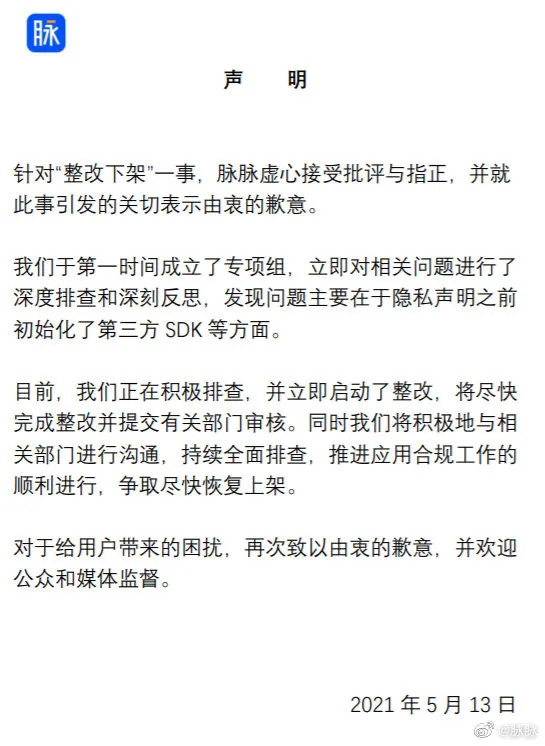

# 一分钟速览新闻点！

- 腾讯防大量群消息骚扰专利获授权
- 脉脉因“App 整改下架”事件致歉：将进行排查整改
- 快手灰度测试同城团购功能，入局本地生活服务赛道
- 字节跳动在重庆成立今日头条公司
- 刘强东：物流兄弟们平均薪资每人每月 9000 元
- 阿里云全年营收超 600 亿，同比增长 50%
- 受黑客攻击关闭的美国能源管道重启运营
- 韩国拟建全球最大芯片制造基地，拟投资 4500 亿美元
- 意大利因谷歌滥用市场地位对其罚款 1 亿欧元
- 苹果和 Epic 法庭大战：法官将寻求折中解决方案，允许开发者绕开 App Store
- TikTok 受欢迎，Facebook 应用下载量同比降低 30%
- Rust 1.52.1 发布
- NumPy 1.20.3 发布

# 国内要闻

**腾讯防大量群消息骚扰专利获授权**

近日，腾讯科技（深圳）有限公司获得“一种消息展示的方法、消息处理的方法及装置”专利授权，公告号CN110011907B，申请日期为 2019 年 4 月。专利摘要显示，本申请用于突出展示第一消息子集合，用户可以只重点查看突出展示的第一消息子集合，从而既可以避免错过重要用户发送的群组消息，又可以避免遭受到大量群组消息给用户带来的骚扰。

**脉脉因“App 整改下架”事件致歉：将进行排查整改**

昨日中午，工信部通报下架了 90 款侵害用户权益的 App，其中天涯社区、大麦、途牛旅游、VIP 陪练、脉脉 5 家企业在 App 不同版本中反复出现同类问题，将依法暂停其违规行为，予以直接下架处理。脉脉发布声明称：虚心接受批评与指正，积极进行排查及整改。

**快手灰度测试同城团购功能，入局本地生活服务赛道**

据报道，快手近日正在灰度测试同城团购功能，正式入局本地生活服务领域。浏览快手 App 发现，在其“同城”页面的上端，新增本地餐饮服务专区，约占整个页面的四分之一，并分为特惠团购、榜单推荐、超赞福利三大板块。

**字节跳动在重庆成立今日头条公司**

5月12日，重庆今日头条科技有限公司成立，注册资本100万，法定代表人为陈韬，经营范围含技术服务、技术开发；广告制作；广告发布等。股东信息显示，该公司由字节跳动有限公司间接全资持股。

**刘强东：物流兄弟们平均薪资每人每月 9000 元**

5 月 13 日晚间消息，即将上市的京东物流披露了一季度营收情况，2021 年一季度收入 224 亿，同比增长 64.1%，过去三年收入增幅持续扩大。数据显示，京东物流员工数量达到约 26 万人，同比去年一季度增加 9 万。据公开资料披露，京东物流是业内极少数坚持为员工缴纳五险一金的企业，在员工支出方面，2020 年京东物流共计为一线员工支出 261 亿，按招股书披露的 2020 年底一线员工数量进行保守估算，平均每位员工年支出近 11 万，月支出近 9000 元。（新浪科技）

**阿里云全年营收超 600 亿，同比增长 50%**

阿里巴巴发布 2021 财年业绩，阿里云全年营收 601.2 亿元，比上一财年 400 亿收入大幅增长 50% 。Gartner 最新数据显示，全球 IaaS 云基础设施市场上，亚马逊、微软和阿里云为前三位，其中阿里云市场份额持续五年增长。

# 国际要闻

**受黑客攻击关闭的美国能源管道重启运营**

美国大型成品油管道运营商科洛尼尔管道运输公司 12 日发表声明说，该公司受网络攻击而被迫关闭的燃油运输管道已于美国东部时间 12 日下午 5 时左右重启。在最初阶段，一些区域管道燃油供应可能出现时断时续等不稳定状况。7 日，网络黑客通过加密手段锁住科洛尼尔管道运输公司计算机系统并盗取机密文件，试图以解锁来勒索赎金。

**韩国拟建全球最大芯片制造基地，拟投资 4500 亿美元**

5月13日，韩国宣布了一项雄心勃勃的计划，计划在未来十年内斥资约510万亿韩元（约合人民币29055亿元）建立全球最大的芯片制造基地。韩国希望通过此次计划，在 2022 年至 2031 年间帮助培养 36000 名芯片专家，为芯片研究和开发贡献 13 亿美元，并帮助半导体行业立法。（雷锋网）

**意大利因谷歌滥用市场地位对其罚款 1 亿欧元**

意大利反垄断监管机构竞争和市场管理局当地时间 13 日发布公告，因滥用市场主导地位，决定对谷歌控股的三家企业，字母表公司、谷歌公司和谷歌意大利处以 1 亿欧元（约 7.81 亿元人民币）罚款。

**苹果和 Epic 法庭大战：法官将寻求折中解决方案，允许开发者绕开 App Store**

负责 Epic Games 和苹果诉讼的美国法官暗示，将达成一项妥协方案，有可能至少在一定程度上打消 Epic Games 的担忧：应用开发商可以告知用户，苹果应用商店并不是用户进行购买的唯一渠道。美国地方法官伊冯·冈萨雷斯·罗杰斯本周听取了两家公司所邀请经济学家的证词，似乎正在寻求中间立场。这起案件有可能给全球规模数十亿美元的应用商店市场带来巨大改变。

**TikTok 受欢迎，Facebook 应用下载量同比降低 30%**

应用分析公司 AppFigures 发布的报告显示，Facebook 今年 4 月在 App Store 和 Google Play 上的应用下载量同比降低 30% 。TikTok 依旧是 App Store 和 Google Play 下载量最高的应用，今年 4 月份的总下载量为 5200 万次，仅从 App Store 来看，Facebook 上月的下载量为 990 万次，而 TikTok 高达 1590 万次。

# 程序员专区

**Rust 1.52.1 发布**

这个版本是 1.52.0 中出现的编译错误的一个临时解决方案。这些编译错误的典型表现是报错信息中包含 found unstable fingerprints。在1.52.0 中，编译器内部新增了一个验证机制， 这个验证机制检测出了一些从增量编译被启用后(Rust 1.24)就存在的 bug。这些 bug 在增量编译下可能会导致最终生成的二进制产物出错，理论上程序可能出现任意行为。所幸在发布版本的构建中增量编译是默认关闭的，所以对生产环境影响应该不会太大（只有那些开启了增量编译的用户）。（Rust 日报）

**NumPy 1.20.3 发布**

该版本是一个 Bug 修复版本，其中包含 NumPy 1.20.2 版本之后合并到主分支的多个修复程序。官方公告还发布了此版本的贡献者名单，此外，该版本共合并了 15 个拉取请求，涉及 纠正了datetime.date的datetime64缺失的 type overload、删除__all__以支持 explicit re-exports、在MacOS上转储gfortran版本时，删除 extra newline、为 NumPy 1.20.3 版本做准备等，更多详情可查看官方发布说明：[https://github.com/numpy/numpy/releases/tag/v1.20.3](https://github.com/numpy/numpy/releases/tag/v1.20.3)