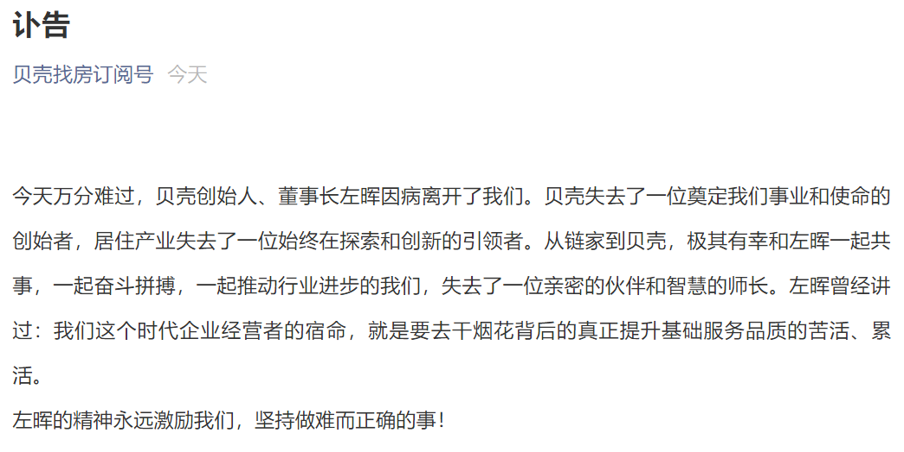

# 一分钟速览新闻点！

- “淘宝特价版”App 正式更名为“淘特”
- 吃撑！微信 520“限时状态”上线：仅限 2 天
- 腾讯前三个月总酬金成本超 204.01 亿元 员工平均每月薪酬 7.6 万元
- 微信及 WeChat 月活达 12.4 亿 QQ 月活用户不到微信的一半
- 百度 CTO 王海峰：百度飞桨开发者数量达 320 万，同比增长 70%
- 贝壳公司创始人兼董事长左晖因疾病恶化去世
- 华为荣耀前副总裁李开新任一加科技副总裁
- 谷歌宣布在纽约市开设首家实体零售店，今夏开业
- 特斯拉 CEO 马斯克：我从来没有也不会出售狗狗币
- 库克发文庆祝苹果直营店开业 20 周年：期待下一个 20 年
- 谷歌无人车业务 Waymo 拟融资 40 亿美元，考虑分拆上市
- ARM 确定举办新品发布会：Cortex X2/A79 大核有望登场
- Deno 1.10 正式发布
- Adobe 停止支持 PostScript Type 1 字体

# 国内要闻

**“淘宝特价版”App 正式更名为“淘特”**

淘宝特价版 App 昨日迎来 4.0 版本更新，“淘宝特价版”正式宣布品牌升级，更名为“淘特”。今年 3 月份，淘宝特价版宣布进行战略升级。阿里巴巴集团副总裁、C2M 事业部总经理汪海表示，未来一年，淘宝特价版将打造全品类源头直供体系，持续补贴日用消费品，打造最大性价比综合电商平台。

**吃撑！微信 520“限时状态”上线：仅限 2 天**

520，微信也上线了新玩法，不但开放了 520 元红包，还推出了两个“限时状态”：撒狗粮、吃狗粮。520、521 连续两天，限时特供！吃撑！网友调侃：今天山上的笋都被你夺完了。

**腾讯前三个月总酬金成本超 204.01 亿元 员工平均每月薪酬 7.6 万元**

据腾讯 2021 年第一季度财报显示，第一季度净利润 478 亿元人民币，市场预估 354.53 亿元人民币，去年同期 288.96 亿元人民币，同比增长 65%。截至2021 年 3 月底，腾讯有 89,228 名雇员，总酬金成本为人民币 204.01 亿元。以此计算，腾讯员工今年前三个月平均薪酬 22.86 万元，平均每名员工每月薪酬7.6 万元。（财经网科技）

**微信及 WeChat 月活达 12.4 亿 QQ 月活用户不到微信的一半**

腾讯 2021 年一季度财报显示，截至 2021 年 3 月底，微信及 WeChat 的月活跃帐户 12.4 亿，同比增长 3.3%。作为对比，一季度 QQ 移动终端月活 6.064 亿，同比减少 12.6%。

**百度 CTO 王海峰：百度飞桨开发者数量达 320 万，同比增长 70%**

在昨日的 WAVE SUMMIT 2021 深度学习开发者峰会上，百度集团首席技术官（CTO）、深度学习技术及应用国家工程实验室主任王海峰博士表示，截至目前，百度飞桨开发者数量累计达到 320 万，相比一年前增长 70%。同时，百度飞桨服务的企事业单位也达到了 12 万家，创建了 36 万模型，而且与超过 22 家 AI 芯片和服务器厂商展开合作。这些开发者企业模型已经覆盖了工业能源、金融、医疗、农业、城市管理、交通、信息技术等各种各样的行业和场景。

**贝壳公司创始人兼董事长左晖因疾病恶化去世**

贝壳发布公告称，公司创始人兼董事会主席左晖先生因病情意外恶化于 2021 年 5 月 20 日去世。



**华为荣耀前副总裁李开新任一加科技副总裁**

昨日，一加手机宣布前华为中国区副总裁、前360手机总裁李开新加盟一加科技，担任一加副总裁职务。


# 国际要闻

**谷歌宣布在纽约市开设首家实体零售店，今夏开业**

据报道，谷歌 5 月 20 日宣布，将在纽约市开设谷歌的第一家实体零售店“Google Store”。这也是谷歌迄今为止开设的第一家实体零售店，将于今年夏天面向公众开放。（新浪科技）

**特斯拉 CEO 马斯克：我从来没有也不会出售狗狗币**

北京时间 5 月 21 日消息，Twitter 用户 Dave Lee 发布推文称，他不认为埃隆·马斯克会出售任何比特币，“马斯克是一名终极持有者”。特斯拉 CEO 埃隆·马斯克随后回复道：“是的，我从来没有，也不会出售任何狗狗币。” （界面新闻）

**库克发文庆祝苹果直营店开业 20 周年：期待下一个 20 年**

美国当地时间 5 月 19 日，苹果直营零售店迎来了开业 20 周年纪念日。苹果公司 CEO 蒂姆·库克 (Tim Cook) 周三在 Twitter 发布庆祝这一时刻，表示期待下一个 20 年。（凤凰科技）


**谷歌无人车业务 Waymo 拟融资 40 亿美元，考虑分拆上市**

谷歌母公司 Alphabet 旗下无人车业务 Waymo 正与外部投资者磋商，拟至多筹集 40 亿美元额外资本以推动自动驾驶业务发展。Waymo 还讨论了从其母公司 Waymo 剥离，最终公开上市的计划。（中国机器人网）

**ARM 确定举办新品发布会：Cortex X2/A79 大核有望登场**

继 Intel、AMD 和 NVIDIA 三家后，ARM 也公布了台北电脑展 2021 的安排。其中 CEO Simon Segars 将亲自主持讲演活动，主题是未来计算以及后疫情时代的产业恢复等，时间是 5 月 31 日下午 14 点。大胆猜测，ARM可能会借此机会公布基于ARM v9指令集的全新 Cortex-A CPU、Mali-G GPU 架构，比如新的超级大核 X2、标准大核 A79、大核 GPU G79 等。（快科技）

# 程序员专区

**Deno 1.10 正式发布**

Deno 1.10 已正式发布，此版本围绕新功能、性能优化以及错误修复三方面进行更新，其中值得关注的特性有：

- 改进内置的 test runner
- 在 Web Workers 中支持结构化克隆 (structured clone)
- 新增 Web Storage API
- 支持远程导入映射 (maps)

如果您已经安装了 Deno，则可以通过运行 deno upgrade 升级到 1.10 版本。如果是首次安装 Deno，则可以使用下面列出的方法之一：

```

# Using Shell (macOS and Linux):
curl -fsSL https://deno.land/x/install/install.sh | sh

# Using PowerShell (Windows):
iwr https://deno.land/x/install/install.ps1 -useb | iex

# Using Homebrew (macOS):
brew install deno

# Using Scoop (Windows):
scoop install deno

# Using Chocolatey (Windows):
choco install deno
```

更多详情，可查看官方发布说明：https://deno.com/blog/v1.10

**Adobe 停止支持 PostScript Type 1 字体**

Adobe 在 1980 年代设计的数字排版字体 PostScript Type 1 即将走进历史。Adobe Photoshop 在今年停止支持 PostScript Type 1，到 2023 年 Adobe 的其它产品也将停止支持该字体。PostScript 字体是 Adobe 为专业数字排版开发的大纲字体规范编码的字体文件。该系统使用 PostScript 文件格式来编码字体信息。Adobe 在 1984 年的 PostScript 页面描述语言中定义了 Type 1 和 Type 3 字体格式。但在 1985 年 3 月支持 PostScript 的激光打印机 Apple LaserWriter 面世，它才真正流行起来。在当时，轮廓字体只在打印机中使用，屏幕上依旧用位图字体。（Solidot）