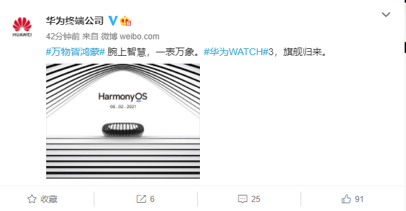
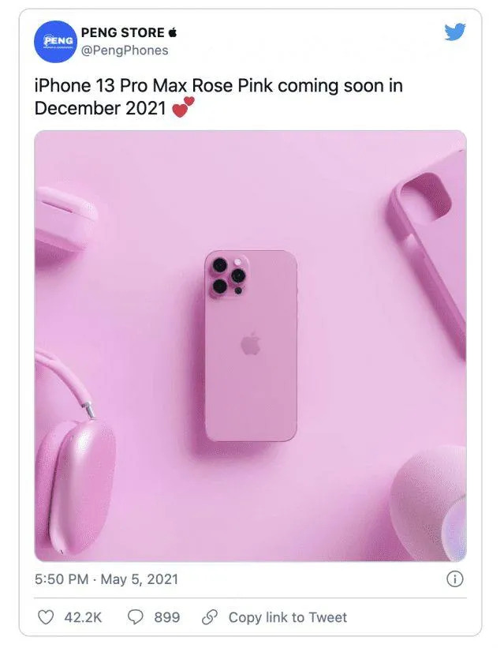

# 一分钟速览新闻点！

- 消息称字节跳动启动股份回购计划 在职员工每股 126 美元
- 拼多多再超阿里，中国电商用户规模最大平台易主
- 卢伟冰立新 Flag：将在乡镇市场开 10000 家小米之家
- 滴滴再回应“高抽成” 司机账单将透明化
- 网易云音乐人格主导色遭微信屏蔽：因包含互动测试内容
- 小米总裁回应汽车芯片短缺：对小米造车没有影响
- 鸿蒙手表来了，华为宣布重启 WATCH 旗舰系列
- 苹果或推出粉色款 iPhone 13 系列
- Facebook 董事会拒绝让扎克伯格卸任董事长
- 贝索斯将于 7 月 5 日卸任亚马逊 CEO：由云计算负责人贾西接任
- ARM 处理器季度出货 73 亿颗，历史总计 1900 亿颗
- 苹果今年或将取代三星，成全球智能手机 OLED 屏幕第一大买家
- Qt 5.12.11 发布
- Inkscape 1.1 发布

# 国内要闻

**消息称字节跳动启动股份回购计划 在职员工每股 126 美元**

据媒体报道称，两名直接知情人士周三表示，字节跳动本周启动了一项针对现任和前任员工的股票回购计划。对在职员工的回购价格为每股 126 美元，对已离职员工的回购价格为每股 100.80 美元。去年，在职员工的股票回购价格为每股 60 美元。（财联社）

**拼多多再超阿里，中国电商用户规模最大平台易主**

昨日晚间，拼多多发布 2021 年第一季度财报：截至 2021 年 3 月 31 日，拼多多平台年活跃买家数达 8.238 亿，正式迈入 8 亿用户新时代。上一个季度，拼多多用户规模达到 7.88 亿，首度问鼎中国用户规模最大的电商平台。从阿里巴巴发布 2021 财年 Q4 及全年财报来看，截至 2021 年 3 月 31 日止的 12 个月内，阿里巴巴中国零售市场年度活跃消费者达 8.11 亿。对比而言，拼多多用户规模领先了阿里 1280 万人，领先优势明显。（网易科技）

**卢伟冰立新 Flag：将在乡镇市场开 10000 家小米之家**

小米集团副总裁、中国区总裁、红米 Redmi 品牌总经理卢伟冰昨日表示，这次，我们又立了一个新的 flag！目标在乡镇市场开 1 万家小米之家乡镇授权店。尽快实现小米新零售的下沉，让更多用户既能享受到门店的便利和服务，又能享受到电商的优惠价格。做到线上线下信息透明，让乡镇用户能够像线上用户一样，享受到电商市场同价格、同品质、同体验的好产品。

**滴滴再回应“高抽成” 司机账单将透明化**

滴滴出行在官方微信公众号发文称，2020年30%以上抽成订单占全年总订单的2.7%，从5月7日开始排查至今，这个数字已经从2.7%下降到了0.03%。滴滴网约车CEO、司机生态发展委员会主任孙枢表示，滴滴还会全力让这个数字继续下降直至完全杜绝，“未来一旦再出现，将会主动把超出部分全额退还给师傅们。也恳请广大司机及社会公众继续监督，遇到类似情况及时联系客服解决。”（每日经济新闻）

**网易云音乐人格主导色遭微信屏蔽：因包含互动测试内容**

昨日，网易云音乐人格主导色在微博、微信朋友圈中刷屏。截至发稿时，网易云人格主导色链接已遭微信屏蔽，用户点击相关链接将提示已停止访问该网页。屏蔽页面显示，网易云人格主导色页面包含游戏、互动测试内容，被多人投诉，为维护绿色上网环境，已停止访问。

**小米总裁回应汽车芯片短缺：对小米造车没有影响**

对于一个多月前刚宣布进军智能电动汽车行业的小米来说，这一切几乎没有影响，因为小米离正式造车还早着呢，或许到时候缺芯问题就解决了。半导体巨头瑞萨电子高管此前表示，全球汽车芯片供应短缺局面可能会持续到今年下半年。小米创始人雷军表示，自己对电动汽车产业非常看好，同时很清楚汽车行业的风险，但是小米亏得起，公司现金流良好。（智车派）

**鸿蒙手表来了，华为宣布重启 WATCH 旗舰系列**

今日早间，华为官方宣布，华为 WATCH 3 旗舰归来。并称“万物皆鸿蒙。腕上智慧，一表万象”。

# 国际要闻

**苹果或推出粉色款 iPhone 13 系列**

根据此前多方预测的消息，今年苹果将继续在 9 月推出全新的 iPhone 13 系列机型（也有消息称为 iPhone 12s 系列），按照往年惯例，今年的新 iPhone 的升级可能并不会太大，但迄今为止关于新机外观升级的爆料使得用户对该机的外观有了不少期待。现在有最新消息，近日有海外爆料达人 PENG STORE 进一步透露，该机将提供一款名为“Rose Pink”（玫瑰粉）的特殊配色。（TechWeb）

**Facebook 董事会拒绝让扎克伯格卸任董事长**

Facebook 董事会周三驳回了两项旨在削弱 CEO 马克·扎克伯格 (Mark Zuckerberg) 对公司控制权的提案。对于那些担忧扎克伯格掌控大权的人来说，这个结果虽然在意料之中但也令人失望。扎克伯格自2012年以来一直担任Facebook董事长，持有大约58%的有投票权股份。另外，Facebook还驳回了一项寻求消除特别超级投票权类股的提案，这类股票使得扎克伯格获得了控股权。(凤凰科技)

**贝索斯将于 7 月 5 日卸任亚马逊 CEO：由云计算负责人贾西接任**

亚马逊创始人杰夫·贝索斯 (Jeff Bezos) 宣布将于 7 月 5 日将首席执行官一职，届时该公司的云计算负责人安迪·贾西（Andy Jassy）将会接任，而这一天恰值亚马逊成立 27 周年纪念日。贝索斯在他作为首席执行官召开的最后一次年度股东大会上通过网络直播方式向股东发表讲话，他说：我之所以选择这一天，是因这是亚马逊 1994 年成立的日子，那已经是 27 年前。贝索斯领导这家互联网巨头数十年，使他成为世界上最富有的人之一。（腾讯科技）

**ARM 处理器季度出货 73 亿颗，历史总计 1900 亿颗**

Arm 给出最新数据，2020 年第四季度，Arm 芯片合作伙伴共出货了 73 亿颗 Arm 架构的芯片，同比增长 22%，创下历史新高，相当于每秒 900 多颗、每天 7000 万颗 。截止到 2020 年底，Arm 架构芯片历史累计出货量已经超过 1900 亿颗。同时，Arm Mali GPU 出货量累计也超过了 60 亿颗，其中 2020 年就超过 10 亿颗，持续排名第一。（品玩）

**苹果今年或将取代三星，成全球智能手机 OLED 屏幕第一大买家**

据报道，苹果今年将采购 1.69 亿块智能手机 OLED 屏幕，较去年的 1.145 亿块增加 5450 万块，同比增长 47.6% 。机构的数据显示，今年三星智能手机 OLED 屏幕的采购量，将达到 1.57 亿块，较去年的 1.523 亿块也有增加，但将低于苹果的 1.69 亿块。

# 程序员专区

**Qt 5.12.11 发布**

该版本是一个补丁修复版本，提供了 40 多个 Bug 修复，例如修复了 qmake 无法运行 iOS Xcode 12 的目标编译器的问题；修复了 qmake 无法运行 iOS Xcode 12 的目标编译器的问题；避免整数溢出和被零除，笔的图案被限制在最大长度 1024。更多特性，可以查看官方发布说明：[https://code.qt.io/cgit/qt/qtreleasenotes.git/tree/qt/5.12.11/release-note.md](https://code.qt.io/cgit/qt/qtreleasenotes.git/tree/qt/5.12.11/release-note.md)

**Inkscape 1.1 发布**

自由软件向量图形编辑器 Inkscape 项目发布了 1.1 版本。Inkscape 1.1 的主要变化包括：欢迎对话框和全新的欢迎界面，命令面板，重新设计了对话框对接系统，可搜索偏好选择，新的导出格式，新的轮廓叠加模式，更多 Live Path Effects 变化等等。Inkscape 项目诞生于 2003 年，2020 年发布了 1.0 版本。更多详情，可访问：[https://inkscape.org/news/2021/05/24/welcome-inkscape-11/](https://inkscape.org/news/2021/05/24/welcome-inkscape-11/)