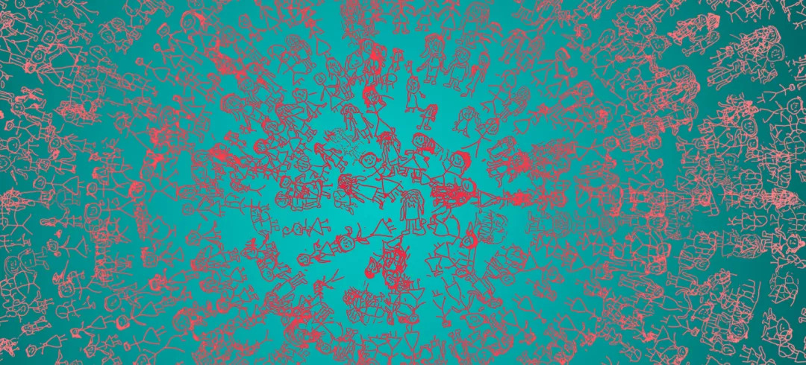
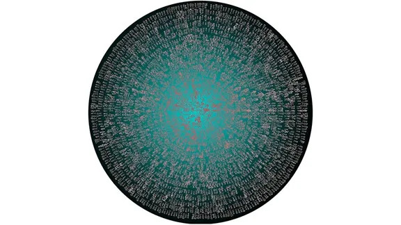
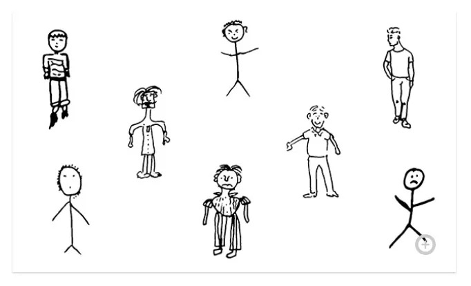
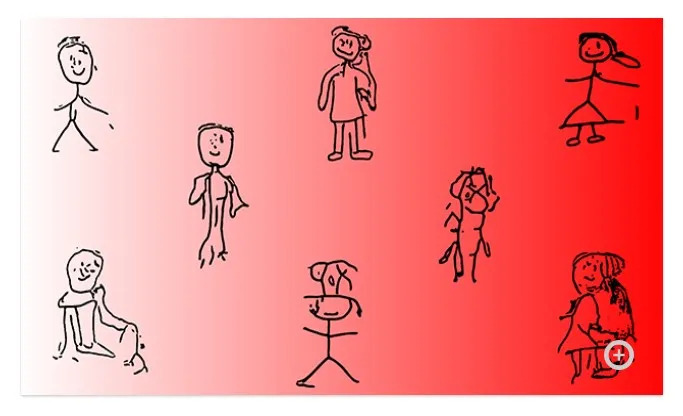
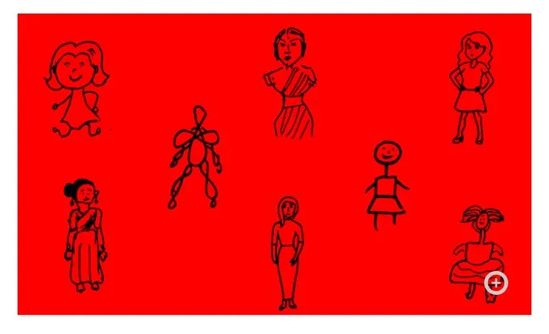
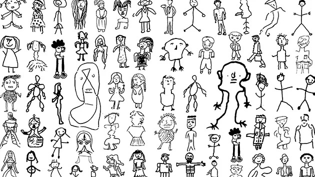
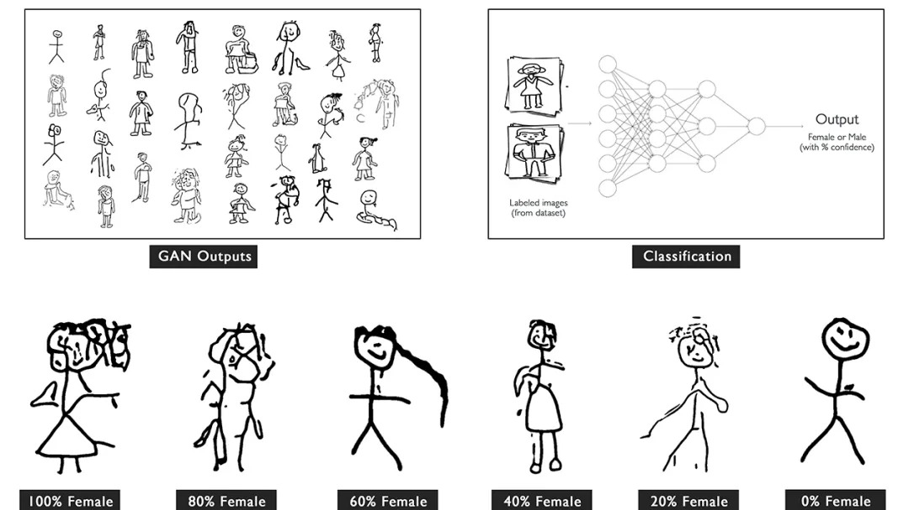
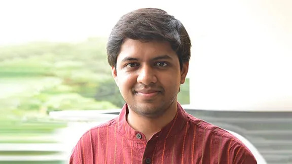

艺术家和音乐家能够利用 AI，在其作品中呈现出人意料的创造力与原创精神。他们将 AI 作为一种工具、协作者或灵感来源，创造出任何人仅凭自身都难以想象的创意成果。

NVIDIA 将分享许多独特的作品，与大家共同探索视觉艺术、音乐和诗歌领域中 AI 创作的美、能量与洞察力。

# 64/1 和 HARSHIT AGRAWAL：

《古怪的性别》收集了绘画数据集，并运用 AI 将一系列性别形式图谱生成为圆形挂毯，帮助理解和展示印度人如何以视觉手法表现性别。

古怪的性别（画布打印件存档，4x6 英尺），2020年

近距离观察这件作品时，可以看到它使用图形形式呈现的梯度纹理揭示了一系列的性别表现手法。

这件艺术品将在 2021 年的 Artissima 大会印度展馆亮相。

# 《古怪的性别》附书

除上面的圆形挂毯外，《古怪的性别》另有三册各 200 页的附书，对所收集的数据集样本和单独生成的图像进行了展示。

## 第 1 册：

包含从所收集的男性数据集中随机抽取的 200 个绘图样本。

## 第 2 册：

包含由 AI 为各百分比的性别生成并且随机选择的绘图，展示了从毫无女性特点（0%）的女性，到充分体现女性性别特点的女性（100%）。

## 第 3 册：

展示了从所收集的女性数据集中随机抽取的 200 个绘图样本。

# 《古怪的性别》创作过程

艺术家们收集了由印度各界人士绘制的约 2300 幅男女站立人物形象组成的数据集。每一位数据集贡献者各绘制一幅女性和男性图像。大约一半的作品是人工完成的（使用黑色马克笔在两张白纸上分别绘制女性和男性形象），另一半使用 Mechanical Turk（模仿真实世界数据采集设置）生成。

GAN（NVIDIA StyleGAN 2）在性别图纸的数据集上经过训练。GAN 输出以采用所收集的数据集训练的二进制分类器作为数据源，在一定的置信度水平下将输出分类为女性或男性。由 GAN 生成的这种扩散式的性别表现用于创作最后的圆形挂毯 – 中心是 100% 的女性形象，最外圈是 0% 的女性形象。

# 关于 64/1

64/1 是一个艺术研究和策展团体，由 Karthik Kalyanaraman 和 Raghava KK 兄弟创立，专注于模糊艺术、艺术批评与艺术教育之间的界限。

Karthik Kalyanaraman 和 Raghava KK

Karthik 是一位概念艺术家、作家和前学者，拥有计量经济学博士学位（哈佛大学），对于在统计学中建立因果关系方面进行了关键研究。除了在伦敦大学学院执教之外，他还曾在美国一家顶级机构工作，并发表过关于社交网络分析和美学理论的作品。

Raghava KK 是一位著名艺术家，擅长跨领域创作。他的作品跨越了传统的绘画、装置艺术和表演形式，同时也采用新的媒体来表达当代的后人类时代的现实。他入选了 CNN 2010 年度十大杰出人物榜单和 2020 年 Netflix 纪录片《印度创意人》(The Creative Indians)。

# 关于 HARSHIT AGRAWAL

Harshit 是一位印度艺术家，专注于使用人工智能和新兴技术进行创作。他使用机器和算法，并经常把它们作为自己艺术创作过程中必不可少的一部分。

HARSHIT AGRAWAL

他的作品已成为全球最大的计算机科学博物馆德国 HNF 博物馆的永久展品。他是七位国际人工智能艺术先驱中唯一的印度人，参加了世界上最早的人工智能艺术展之一（在当代艺术画廊 Gradient Descent at Nature Morte 举行）。Harshit的作品还曾在其他主要展馆展出，如电子艺术节（奥地利）、亚洲文化中心（韩国光州）和明日博物馆（巴西）等。他的作品还被英国广播公司、《纽约时报》和 Stir World 等国际媒体报道，并就人工智能艺术问题进行过多次演讲，包括三次 TEDx 演讲。

HARSHIT AGRAWAL毕业于麻省理工学院媒体实验室和古瓦哈蒂分校。除艺术实践，他还撰写过几本关于他的作品（交融人机交互与创意表达）的出版物并获得了一些专利。