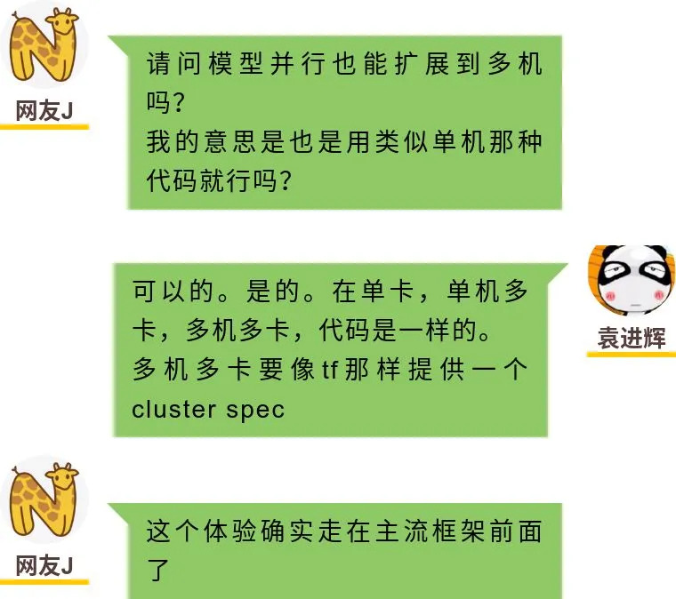
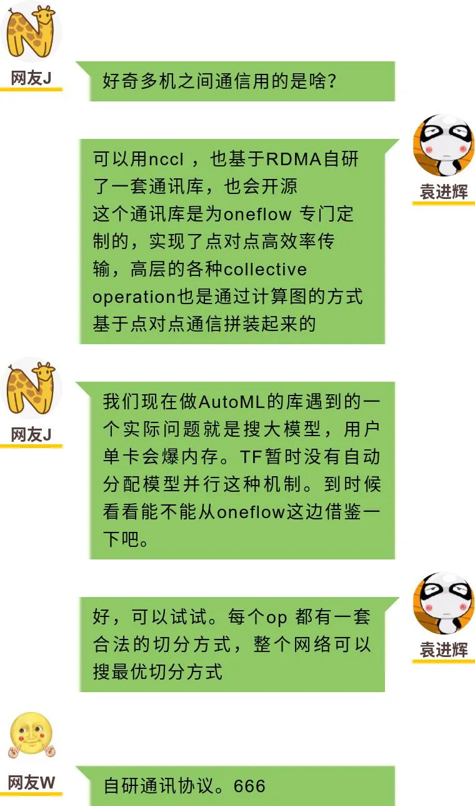
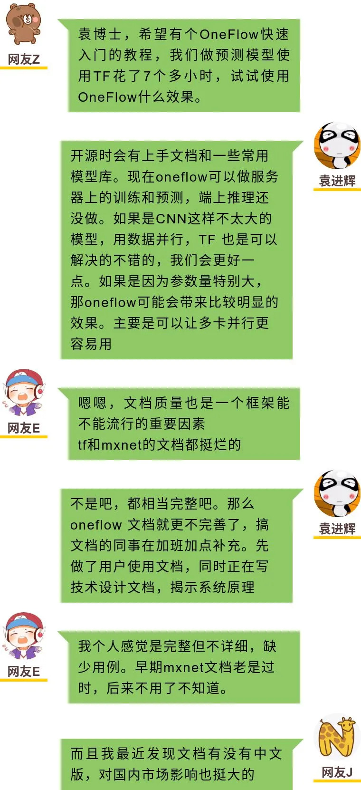
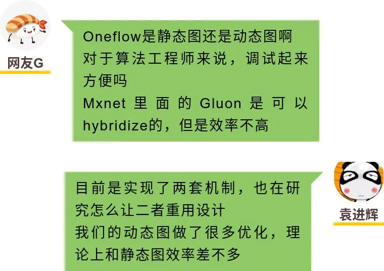
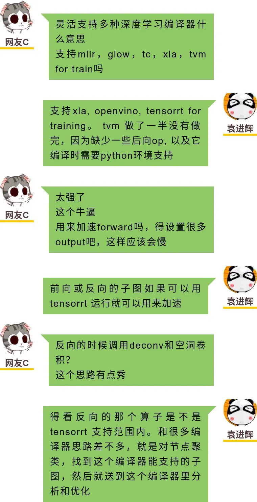

距离志在引领下一代深度学习框架的 OneFlow 开源的时间越来越近了，群中资深票友的讨论也依然精彩。今天整理的群讨论，包括了OneFlow 分布式训练易用性、OneFlow 通讯库、OneFlow文档建设及对深度学习编译器等话题。

以下内容摘录自2020.7.27OneFlow深度学习框架交流群。

**太长不看版本**

OneFlow 为单卡、单机多卡、多机多卡提供了一样的视角，从单卡程序变为分布式程序，只需要做很简单的几行代码配置，其它代码都一样。

**讨论过程：**

**太长不看版本**

OneFlow基于RDMA自研了一套通讯库，相当于在RDMA的基础上实现了nccl的功能，这对于自研芯片的厂商可能更友好。OneFlow可以使用nccl通信。

OneFlow 的通讯模块会随着OneFlow整个框架一起开源。

**讨论过程：**

**太长不看版本**

OneFlow会随开源提供快速入门的教程和一些常用的模型库。与tf等完备框架比OneFlow 的文档可能还不够完善，会尽快推进完备起来。OneFlow的文档会有中英两个版本。

**讨论过程：**

**太长不看版本**

OneFlow 实现了动态图与静态图两套机制，对于动态图做了很多优化，理论上效率和静态图的效率差不多。完成的测试结果会在后续公布。

**讨论过程：**

**太长不看版本**

OneFlow已经支持xla、openvino、tensorrt for training多种深度学习编译器，tvm的支持也正在推进。

**讨论过程：**

