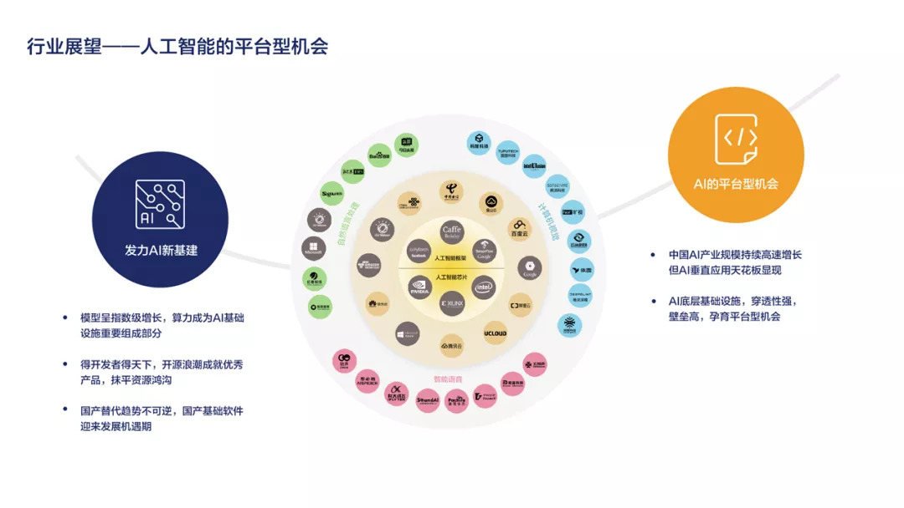
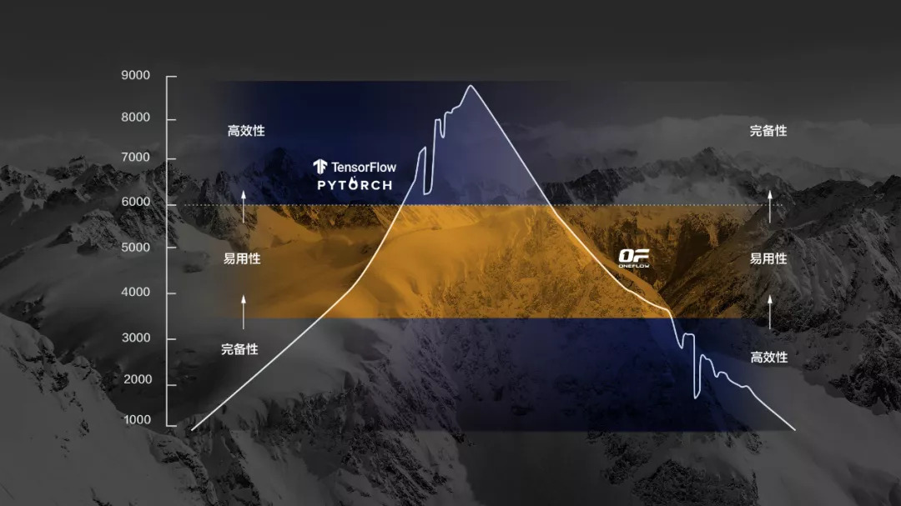
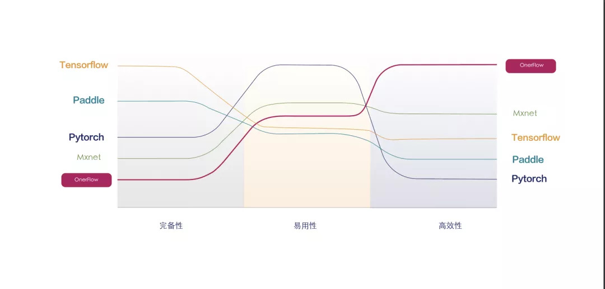
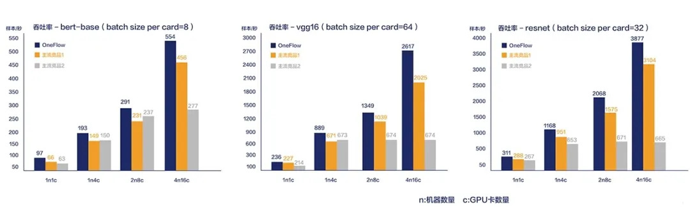
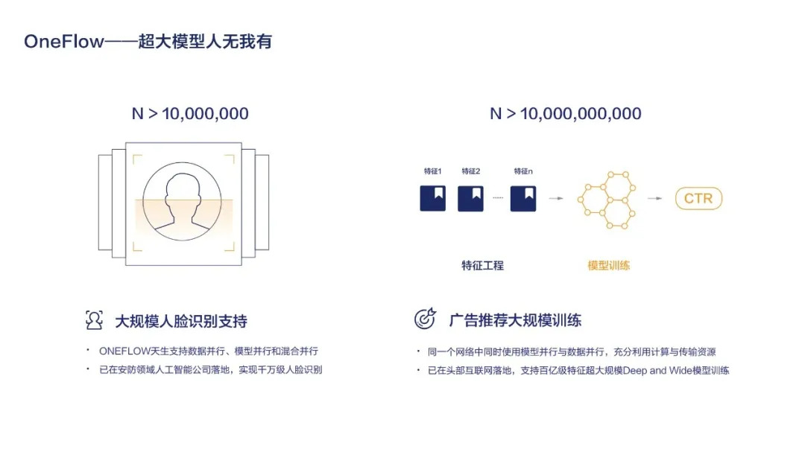
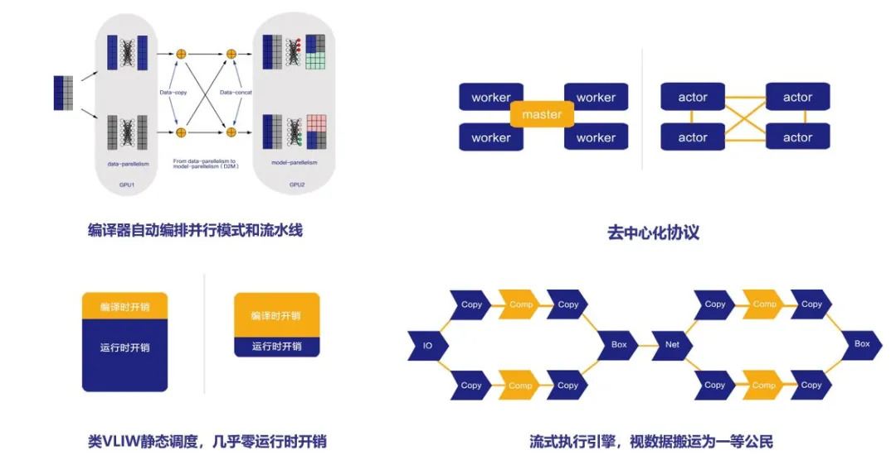
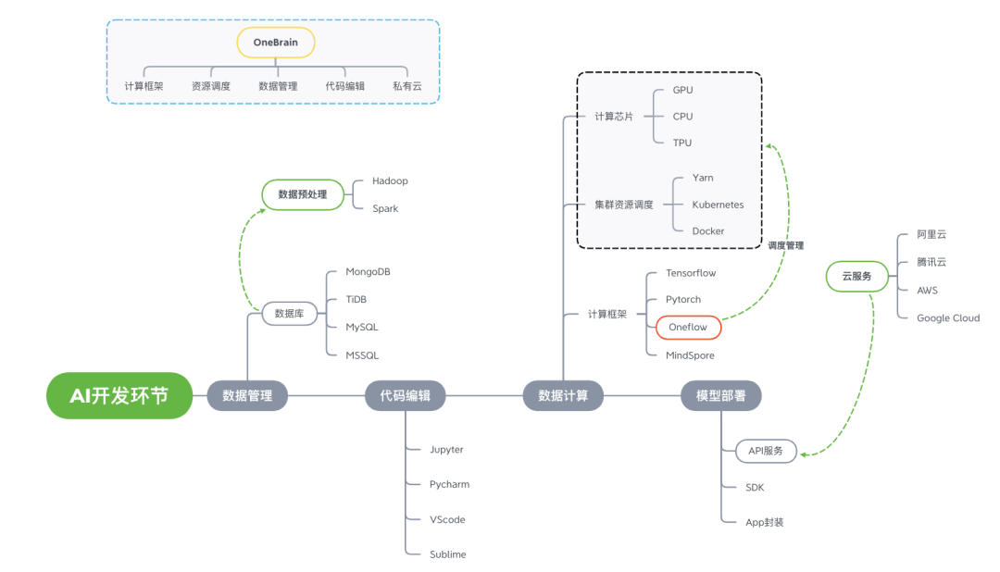

7 月 31 日，深度学习框架 OneFlow 正式在 GitHub 上开源，采用 Apache 2.0 开源协议，这是国内首个由初创公司、小团队自研并开源的 AI 框架。OneFlow 从研发之初就主打高效性，致力于解决大规模分布式 AI 训练问题。

**OneFlow 开源项目地址：**https://github.com/Oneflow-Inc/oneflow

对于从 OneFlow 项目早期就开始关注的开发者来说，这一天已经等了 1300 多天；而对于 OneFlow 的创建者袁进辉（微博人称老师木）来说，创业三年多，这一次“吹过的牛终于要兑现了”。

与目前业界主流的开源 AI 框架，以及国内已经开源的三款 AI 框架相比，OneFlow 似乎开发的不太早、开源的更晚，但袁进辉认为，OneFlow 仍有机会颠覆当前主流 AI 框架，因为目前已有的 AI 框架仍有重要痛点没解决，而 OneFlow 选择的技术路径恰好可以解决这一痛点。

在 OneFlow 正式开源前一周，InfoQ 有幸采访了 OneFlow 创建者、一流科技创始人袁进辉，深入了解 OneFlow 背后的故事以及他对于 AI 框架技术、产品和商业化的思考。**关于 OneFlow 的技术实现完整细节，敬请期待我们后续的文章。**

# AI 框架之争即将进入终局

2017 年 1 月，袁进辉辞掉 MSRA 薪资优厚的工作，创立北京一流科技有限公司（下文简称一流科技）。创业的目标从一开始就只有一个——做最快、最好的 AI 框架，打造分布式深度学习平台的事实工业标准。

2017 年 9 月，InfoQ 就曾采访过袁进辉，他当时说的这段话，放到现在看，依然非常合时宜，而在当时则显得颇有前瞻性。

“遍地黄金的日子过去了，低垂的果子已经没了”，技术创新主导的时代必将来临，让我们有“像鹰一样的眼光，像狼一样的精神，像熊一样的胆量，像豹一样的速度”，去抓住属于技术人的机遇。

对袁进辉来说，AI 框架就是那个“悬在高处的果子”。

深度学习算法、算力和大数据被看作这波人工智能浪潮的“三驾马车”。其中深度学习算法通过封装至软件框架的方式供开发者使用，深度学习框架是整个技术体系的核心，实现对人工智能算法的封装、数据处理以及底层硬件的调度使用。

正如 Windows、Linux、iOS、Android 在 PC 时代和移动互联网时代的角色，深度学习框架上承算法应用，下接底层硬件，又被称作人工智能的操作系统。谁能掌握操作系统技术并建立起围绕操作系统的生态系统，就能在全球竞争中掌握主动权。在袁进辉看来，AI 框架的商业和战略意义巨大，这是他选择这个方向的原因之一。

**唯有深度学习框架有可能形成用户生态**，框架汇聚了数据、算法和硬件的核心技术，整个行业的发展成果及用户生态全部都沉淀到深度学习框架上。无论是哪个国家或哪个企业，想要在人工智能生态中占据战略要地，都必须从深度学习框架入手。因此，深度学习框架是不可替代的，其占据着人工智能浪潮“三驾马车”中最为中心和重要的战略地位。

但 AI 框架的开发难度不低于操作系统，而且在袁进辉开始创业的 2017 年，已经有很多大厂开源了自己的 AI 框架并发展得有声有色，这时候再去开发 AI 框架已经没有先发优势了。为什么这个时候选择 创业去做这个方向的事情？看起来有些不可思议。

袁进辉表示，这个问题差不多从创业之初一直被问到现在：**Google 在做、Facebook 在做、国内百度在做，你们创业公司人少钱少，怎么搞？怎么能打败别人？**

确实，大厂们做 AI 框架都投入了大量财力和人力，Google 在 TensorFlow 上花的钱至少在 10 亿美金以上，国内大厂或 Facebook 的框架团队能占一层楼。相比之下，一流科技创始团队只有 3 个人（即使到了现在也不过 30 多人），如今算上拿到的融资 + 商业订单就几千万，创业之初更是一穷二白，袁进辉也自嘲是“丐版”创业。

对创业做 AI 框架，袁进辉有自己的思量和判断，当然也少不了技术人寻求技术突破的执念。

在他看来，框架技术和市场仍处于中早期，还是新兴的东西。而 **技术创新具有高度的偶然性，很难预测颠覆性创新发生在哪里，哪一家的框架产品会最终胜出**。

即使在 17-18 年，TensorFlow 的确在市场上一家独大，但它也有很多问题。从技术角度判断，袁进辉认为 TensorFlow 存在的问题都是根本性问题，**如果顺着原来的方向做下去，TensorFlow 肯定不是未来深度学习框架最终收敛的方向**。

同时，对于一个好的 AI 框架具体该怎么做，基于过去多年在算法、分布式平台积累的研究和实践经验，袁进辉坚信自己可以做得出比TensorFlow好得多的AI框架。这个想法越来越强烈，到最后就变成非得自己把它做出来不可。

要想怎么完成这件事情，就要想在哪完成。当时在微软亚洲研究院得不到工程师支持，至多就带两个实习生，基本上没法完成这事。彼时 ， 袁进辉觉得技术上已经信心十足 ， 这已经不单纯是一个技术问题， 而是变成了资源问题、组织问题、机制问题，创业成了唯一的选择。

袁进辉认为，深度学习框架这种基础软件也蕴含了巨大的商业机会。除了走广为人知的切入“垂直”行业这种创业模式外，深扎技术走“横向”赋能的模式可以服务的业务足够广。若切入垂直行业，行业的积累和认知比技术更重要，而“横向”更倚重技术竞争力，也是自己擅长的。“横向”技术包括中间层（算法）和底层（计算框架、编译器和芯片等），当然，中间层的算法壁垒门槛比较低，不足以形成护城河，难以实现大的商业回报，而深度学习框架这样的底层技术具有足够高的门槛，具有走通“横向”赋能模式的可能。

另外，袁进辉相信，市场和用户肯定还是会接受更好的框架的，不分时间早晚。**只要有重要的需求没有被满足，又没有一个框架很好地解决这个需求，新框架就有机会**。

这几年 AI 框架的快速更迭也与袁进辉的判断基本相符。PyTorch 推出比 TensorFlow 晚，在原本 TensorFlow 一家独大的情况下，近两年其依然凭借易用性的优势脱颖而出，在学术圈受欢迎程度超过 TensorFlow。而最早推出的 Caffe、Theano 已经由于技术无法跟上需求，逐渐退出历史舞台，微软的 CNTK 也已经停止维护，MXNet 只在少数领域还有应用。

袁进辉认为，**当前 AI 框架领域已经结束最初的百家争鸣，进入收敛阶段**，业界对于框架该怎么做已经有越来越多共识，因此框架会越来越像。目前市场上 PyTorch 和 TensorFlow 并列为 AI 框架领域的两座大山，分别圈住了自己的一波铁杆用户，现在它们在做的事情就是在自己站稳脚跟的情况下去抢对方的用户。虽然最近看起来是 PyTorch 抢 TensorFlow 更多，但总体还是僵持局面。

在袁进辉看来，现在 AI 框架正处一个非常关键的时候，竞争渐趋白热化，不过最终还是会进入赢者通吃的终局，“可能还有一两年的时间”，市场会出现一个支配地位的框架。

时间不多，挑战很大，OneFlow 要从什么角度在铁板一块的市场格局情况下杀出重围？

# OneFlow 的打法

袁进辉认为，一个框架可以靠差异化竞争优势立足细分市场，但随着市场竞争日趋白热化，每个框架既要有自己的长板，也要迅速补齐自己的短板。**笑到最后的框架一定是在完备性、易用性、高效性等各方面综合体验最优的。** 最早实现这个目标的框架会吸引到最广大的开发者，形成最强的生态，成为所谓的事实工业标准。

TensorFlow 最突出的优势是完备性，它应该是世界上最完全、最完整的框架；PyTorch 则是业界公认最容易使用的框架。但它们也有短板，TensorFlow 一直以来被诟病最多的就是易用性，袁进辉认为 TensorFlow 现阶段其实有些危险，因为 CodeBase 太大，历史包袱重，不灵活，对深度学习系统方向最新研究成果的吸收速度慢， 掉头转向非常困难，改了这么长时间，其易用性和 PyTorch 相比还是有些问题 ，对模型并行、流水并行的支持也一直没加上。

除了完备性、易用性，高效性是现在已有 AI 框架都还解决得不好的问题。

很多人认为 TensorFlow 的传统强项是分布式，但实际上 TensorFlow 在分布式上只解了最容易的问题，即数据并行，在 小模型情况下 TensorFlow 和其它框架都可以做的非常漂亮，但对于比较大的模型，TensorFlow 做的不够好，它搞不定像 GPT-3 这类超大参数量的大模型的工业级需求。为此，目前 有类似需求的头部企业都需要花很大的代价去定制和改造出自己的一套框架，但仅在企业内部使用。

PyTorch 易用性做的好，是因为它采用了 一些对易用性有奇效的 独特技术，但是这些技术和效率相矛盾，因此其在部署效率这块一直做不好。这也是为什么现在很多公司内部两种框架并存，因为经常要根据不同场景需求切换框架。

面对完备性、易用性、高效性三座大山，OneFlow 在技术路线上选择高效性进行重点突破。这样的选择，一是基于公司背景 ，在巨头已有先发优势的情况下，跟在对方后面，即使有“微创新”，技术也很容易被对方吸收，不可能脱颖而出 ；二是因为团队认为相比先做完备性和易用性，先做底层技术可能更好。后期对内核的修改，可能带来比较大的改动成本和推广成本。例如，Python2 升级到 Python3，TensorFlow 升级到 TensorFlow2，由于接口 API、运行逻辑等变化，对已经在使用的用户造成了一定的困扰。

以攀登珠穆朗玛峰的两条经典路线来打比方的话，OneFlow 相当于是从珠穆朗玛峰的南坡爬起，首先经历并解决了最困难的问题，刚度过最困难点时的海拔会比 TensorFlow 和 PyTorch 低。TensorFlow 和 PyTorch 已经从北坡爬到了很高的高度，但他们之前的路相对容易，马上要面临最难的问题。袁进辉认为，这种局面下 OneFlow 有机会 最先爬到山顶。解决完备性等问题，再去解决高效性的难度非常大，而先解决高效性的问题会使攀登路途变得容易。

深度学习从 12 年爆发发展到现在，刚开始比较活跃的是算法创新。但是 17 年到 18 年之后，很多给人留下较深刻印象的技术突破基本上是“大力出奇迹”类型的，即算法的新鲜度不强 ，但是通过使用更多的数据、更多的算力，实现了惊艳的效果 。

比如 2018-2019 年 BERT 算是业界最大模型，而今年又有大小是 BERT 10 倍到 100 倍的模型出现了。前段时间，微软推出了世界上最大的自然语言模型 Turing-NLG，有 170 亿参数。一个月之后，OpenAI 又推出了 GPT-3，有 1700 亿参数。训练这一份模型需要多少钱呢？有业界同行估计需要 1200 万美金，此类科研的意义就像 发射 火箭一样。哪个公司能够掌握算力的 顶尖技术 ，它在 算法创新、 品牌、 应用落地 上就会有很大的优势。

那怎么去实现这种级别的算力呢？我们听到最多的答案是芯片。如果 CPU 不够就用 GPU，GPU 还不行，那就用 TPU 或者其他 AI 专用芯片。但袁进辉表示，单个芯片是有物理限制的，比如制程、面积和功耗。现在不断有新的芯片问世，但英伟达最新款一旦面世往往立即变成最强芯片。芯片厂商 在当前物理工艺限制下想做出能超过其他芯片 10 倍性能的新芯片非常困难。

要获得成百上千倍的算力，难以从芯片层面解决，而要从系统层面解决。当前业界通用的做法是，把很多芯片连起来插在一个服务器内，把很多服务器通过高速互联网络连起来变成一个芯片池来解决这个问题。在这种情况下，最具有挑战的问题就 交给 了软件框架。即如何通过软件框架让用户把芯片集群非常高效率地利用起来？

这需要解决两个难题，降低分布式编程门槛和实现逼近线性加速的运行效率。即， 如何通过深度学习框架让用户在多机多卡的训练体验上就像单卡一样简单容易，同时，让多机多卡分布式训练实现线性加速比，投入多少倍的计算资源，就可以得到多少倍的加速效果。

袁进辉表示， 已有框架都是首先聚焦于单卡的用户体验，仅对适合数据并行的多机多卡场景处理的较好，对这个层面的探索非常初步。遇到 Deep and Wide 、 GPT-3 等参数量巨大的模型，用户就面临多机多卡编程难、效率低下或无法实现等问题。*三年过去，为解决分布式深度学习的痛点，业界不仅改进 了 深度学习框架自身，还研发了多种第三方插件，譬如 NCCL 、 Horovod 、 BytePS 、 HugeCTR 、 Mesh-tensorflow 、 Gpipe 等*，虽然已经取得一些进步，但受限于框架原有技术架构的约束，仍不能满足用户极致的性能需求 ，OneFlow 在这方面仍有显著优势。

5 款主流框架在三个维度上的优劣对比（由采访嘉宾提供）

袁进辉透露，团队已经在经典的深度学习任务上对 OneFlow 进行全面的测试，这些 **测试脚本都会在 GitHub 上公开** ，感兴趣的读者可以尝试重现和验证这些结果。**权威第三方也进行了深度学习框架的基准测试，详细报告将于近期发布** 。

从运行效率角度考察，OneFlow 的优势可以概括为“人有我优”和“人无我有”。对于参数量不大的模型， 现有框架已经支持的比较好，例如对 CNN 和 BERT，OneFlow 仍会有百分之十以上的性能提升 （性能对比情况见下图， 图中 2n8c 表示 2 机 8 卡）， 谓之“ 人有我优 ”；而对于超大参数量的大模型， 就需要模型并行或流水并行技术，现有主流深度学习框架并不支持，只有经过深度定制才能满足这种大模型训练的需求，所以称作“人无我有”。经过实测，对于这种超大模型的场景，即使其它框架经过深度定制，可以支持， OneFlow 的运行效率 仍 会有数量级的优势。

对于 支撑 OneFlow 高效性背后的 关键技术，袁进辉总结为几点：

- **编译器自动编排并行模式和流水线**

  编译器自动解决从逻辑任务到硬件资源的映射，包括数据并行、模型并行、流水并行的设备分配以及数据路由方案，大大降低分布式编程的复杂度，用户只需要关心任务的逻辑结构以及本次任务可使用的硬件资源，而不用去编程实现数据在硬件资源中的流动机制。

- **静态调度**

  把所有能在正式运行之前得到的调度策略、资源管理策略等问题都在编译阶段解决，运行时就不需要在线求解最优的调度方案，从而大大降低运行时开销。为了让用户在使用高度动态模型时也有良好的体验，目前 OneFlow 内部有动静两套执行机制。团队正在研究有没有可能把两套机制整合起来，让二者尽可能的统一和复用，使系统的内核更简单。

- **去中心化协议**

  在运行任务时，不再需要中心调度器，只需要支持上下游任务之间局部的握手信号即可，即生产者向消费者发送的请求以及消费者向生产者发送的确认，整个系统以全链路异步的方式运行。

- **流式执行引擎**

  区别于其它深度学习框架把数据搬运当成二等公民，OneFlow 将数据搬运看作一等公民。在静态分析阶段，OneFlow 就把磁盘 IO、主存和设备之间数据搬运，节点间数据搬运看作和计算同等重要的任务，在代价分析和调度策略里作为一等公民进行显式建模，从而得到重叠传输和计算的最优方案。

凭借在分布式和高效性上的技术优势，袁进辉认为，OneFlow 至少能吸引一波细分市场的用户，这些用户需要 OneFlow 去解决他们的痛点，因为其他框架解不了 。当然， OneFlow 要快速补齐完备性和易用性 ， 并争取在这些方面 做的比已有框架更好，未来两年是非常重要的时间窗口。

此外，将 OneFlow 开源并推广给更多使用者，是接下来一流科技最重要的工作之一，这也是 OneFlow 在研发之初就立下的 Flag。

# 基础设施软件开源是大势所趋

基础设施软件必须开源，否则没有出路。

提及为什么一定要开源，袁进辉表示，如今 **基础设施软件不开源就打不开市场，特别像大数据、AI、容器、云等，必须开源，不开源人家也不用**。就像 Google 当年发明了 GFS 和 MapReduce，但没开源，于是业界就基于其公开论文的技术原理和设计思想开发出了一个 Hadoop，最后 Hadoop 变成了全世界都在使用的东西，即使 Google 的东西再出来卖也没人买、没人用了。

其次，**开源是基础软件走向市场有效的推广手段，可以帮助 基础软件完成从技术领先到生态领先**。当开源社区的用户群体基数够大之后，这些开发者会影响其背后的企业。互联网公司可以通过流量做广告变现，开源也一样，只要用户数足够大，也能 通过一些商业模式 变现。

现在相关商业模式至少在国外是走通了的，比如销售服务、企业版、上云。如果不开源，除非是比别人好一百倍， 闭 源别人也抢着用。有时候即使不开源，技术实现的秘密也保守不住，开源社区里迟早会出来类似甚至更好的东西 ，因此，基础设施软件搞闭源没有意义 。

**由于市场和技术的双向选择，开源软件已经成为了基础软件研发的主流，并且将会成为未来的大多数软件研发的首选模式。**

虽然当下开源和云厂商之间确实存在利益冲突，但袁进辉相信，随着云厂商和云厂商的竞争、云厂商和开源厂商的竞合，最终会磨合探索出一个双赢的模式，只是需要一些时间。

在开源和正式产品发布之后，一流科技将进入新阶段，从技术挑战到走向市场的挑战。

*在服务初期客户时，团队发现企业级客户都是在一个一站式机器学习平台中使用框架，每个框架用 Docker 封装和隔离，通过 Kubernetes 调度来使用，所以团队就基于 OneFlow 开发了一站式深度学习平台 OneBrain。在这个平台上可以实现多租户和多任务管理，支持可视化、日志分析等功能*。

在服务更多客户的过程中又发现，有些用户不仅需要深度学习平台，还需要大数据平台，于是顺势集成了大数据平台；还有客户需要数据标注平台，就进一步丰富了数据标注功能。经过多轮迭代，除了具有完全自研的深度学习框架，OneBrain 机器学习平台的功能也越来越完备。

目前一流科技的主要盈利方式是提供基于 OneBrain 的企业版服务，多数还是在私有云上部署，根据用户的集成规模、节点、使用时长等来计费。在开源之前，一流科技已经有十几家商业客户，包括国内头部互联网公司、安防公司、金融公司、AI 芯片公司、云计算公司、政务云以及科研院所，涵盖图像、自然语言处理、金融、广告 / 推荐等应用场景。

商业推广初期主要瞄准对性能、大规模分布式场景有迫切需求的客户重点突破，特定企业的市场开拓和推广也会做，但是在接业务时首先保证业务是围绕公司技术主线的，不会进行特别多的定制化开发，那样维护成本极其高昂，且会拖慢技术迭代节奏，也与公司要做通用性基础设施服务的初衷不符。

未来团队会在 OneBrain 基础上进一步开发，提供广泛的 PaaS 和 SaaS 服务，**希望像 Spark 一样做成云上的服务，通过上云做商业拓展**。更进一步的计划是基于 OneBrain 的设计架构推出轻量版的 AI IDE，将数据库查询管理、可视化分析、编辑器、项目管理、软件环境管理、版本控制等 AI 开发中的关键需求整合进一个 IDE，让普通开发者也用的上一站式 AI 开发体验。

# 国产自研不能停留在做“备胎”

在过去很长一段时间里，做 AI 框架这件事是得不到社会的理解和认可的，这里的社会包括资本、人才市场。

三年前袁进辉创业时，社会上热门的是 AI+ 应用场景，大部分投资机构对深度学习框架这样的底层基础设施了解甚少，对国内创业团队能否对抗国际巨头也缺乏信心， 很多投资机构觉得这事很有情怀，但谈到投资就很谨慎。

只是袁进辉就认准了这一个方向， 因为做这个方向最有激情， 而且他也坚信一定会取得商业成功。幸运的是，一流科技持续获得了一些具有深厚技术背景的投资机构的支持。2018 年开始的资本寒冬原本是雪上加霜， 对团队的信念和韧性提出了极高挑战。好在，框架第一个版本研发完成并开始获得订单。

今年因为众所周知的国际形势变化，我国在芯片领域以及基础工业软件（如 EDA）等方面体会到了“卡脖子”之痛，国产自研这个概念因此变得比以前更受关注。

此外，袁进辉认为还有另一个因素引发了国产自研热，即我国经济发展水平也到了创新引领和驱动的阶段，模式创新的事该做的都做了。事实上，无论有没有“卡脖子”这个国际形势，在硬核底层核心技术上实现突破是国家提升发展质量的内在需求，科创板的设立也服务于这个目的。

同时，国家从去年开始提出新基建的概念。AI 框架作为新基建中的重要一环，是新基建数据基础设施中最重要也最前沿的技术难关。因此我们可以看到很多政策点名要建设 AI 框架，如 《北京市加快新型基础设施建设行动方案（2020-2022 年）》、《浙江省新型基础设施建设三年行动计划（2020-2022 年） 》都把深度学习框架列入其中。

这一大形势对于像一流科技这类选择底层技术创业的团队来说是很大的利好信息。袁进辉表示，一开始选中 AI 框架这个方向纯粹是觉得 AI 基础设施商业想象空间巨大以及自信可以搞出更好更有竞争力的产品来，确实没想到这两年形势会有这么大的变化，“正好赶上了”。

不过袁进辉补充强调：“第一，目前在开源软件领域国际交流还是通畅的（详见 Linux 基金会的声明），国外创造的优秀软件，我们要以开放的心态去学习和使用，多做贡献，只要在开源社区有影响力，就是安全的，这也符合‘自主可控’ 目的 ；第二，**创业者的追求不能停留在‘国产替代’和做‘备胎’这个层次上**，一定从技术创新突破、引领技术潮流的高度去投入到产品研发中去，立志为全人类创造出最优秀的产品来。”

在他看来，长周期、高风险是当今硬核技术创业的常态，以前消费互联网 2C 产品所倡导的“敏捷”和“精益”的思路不太适用。

*在 OneFlow 之前，今年国内已经开源了不少国产自研的 AI 框架，包括旷视的天元、清华大学的计图、华为的 MindSpore，还有更早的百度飞桨等*。

那么 AI 框架国产自研是必须的吗？国内企业和机构自研 AI 框架的价值在哪里？

袁进辉认为：非必须，也必须。

从应用框架的角度来说，如果国外企业研发的深度学习框架已经非常完美，对需求满足的非常好，从市场角度来说，没必要重新造轮子，即使造出轮子，没有竞争力也会被市场淘汰。所以，**除非在想法和技术上有突破，有信心造出更有竞争力的产品，否则不一定要国产自研**。

从另一个角度来说， 国内企业 又必须掌握深度学习框架的研发技术。深度学习框架是一头奶牛，会生下很多其他技术，促进其他技术的发展。诺贝尔奖得主理查德费曼曾说过，what you can not create, you can not understand，不会创造出来就不理解。深度学习框架也一样，只会使用，不会研发，就不会理解。不理解，不仅仅是 能 不能研发出来深度学习框架的问题，也意味着不能在算法上领先，不能在芯片上领先，最终会导致在应用层面也不能领先，结局只能是全面的落后。

深度学习框架的研发事关周边各科研方向的发展水平，事关人才培养质量 ， 更别提深度学习框架自身的战略地位了。每一项底层核心技术都是有时间窗口的，在发展的中早期还有机会“弯道超车”，错过时间窗口再想追上就非常困难了。

在袁进辉看来，良性的市场竞争有利于促进技术进步，大家为了取胜，都会绞尽脑汁的做技术创新，以取得更大的市场机会，最终提高框架技术的发展水平。国内有多款国产自研框架是好事，一方面培养了大量的框架人才，另一方面也提高了国产框架胜出的概率。

目前来看，*国产框架也有不同侧重点，PaddlePaddle 主攻完备，MegEngine 主攻易用，MindSpore 主攻易用性、并行和效率*。但袁进辉直言，**现有国产自研开源 AI 框架仍存在创新性不足的问题**，比如别人没做过、我们搞出来而且比别人好，这在现在已经开源的框架里比较少见，有局部创新，但总体上在 概念 、架构层面大的创新不多 ，当然这也很不容易。

对于国内 IT 软件底层基础技术的发展前景，袁进辉持乐观态度。在他看来，底层基础技术原创和创新性匮乏，只是一个发展阶段，也有历史因素。当应用和需求达到更好水平之后，会反过来催着技术往前突破。

**采访嘉宾介绍：**

袁进辉，清华大学计算机系博士，一流科技公司（OneFlow）创始人，之江实验室天枢人工智能开源开放平台架构师。曾在微软亚洲研究院从事大规模机器学习平台研发工作，2014 年其研发出当时世界上最快的主题模型训练算法和系统 LightLDA，被应用于微软在线广告系统。一流科技成立于 2017 年初，致力于打造深度学习框架的事实工业标准。