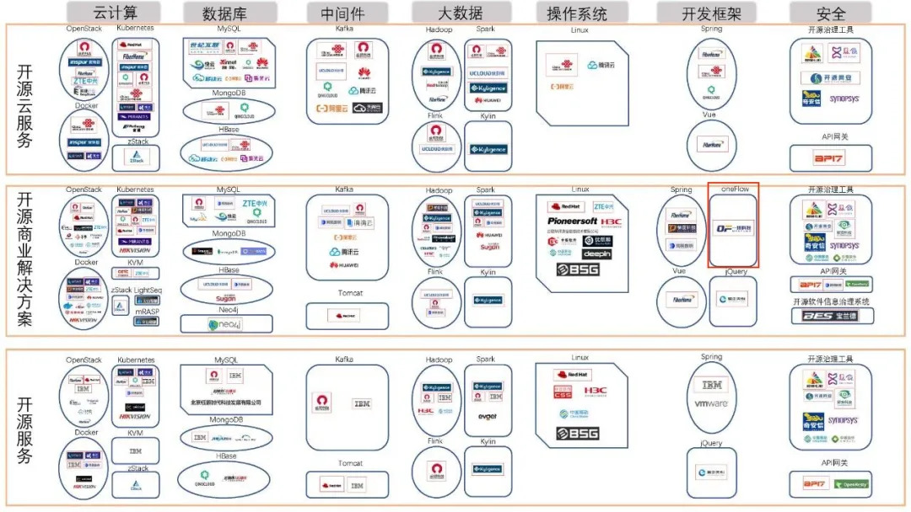
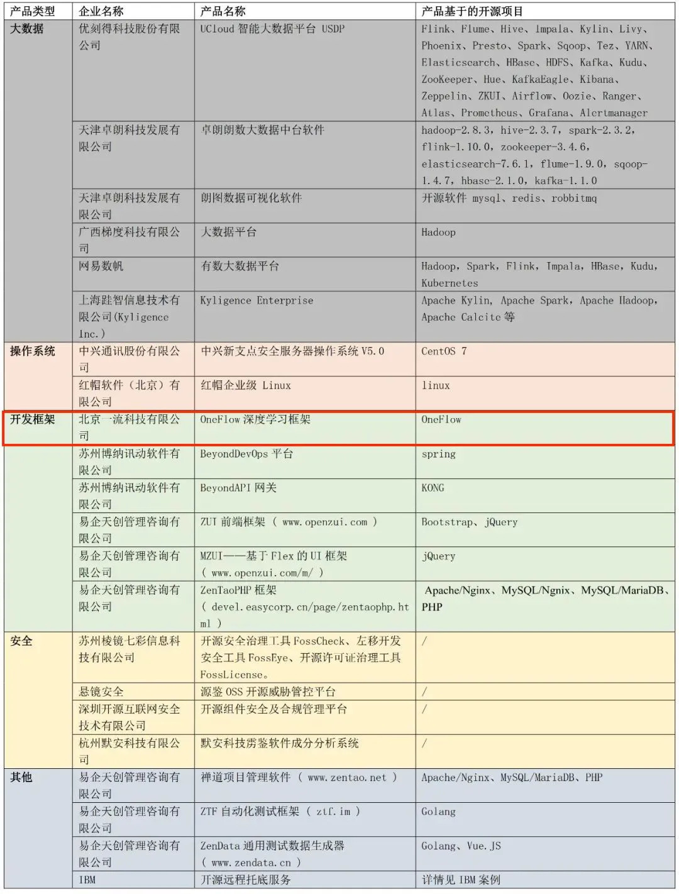

近日，中国信通院发布首批开源供应商名录。其中，一流科技凭借OneFlow新一代深度学习框架位列其中。

开源供应商全景图（源自信通院）

2021年1月底，中国信息通信研究院开展了第一批开源供应商名录征集活动，征集范围涵盖云计算、大数据、中间件、数据库、操作系统、开发框架和安全等领域，企业服务范围包括开源商业解决方案、开源云服务和开源服务。

据信通院介绍，活动一经发布得到了众多企业的积极反馈，经过历时3个月的前期调研、公开征集、申报资料验证与分析，2次专家研讨会和近30次的企业实际调研访谈，本次发布的第一批开源供应商名录，共收录26家开源供应商。

信通院公布的开源供应商产品列表（部分）

OneFlow秉承“效率为王”的开发理念，拥有完全自主知识产权，所有代码全部自研。其独创的自动数据模型混合并行、静态调度、去中心化和全链路异步流式执行四大核心技术，使用纯软件技术完美地解决了大数据、大模型、大计算所带来的异构集群分布式横向扩展挑战，技术水平世界领先。

目前，OneFlow深度学习框架已经收到多家头部互联网企业和人工智能公司的使用需求，将创新转化为市场落地成果。