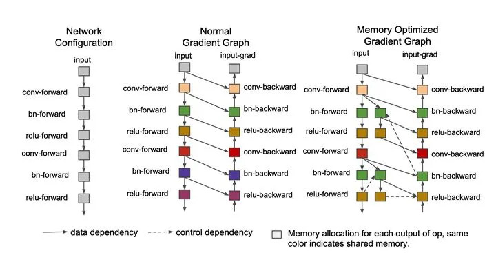
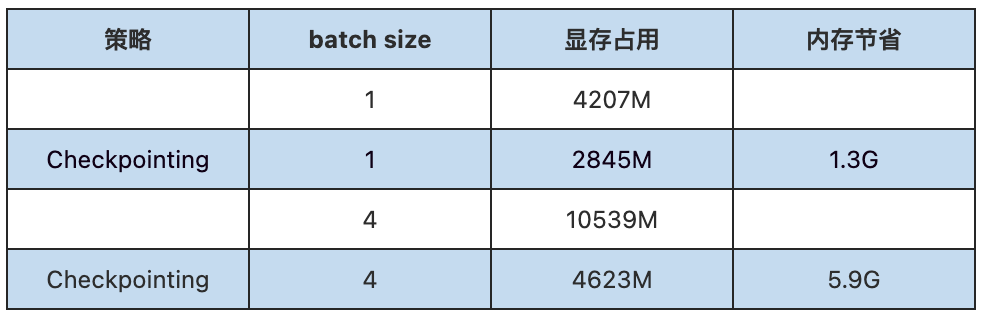
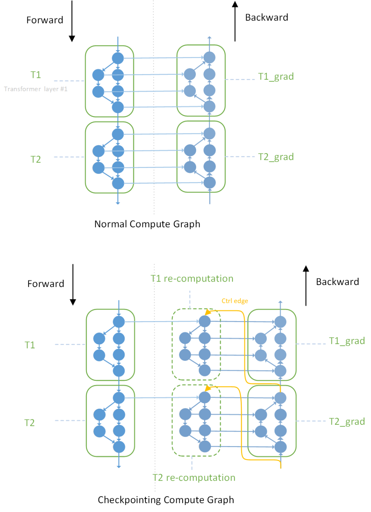

2016年，陈天奇团队提出了亚线性内存优化相关的“gradient/activation checkpointing（后向重计算）”等技术[1]，旨在降低深度学习训练过程中的中间激活(activation)带来的显存占用。Checkpointing技术属于亚线性内存优化的一种，除此之外还有CPU offload等技术（CPU offload在微软Deepspeed框架中被广泛使用）。



CPU offload将暂时用不到的GPU内存换入到CPU内存中存储，待需要时再取出，主要开销是来自于CPU和GPU之间的拷贝，会占用传输带宽（PCIE带宽），属于以传输换空间。而Checkpointing核心在于以时间换空间：**通过计算图分析技术来实施Inplace操作以及内存共享优化（Memory sharing），在每个mini-batch的前向过程中删除一些暂时用不到的中间激活特征以降低内存占用，并在后向过程中需要时借助额外的前向计算恢复它们。**

在OneFlow中，Checkpointing的实现主要是通过静态内存复用的方式，前向Tensor的生命周期结束后，其余Tensor可以复用这块内存，从而起到内存复用、节省内存的效果。

OneFlow目前支持了“gradient/activation checkpointing”（后向重计算）以实现亚线性内存优化，且对算法开发者非常友好，使用方式很简单：**针对需要优化的网络部分，用一行代码将其包裹在“Checkpointing”的scope范围内即可，系统内部会针对此scope区域内的网络做分析并在训练过程中自动进行Checkpointing内存优化。**

本文主要内容为以下3点：

- 1.亚线性内存优化的用法
- 2.亚线性内存优化的设计
- 3.代码解读

其中：1.将介绍如何在OneFlow中开启试用亚线性内存优化；2.将介绍OneFlow中亚线性内存优化是如何设计的及其原理；3.将从代码入手，剖析具体实现过程。

# 亚线性内存优化的用法

OneFlow中开启亚线性内存优化的方式如下：

```
# 用法：
with flow.experimental.scope.config(checkpointing=True):
    # your net work, such as :
    # input layernorm
    norm1 = layernorm("layernorm_1", h)
    # attention
    h = h + self.attn(norm1)
    # output layernorm
    norm2 = layernorm("layernorm_2", h)
    # mlp
    h = h + self.mlp(norm2)
```

用上述代码包裹后，此scope区域内的网络，在整个前向过程中只会保存一份input tensor的内存，从input到最后输出h，这之间所有中间特征tensor的内存都不会被保存，后向过程需要时从input开始进行（前向的）重计算。

我们在多个网络上进行了开启/关闭checkpointing的显存占用测试，以GPT-2为例，具体是在每个Transformer Layer内都使用`checkpointing = True` scope标记重计算的部分。



可以看见，开启checkpointing后会大幅降低GPT-2训练时的显存占用，在batch size = 4 时，内存节省超过50+%。

# 亚线性内存优化的设计

在系列文章《深度解析：让你掌握OneFlow框架的系统设计（上篇、中篇、下篇）》中，我们介绍了OneFlow中的OpNode/OpGragh抽象以及建立在这之上的Actor、SBP抽象等系统设计，正是这些良好的系统设计和抽象使得OneFlow在多种任务下都有着优秀的表现。

OneFlow的Job任务在逻辑图编译期会基于由OpNode构成的Job逻辑图(OpGragh），进行一系列pass的系统优化过程，每个pass对逻辑图进行了一次图修改/重写（对逻辑图中的节点和连边进行了增删操作)，这些优化对性能的提升至关重要。

Activation Checkpointing 在OneFlow中的实现，也是通过一个Checkpointing的pass对Job逻辑图实现修改/重写来实现的（见[https://github.com/Oneflow-Inc/oneflow/pull/3976](https://github.com/Oneflow-Inc/oneflow/pull/3976)）。




主要原理

如图所示： 

1.上半部分为正常情况下的逻辑子图。T1、T2为Transformer Layer的前向计算部分、子图中每个op计算完成后得到的中间激活特征将持续占用内存，当计算进行到反向时（T1_grad、T2_grad），再利用这些中间激活进行反向的计算； 

2.下半部分为开启Activation Checkpointing后的逻辑子图。可以看到，中间部分增加了虚线框住，用于重计算的fake子图，由于fake子图的存在，正常forward子图在进行前向时，就无须保存中间激活了，当backward计算需要用到时，再临时根据fake子图进行前向的重计算。

在OneFlow中，Activation Checkpointing的细节流程如下：

1.收集checkpointing作用域包裹下的所有前向pass下的ops

2.收集ops下所有的子图subgraphs

3.遍历子图subgraphs，并对所有需要做后向的subgraph做如下操作:

- 生成fake子图，并将其作为后向消费者的输入（而不是真实子图）
- 在fake子图中增加由end op连向所有源节点source nodes的控制边
- 将fake子图添加至job builder（被其管理）

4.在job builder中更新所有后向消费者ops

代码实现：

```
https://github.com/Oneflow-Inc/oneflow/blob/master/oneflow/core/job/checkpointing_config_def.cpp
https://github.com/Oneflow-Inc/oneflow/blob/master/oneflow/core/job/job_build_and_infer_ctx.cpp#L989
https://github.com/Oneflow-Inc/oneflow/blob/master/oneflow/core/job_rewriter/checkpointing_pass.cpp
```

# 代码解读

## 收集所有前向pass下的ops

由于activation checkpointing的设计主要是节省前向计算过程中的内存，即在checkpointing作用范围内，将前向计算过程中op nodes产生的activation显存释放掉，后向backward时，重新进行此部分的前向计算，得到所需的activation。

由于我们所有的操作是在逻辑图层面，操作的对象为每个op node节点，所以首先需要标记、筛选出checkpointing作用范围内所有前向的op nodes。此部分主要通过CollectAllCheckpointingOpsInForwardPass()方法实现：

```
https://github.com/Oneflow-Inc/oneflow/blob/master/oneflow/core/job_rewriter/checkpointing_pass.cpp#L65
```

```
void CollectAllCheckpointingOpsInForwardPass(
  // 收集所有属于前向pass下，且符合条件的op nodes，存放至HashMap中
    const OpGraph& op_graph, HashMap<std::string, const OpNode*>* checkpointing_op_name2op_node) {
  // NOTE(chengcheng):
  //   ignore batch_norm ops because of recompute bn will repeat the calculation of 'm' and 'v'.
  //   in the future, we need to support the recomputation version of batch_norm which do NOT
  //   update forward variables.
  HashSet<std::string> ignore_op_type_names = {"normalization", "normalization_add_relu",
                                               "cudnn_fused_normalization_add_relu"};
  op_graph.ForEachNode([&](const OpNode* op_node) {
    const OperatorConf& op_conf = op_node->op().op_conf();
    // 跳过不包含user_conf以及ignore_op_type_names指定的op_node
    if (!op_conf.has_user_conf()) { return; }
    if (ignore_op_type_names.find(op_conf.user_conf().op_type_name())
        != ignore_op_type_names.end()) {
      return;
    }
    // 对scope范围内开启了checkpointing且标记为ForwardPass的op_node，则为目标node,将其插入HashMap中
    if (IsForwardPass7CheckpointingScope(Scope4OpNode(op_node))) {
      CHECK(checkpointing_op_name2op_node->emplace(op_conf.name(), op_node).second);
    }
  });
}
```

其中，主要通过`IsForwardPass7CheckpointingScope()`方法，来对符合条件的op node进行筛选：

```
bool IsForwardPassScope(const Scope& scope) {
  // scope中，calculation_pass_name属性为kForwardPass的node，则为参与前向计算的目标node
  return scope.scope_proto().calculation_pass_name() == kForwardPass;
}

bool IsForwardPass7CheckpointingScope(const Scope& scope) {
  // True if 属性为kForwardPass的node且scope开启了checkpointing
  return IsForwardPassScope(scope) && scope.Bool("checkpointing");
}
```

`IsForwardPass7CheckpointingScope()`方法通过node的scope来判断该op node是否属于直接参与前向计算的node（scope中包含kForwardPass），且是否开启了“checkpointing”，同时满足则为目标node，将其插入hashmap(checkpointing_op_name2op_node)中。

## 收集ops下所有的subgraphs

筛选出checkpointing作用区域内所有的op nodes后，需要根据这些nodes生成所有子图subgraghs，这些子图有些是和后向重计算无关、有些则是后向重计算所需的目标子图，它们的输出作为后向op node的输入被消费，这些子图是实现activation checkpointing设计中前向重计算的最小单位。

生成子图的代码如下：

```
// 根据ops生成所有subgraphs子图，并将其存放在vector中
// step 2. get all connected subgraphs in checkpointing ops.
std::vector<HashSet<const OpNode*>> checkpointing_subgraphs;
GenConnectedCheckpointingSubgraphs(checkpointing_op_name2op_node, &checkpointing_subgraphs);
```

其中，主要通过GenConnectedCheckpointingSubgraphs()方法生成subgraphs：

```
void GenConnectedCheckpointingSubgraphs(
  // 生成Subgraphs子图
    const HashMap<std::string, const OpNode*>& checkpointing_op_name2op_node,
    std::vector<HashSet<const OpNode*>>* checkpointing_subgraphs) {
  HashSet<const OpNode*> visited_nodes;
  for (const auto& pair : checkpointing_op_name2op_node) {
    const OpNode* node = pair.second;
    if (visited_nodes.find(node) != visited_nodes.end()) { continue; }

    // new subgraph
    checkpointing_subgraphs->push_back(HashSet<const OpNode*>());
    CHECK(!checkpointing_subgraphs->empty());
    auto& subgraph = checkpointing_subgraphs->back();
    CHECK(subgraph.empty());

    // bfs search all node in checkpointing ops
    CHECK(visited_nodes.insert(node).second);
    std::queue<const OpNode*> queued_nodes;
    queued_nodes.push(node);
    while (!queued_nodes.empty()) {
      const OpNode* cur_node = queued_nodes.front();
      queued_nodes.pop();

      CHECK(subgraph.insert(cur_node).second);
      cur_node->ForEachNodeOnInOutEdge([&](const OpNode* next_node) {
        const std::string& next_op_name = next_node->op().op_name();
        if (checkpointing_op_name2op_node.find(next_op_name) != checkpointing_op_name2op_node.end()
            && cur_node->parallel_desc() == next_node->parallel_desc()
            && visited_nodes.find(next_node) == visited_nodes.end()) {
          queued_nodes.push(next_node);
          CHECK(visited_nodes.insert(next_node).second);
        }
      });
    }
  }
}
```

根据当前节点（cur_node），找到下一个子图节点(next_node)，采用的是BFS搜索，搜索逻辑为：以cur_node为起点，遍历其输入/输入边上有消费关系的节点next_node；对于不属于checkpointing op && 没有被当作子图node访问过 && 并行方式和cur_node一致的node；作为subgraph中的目标node（next_node），插入subgraph队列中，并将该node标记为已访问，放置到visited_nodes Set中。

## 遍历子图subgraphs

经历上述过程后生成了子图vector()，我们需要对其进行遍历，筛选出和activation checkpointing相关的子图subgraghs，并做如下几件事：

- 生成fake子图，并将其作为后向消费者的输入（而不是真实子图）
- 在fake子图中增加由end op连向所有源节点source nodes的控制边
- 将fake子图添加至job builder（被其管理）

对子图subgraghs的遍历主要在：

```
https://github.com/Oneflow-Inc/oneflow/blob/master/oneflow/core/job_rewriter/checkpointing_pass.cpp#L148-L290
```

过滤和activation checkpointing无关的subgragh子图

在`[for (auto& subgraph : checkpointing_subgraphs) {}]()`遍历循环的一开始，就会跳过不符合activation checkpointing条件的subgragh

```
for (auto& subgraph : checkpointing_subgraphs) {
    // step 3.1 ignore this subgraph if there is no direct edge to backward pass op.
    HashSet<const OpNode*> bw_consumers;
    for (const OpNode* node : subgraph) {
      node->ForEachNodeOnOutEdge([&](const OpNode* out_node) {
        if (!IsForwardPassScope(Scope4OpNode(out_node))) {
          bw_consumers.insert(out_node);
          CHECK(subgraph.find(out_node) == subgraph.end());
        }
      });
    }
    if (bw_consumers.empty()) { continue; }
```

具体条件，即遍历subgraph子图中的所有node节点、判断node节点的所有出边out_edges是否有出边连到后向backward消费者op，如果subgraph中所有节点均没有连到后向backward消费者，则跳过该子图（表明该子图只有只和forward有关而和backward无关，即不是activation checkpointing优化的目标子图。

生成fake子图，并将其作为后向消费者的输入（而不是真实子图）

过滤掉无效子图后，对于和activation checkpointing直接相关的目标子图，我们需要生成fake子图，其中的每个节点由fake op构成。

fake子图，即重计算的最小单位，其作用即用于取代原有真实的子图、并在后面替换这些真实子图，用于被后向op nodes消费。通过将fake子图中fake op的scope属性从kForwardPass变为kBackwardPass，实现当计算进行到该fake op时，重新运行前向计算以产生backward所需的activation数据。

生成fake 子图的主要代码在：L168-L222 

```
https://github.com/Oneflow-Inc/oneflow/blob/master/oneflow/core/job_rewriter/checkpointing_pass.cpp#L168-L222
```

生成fake子图后，将其设置为backward消费者的输入，主要代码如下：

```
const OpNode* first_bw_consumer = nullptr;
    int32_t first_bw_order = std::numeric_limits<int32_t>::max();
    // 将backward消费者的input更改为fake子图op（而不是真实子图）
    // step 3.3 change bw consumers input from subgraph to fake subgraph
    for (const OpNode* node : bw_consumers) {
      std::string bw_consumer_name = node->op().op_name();
      OperatorConf bw_consumer_op_conf;
      // NOTE(chengcheng):
      //   reuse bw conumer op conf if it has been existed in map.
      if (total_bw_consumers_op_name2conf.find(bw_consumer_name)
          != total_bw_consumers_op_name2conf.end()) {
        bw_consumer_op_conf = total_bw_consumers_op_name2conf.at(bw_consumer_name);
      } else {
        bw_consumer_op_conf = node->op().op_conf();
      }
      CHECK_EQ(bw_consumer_name, bw_consumer_op_conf.name());

      auto* user_conf = bw_consumer_op_conf.mutable_user_conf();
      // 修改和subgragh相关的backward op输入的blob name
      // change input lbns if in subgraph
      for (auto& pair : *(user_conf->mutable_input())) {
        auto& list_s = pair.second;
        for (int i = 0; i < list_s.s_size(); ++i) {
          std::string old_lbn = list_s.s(i);
          LogicalBlobId old_lbi = GenLogicalBlobId(old_lbn);

          std::string old_input_op_name = old_lbi.op_name();
          if (subgraph_op_name2op_node.find(old_input_op_name) != subgraph_op_name2op_node.end()) {
            list_s.set_s(i, kCheckpointingFakeOpNamePrefix + old_lbn);
          }
        }
      }

      // NOTE(chengcheng):
      //   emplace maybe repeated, so do not check the return value
      total_bw_consumers_op_name2conf.emplace(bw_consumer_name, bw_consumer_op_conf);

      CHECK(op_node2order.find(node) != op_node2order.end());
      int32_t this_order = op_node2order.at(node);
      if (this_order < first_bw_order) {
        first_bw_consumer = node;
        first_bw_order = this_order;
      }
    }
```

在fake子图中为所有source node—end node添加控制边

这一步操作的目的主要将子图subgraph中所有和backward op相连的node(source node)，添加一条控制边。控制边的添加是人为控制node间执行的时序，控制边保证了fake子图的计算尽可能晚的发生，这样才能缩短生命周期，保证内存复用的效率。

添加控制边相关的代码在L267-L284：

```
https://github.com/Oneflow-Inc/oneflow/blob/master/oneflow/core/job_rewriter/checkpointing_pass.cpp#L267-L284
```

```
// step 3.4 add control edge from End Op to all source node in fake subgraph
    CHECK(first_bw_consumer != nullptr);
    std::string end_op_name = kCheckpointingBadOpName;
    int32_t end_order = -1;
    first_bw_consumer->ForEachNodeOnInEdge([&](const OpNode* end_node) {
      CHECK(op_node2order.find(end_node) != op_node2order.end());
      int32_t this_order = op_node2order.at(end_node);
      if (this_order > end_order) {
        end_order = this_order;
        end_op_name = end_node->op().op_name();
      }
    });
    CHECK_NE(end_order, -1);
    CHECK_NE(end_op_name, kCheckpointingBadOpName);
    CHECK_LT(end_order, first_bw_order);
    for (const auto& source_op_name : source_node_in_fake_subgraph) {
      fake_op_name2conf.at(source_op_name).add_ctrl_in_op_name(end_op_name);
    }
```

将fake子图添加至job build（被其管理）

fake subgraphs的生成、以及控制边的添加，实际上对原有job逻辑图产生了改动。改动后，需要将fake subgraphs中这些新生成的fake op nodes添加至job builder管理，正式完成了逻辑图的图改写。

主要代码如下：

```
// 将fake subgraph所包含的ops加入至job_builder管理（图改写）
// step 3.5 add fake subgraph ops to job builder
std::vector<OperatorConf> fake_op_confs;
for (auto& pair : fake_op_name2conf) { fake_op_confs.push_back(pair.second); }
job_builder->AddOps(parallel_conf, fake_op_confs);
```

## 更新所有后向消费者ops

最后，由于fake op nodes更新了backward op nodes的输入输出等属性，需要将更新后的backward op nodes同步至job_builder管理：

```
// 在job builder中更新所有backward ops
// step 4. update bw consumers in job builder only once
std::vector<OperatorConf> total_bw_consumer_op_confs;
for (auto& pair : total_bw_consumers_op_name2conf) {
  total_bw_consumer_op_confs.push_back(pair.second);
}
job_builder->MutOpsOnlyOnce(total_bw_consumer_op_confs);

return Maybe<void>::Ok();
```

至此，通过这些fake subgraphs的插入、输入输出连边的变动等完成了整个job逻辑图的改写，改写后的逻辑图执行时即自动支持了activation checkpointing。

OneFlow最近复现了GPT-3相关的工作，其中就使用了activation checkpointing的技术，**代码在OneFlow-Benchmark已开源，欢迎在GitHub下载试用：**

```
https://github.com/Oneflow-Inc/OneFlow-Benchmark/tree/master/LanguageModeling/GPT
```

参考文献

[1] Tianqi Chen, Bing Xu, Chiyuan Zhang, and Carlos Guestrin. Training Deep Nets with Sublinear Memory Cost. arXiv preprint arXiv:1604.06174, 2016.