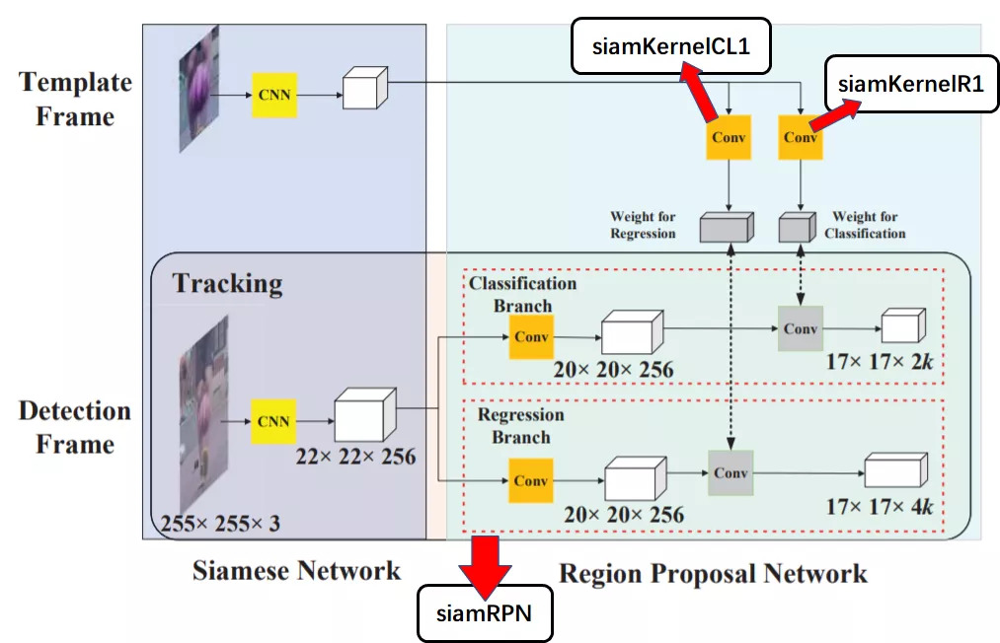
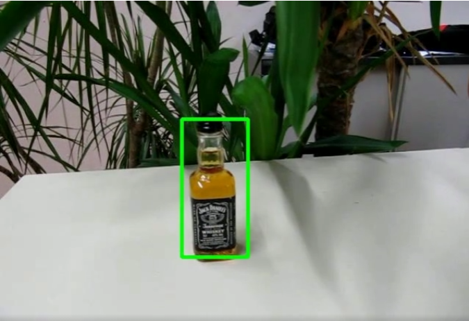

单目标跟踪是计算机视觉中的一个基本问题。在如今深度学习时代也涌现出多种基于深度学习的单目标跟踪算法，其中基于SiamFC（双流网络）的单目标跟踪算法占据了半壁江山。DaSiamRPN就是典型的基于SiamFC的方法。

GSoC 2020为OpenCV增加了Python版本的DaSiamRPN，后来发现大家对C++版本的需求挺强烈的，于是我就为OpenCV贡献了一个C++版本的DaSiamRPN。

对于DaSiamRPN，在inference阶段，模型的主要结构如下图所示：



其中**黄色的CNN网络**和**橙色的Conv网络**是模型文件，DaSiamRPN最后的输出有两个分别为分类分支:17 x 17 x 2k 和 回归分支:17 x 17 x 4k。

在实际代码中我们将上图中的模型整合成三个模型：siamRPN，siamKernelCL1，siamKernelR1。其中siamRPN是主要模型，会在每一帧的跟踪中用到，而siamKernelCL1和siamKernelR1仅会在设定模板参数时用到。注意：图中的两个黄色的CNN是公用参数的，详细介绍请看原文[1]。

C++版本使用了与Python版本同样的逻辑和模型文件，下面简单介绍一下实现的主要逻辑。

在单目标跟踪中，首先需要设定模板参数，如以下代码所示：

```
siamRPN.setInput(blob); // blob 为输入的template
Mat out1;
siamRPN.forward(out1, "63"); // 63层的输出为文中描述的黄色CNN的输出
siamKernelCL1.setInput(out1); // 分别作为回归和分类分支的输入
siamKernelR1.setInput(out1);

Mat cls1 = siamKernelCL1.forward(); // 获取模板分类分支的特征
Mat r1 = siamKernelR1.forward();  // 获取模板回归分支的特征
std::vector<int> r1_shape = { 20, 256, 4, 4 }, cls1_shape = { 10, 256, 4, 4 };

siamRPN.setParam(siamRPN.getLayerId("65"), 0, r1.reshape(0, r1_shape)); // 将获取到的参数写入主模型
siamRPN.setParam(siamRPN.getLayerId("68"), 0, cls1.reshape(0, cls1_shape));
```

设定模板参数之后进入跟踪主循环：

```
// 主循环
for (int count = 0; ; ++count)
{
    cap >> image;
    // ...
    float score = trackerEval(image, trackState, siamRPN); // 每一帧的跟踪计算

    // 绘制图像
    Rect rect = {
        int(trackState.targetBox.x - int(trackState.targetBox.width / 2)),
        int(trackState.targetBox.y - int(trackState.targetBox.height / 2)),
        int(trackState.targetBox.width),
        int(trackState.targetBox.height)
    };

    Mat render_image = image.clone();
    rectangle(render_image, rect, Scalar(0, 255, 0), 2);
    // ...
    imshow(winName, render_image);

    int c = waitKey(1);
    if (c == 27 /*ESC*/)
        break;
}
```

其中上述的`trackerEval`函数即为跟踪目标的计算，主体如下所示：

```
float trackerEval(Mat img, trackerConfig& trackState, Net& siamRPN)
{
    // 第一步：确认搜索区域。跟踪算法根据前一帧中目标位置确定搜索区域
    float searchSize = float((trackState.instanceSize - trackState.exemplarSize) / 2);
    float pad = searchSize / scaleZ;
    float sx = sz + 2 * pad;

    Mat xCrop = getSubwindow(img, targetBox, (float)cvRound(sx), trackState.avgChans);

    static Mat blob;
    std::vector<Mat> outs;
    std::vector<String> outNames;
    Mat delta, score;
    Mat sc, rc, penalty, pscore;

    // 第二步：用siamRPN网络推理
    blobFromImage(xCrop, blob, 1.0, Size(trackState.instanceSize, trackState.instanceSize), Scalar(), trackState.swapRB, false, CV_32F);

    siamRPN.setInput(blob);

    outNames = siamRPN.getUnconnectedOutLayersNames();
    siamRPN.forward(outs, outNames);

    delta = outs[0];
    score = outs[1];
    // score 和 delta即为文章开头结构图中的两个输出矩阵
    score = score.reshape(0, { 2, trackState.anchorNum, trackState.scoreSize, trackState.scoreSize });
    delta = delta.reshape(0, { 4, trackState.anchorNum, trackState.scoreSize, trackState.scoreSize });
    // 第三步：后处理
    // ...太长，这里省略
    return score.at<float>(bestID); // 返回最好的跟踪框
}
```

运行效果：



算法存在的问题：模型训练集中包含的小物体较少，该算法在目标为小物体情况下的性能较弱，只能重新训练解决这个问题。

全部代码请参考：

https://github.com/opencv/opencv/blob/master/samples/dnn/dasiamrpn_tracker.cpp

参考资料：

1. 原始论文：https://arxiv.org/abs/1808.06048

2. 原始PyTorch实现：https://github.com/foolwood/DaSiamRPN

3. OpenCV中Python实现：https://github.com/opencv/opencv/blob/master/samples/dnn/dasiamrpn_tracker.py