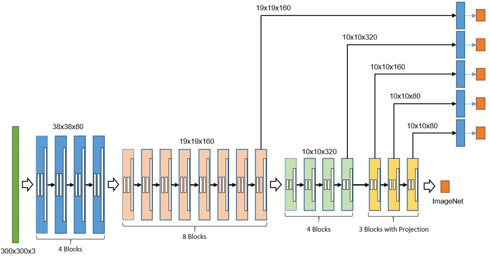
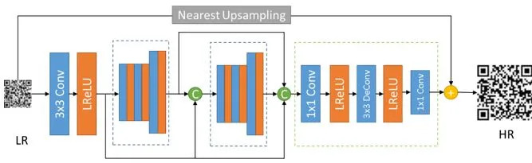
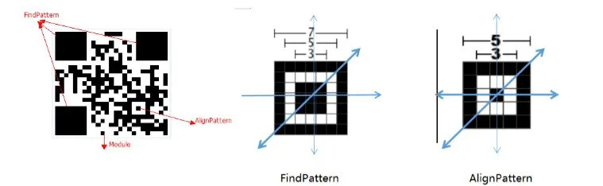

2011年12月微信3.5版本正式上线“扫一扫”二维码，历经9年蜕变，“扫一扫”从二维码名片到扫码支付、从小程序码到健康码，二维码已经成为一种生活方式，连接着数字与现实。

现在，在腾讯WeChatCV团队的贡献下，微信扫码引擎正式加入OpenCV开源了！只需3行代码，你便轻松拥有微信的扫码能力：

```
import cv2

detector = cv2.wechat_qrcode_WeChatQRCode("detect.prototxt", "detect.caffemodel", "sr.prototxt", "sr.caffemodel")
img = cv2.imread("img.jpg")
res, points = detector.detectAndDecode(img)

print(res, points)
```

微信扫码引擎收录于：

opencv_contrib/modules/wechat_qrcode

开发文档：

[https://docs.opencv.org/master/d5/d04/classcv_1_1wechat__qrcode_1_1WeChatQRCode.html](https://docs.opencv.org/master/d5/d04/classcv_1_1wechat__qrcode_1_1WeChatQRCode.html)

微信扫码引擎是一款基于开源引擎ZXing，并高度优化和深度改造的高性能轻量二维码识别器。

# 基于CNN的二维码检测

**“一图多码**”是扫码支付经常遇到的线下场景。早在2016年，微信扫码引擎在业内率先支持远距离二维码检测、自动调焦定位、多码检测识别。然而，传统方法需要牺牲40%以上的性能来支持多码的检测与识别。伴随着深度学习技术的成熟和移动端计算能力的提升，微信扫码引擎引入基于CNN的二维码检测器解决上述问题。



图1 二维码检测器

我们以SSD框架为基础，构造了短小精干的二维码检测器（图1），采用残差连接（Residual Concat）、深度卷积（Depthwise Convolution）、空洞卷积（Dilated Convolution）、卷积投影（Convolution Projection）等技术进行了针对性的优化。**整个模型大小仅943KB**，iPhone7（A10）单CPU的推理时间仅需20ms，很好地满足“低延时、小体积、高召回”的业务需求。

检测代码：

[https://github.com/opencv/opencv_contrib/blob/master/modules/wechat_qrcode/src/wechat_qrcode.cpp#L156](https://github.com/opencv/opencv_contrib/blob/master/modules/wechat_qrcode/src/wechat_qrcode.cpp#L156)

模型文件：

[https://github.com/WeChatCV/opencv_3rdparty/blob/wechat_qrcode/detect.prototxt](https://github.com/WeChatCV/opencv_3rdparty/blob/wechat_qrcode/detect.prototxt)

参数文件：

[https://github.com/WeChatCV/opencv_3rdparty/blob/wechat_qrcode/detect.caffemodel](https://github.com/WeChatCV/opencv_3rdparty/blob/wechat_qrcode/detect.caffemodel)

# 基于CNN的二维码增强

“**大图小码**”是远距扫码和长按识码经常面临的难点，二维码增强技术可以让小码更加清晰。2014年，微信率先在对话中上线“识别图中二维码”能力，离不开增强技术的加持。在长按识别的场景中，二维码图像经过用户的裁剪、压缩、转发，图像质量严重受损，分辨率急剧下降，边缘变得模糊不清，这给扫码引擎的识别带来了极大的挑战。

传统图像增强算法很难完美地解决以上问题，因此微信扫码引擎率先在识别流程中引入了基于深度学习的超分辨率技术（图2）。在网络结构上，密集连接（Dense Concat）、深度卷积（Depthwise Convolution）、反向卷积（Deconvolution）、残差学习（Residual Learning）等技术改善模型的性能；在目标函数上，针对二维码强边缘和二值化的特点，结合L2/L1损失、边界加权、二值约束设计了针对二维码的目标函数。经过精心的调优，**超分辨率模型大小仅23KB**，在iPhone7（A10）单CPU的推理时间仅需6ms（100x100超分200x200），完全满足移动端的应用需求。



图2 二维码超分辨率

超分代码：[https://github.com/opencv/opencv_contrib/blob/master/modules/wechat_qrcode/src/wechat_qrcode.cpp#L68](https://github.com/opencv/opencv_contrib/blob/master/modules/wechat_qrcode/src/wechat_qrcode.cpp#L68)

模型文件：

[https://github.com/WeChatCV/opencv_3rdparty/blob/wechat_qrcode/sr.prototxt](https://github.com/WeChatCV/opencv_3rdparty/blob/wechat_qrcode/sr.prototxt)

参数文件：

[https://github.com/WeChatCV/opencv_3rdparty/blob/wechat_qrcode/sr.caffemodel](https://github.com/WeChatCV/opencv_3rdparty/blob/wechat_qrcode/sr.caffemodel)

# 更鲁棒的定位点检测

二维码在识别的时候，通常需要根据扫描像素行/列匹配对应比例来寻找定位点（图3）。



图3 二维码定位点

在定位点检测上，我们提出面积法的定位点检测方法，相比于传统扫描线方法更为鲁棒和高效，有效地避免了误召回和漏召回；在定位点匹配上，特征聚类方法使得扫码引擎可以高效和准确地匹配多个定位点；在图像二值化上，引入多种更为鲁棒的二值化方法，有效地提高解码的成功率。

核心代码：

[https://github.com/opencv/opencv_contrib/blob/master/modules/wechat_qrcode/src/wechat_qrcode.cpp#L117](https://github.com/opencv/opencv_contrib/blob/master/modules/wechat_qrcode/src/wechat_qrcode.cpp#L117)

结合传统计算机视觉和深度学习技术，微信扫码引擎解决了一图多码、大图小码、鲁棒解码等业务痛点和技术难点。如今，该引擎在OpenCV上正式开源，期待广大开发者与我们一同打造业内领先的扫码引擎！