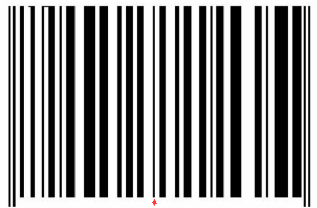
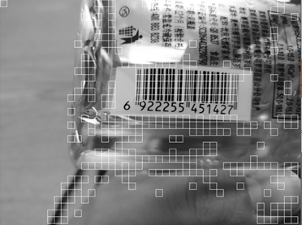
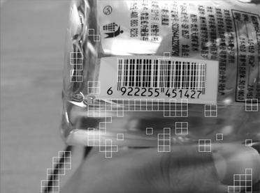
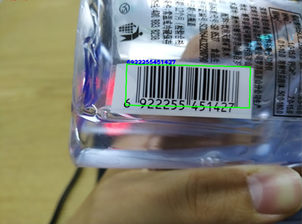
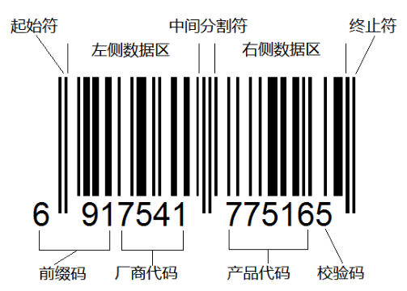
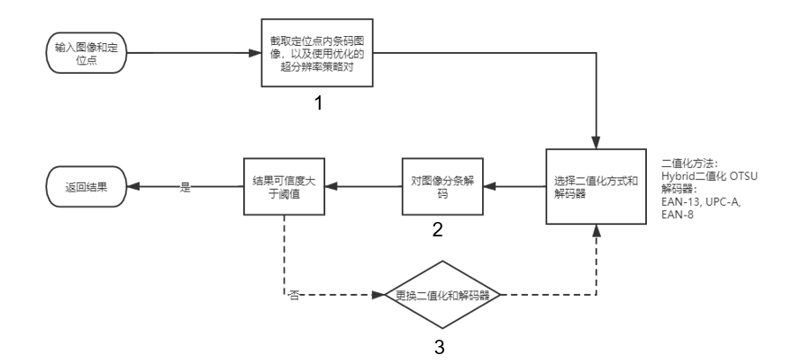

作者：梁峻豪，王天麒，孙中夏 （南方科技大学计算机科学与工程系）

最近，我们为OpenCV贡献了一维条形码识别模块，代码收录在：

https://github.com/opencv/opencv_contrib/tree/master/modules/barcode。

我们收集的数据集（数据集地址：https://github.com/SUSTech-OpenCV/BarcodeTestDataset，

共250张条码图片）上进行了测试，我们的识别算法正确率达到了96%，速度为20ms每张图像。作为对比，我们也测试了ZXing在该数据集上的表现，其正确率为64.4%，速度为90ms每张图像。

注：测试速度不包含初始化以及读图时间。同时，我们的算法是C++实现，ZXing是Java实现。另外，对于用图片数据集进行的测试，ZXing99%的时间是在做彩色图到灰度图的转换。

本文将对此模块的原理和使用方式进行介绍。

# 条形码介绍

条形码是将宽度不等的多个黑条和空白，按照一定的编码规则排列，用以表达一组信息的图形标识符，如下图所示：



条码区域与其他图像相比有如下两个重要特点：第一，条码区域内的条空是平行排列的，方向趋于一致；第二，为了条码的可识读性，条码在制作时条和空之间有着较大的反射率差，从而条码区域内的灰度对比度较大，而且边缘信息丰富。

# 基于方向一致性的条码定位算法

根据条形码方向趋于一致的特点，我们可以将图像分块，通过计算每个块内**梯度方向的一致性**，来滤除那些**低一致性**的块。下图是筛选过后剩下的块：



由于包含条码区域的块**一定连续存在**的特性，我们可以通过对这些图像块再进行一个改进的**腐蚀**操作过滤掉部分背景图像块。下图是滤除部分背景图像块后剩余的块：



得到这些块之后，我们再根据每个图像块内的**平均梯度方向进行连通**。因为如果是相邻的图像块都属于同一个条码的话，那么他们的平均梯度方向也一定相同。

得到连通区域之后我们再根据条码图像的特性进行筛选，比如连通区域内的梯度大于阈值的点的比例，组成连通区域的图像块数量等。

最后，用**最小外接矩形**去拟合每个连通区域，并计算外界矩形的方向是否和连通区域内的平均梯度方向一致，过滤掉差距较大的连通区域。将平均梯度方向作为矩形的方向，并将矩形作为最终的定位框。



# 条形码解码

目前我们支持了三种类型的条码解码，它们分别是EAN13、 EAN8 和UPC-A。(下图为EAN13 条码示例)



条码的识别主要流程如下图：



其中：

1. 优化的超分辨率策略指的是对较小的条码进行**超分辨率放大**，不同大小条码做不同处理。

2. 解码算法的核心是基于条码编码方式的**向量距离计算**。因为条码的编码格式为固定的数个"条空"，所以可以在约定好"条空"间隔之后。将固定的条空读取为一个向量，接下来与约定好的编码格式相匹配，取匹配程度最高的编码为结果。

3. 在解码步骤中，解码的单位为一条线，由于噪点，条空的粘连等原因，单独条码的解码结果存在较大的不确定性，因此我们加入了对**多条线的扫码**，通过对均匀分布的扫描与解码，能够将二值化过程中的一些不完美之处加以抹除。

   **具体实现为**：首先在检测线上寻找起始符，寻找到起始符之后，对前半部分进行读取与解码，接着寻找中间分割符，接着对后半部分进行读取与解码，最后寻找终结符，并对整个条码进行首位生成与校验（此处以EAN13格式举例，不同格式不尽相同）。最后，每条线都会存在一个解码结果，所以对其进行投票，只将最高且总比例在有效结果50%以上的结果返回。这一部分我们基于ZXing的算法实现做了一些改进(投票等)。 

4. **更换二值化和解码器**指的是在为解码成功遍历使用每种解码器和二值化尝试解码。

# 使用方式

C++

```
#include "opencv2/barcode.hpp"
#include "opencv2/imgproc.hpp"

using namespace cv;

Ptr<barcode::BarcodeDetector> bardet = makePtr<barcode::BarcodeDetector>("sr.prototxt", "sr.caffemodel"); //如果不使用超分辨率则可以不指定模型路径
Mat input = imread("your file path");
Mat corners; //返回的检测框的四个角点坐标，如果检测到N个条码，那么维度应该是[N][4][2]
std::vector<std::string> decoded_info; //返回的解码结果，如果解码失败，则为空string
std::vector<barcode::BarcodeType> decoded_format; //返回的条码类型，如果解码失败，则为BarcodeType::NONE
bool ok = bardet->detectAndDecode(input, decoded_info, decoded_format, corners);
```

Python

```
import cv2

bardet = cv2.barcode_BarcodeDetector()
img = cv2.imread("your file path")
ok, decoded_info, decoded_type, corners = bardet.detectAndDecode(img)
```

更多使用方式请参考文档：

https://docs.opencv.org/master/dc/df7/classcv_1_1barcode_1_1BarcodeDetector.html

# 参考文献

王祥敏，汪国有. 一种基于方向一致性的条码定位算法[EB/OL]. 北京：中国科技论文在线 [2015-04-22]. http://www.paper.edu.cn/releasepaper/content/201504-338.