本文用OpenCV部署了超轻量目标检测模型NanoDet，实现了C++和Python两个版本，并对此进行了解析。

2020年，在深度学习目标检测领域诞生了yolov4,yolov5和nanodet这些优秀的检测模型，有许多的微信公众号报道这些算法模型。深度学习目标检测方法可划分为 Anchor-base 和 Anchor-free 两大类，nanodet是一个速度超快和轻量级的移动端 Anchor-free 目标检测模型,并且它的精度不亚于yolo系列的。

nanodet通过一些论文里的trick组合起来得到了一个兼顾精度、速度和体积的检测模型。作者用到的一些trick，主要参考自：(1)参考FCOS 式的单阶段 anchor-free 目标检测模型，FCOS特点是让模型学习feature map中每个位置到检测框的四条边的距离，如下图所示。

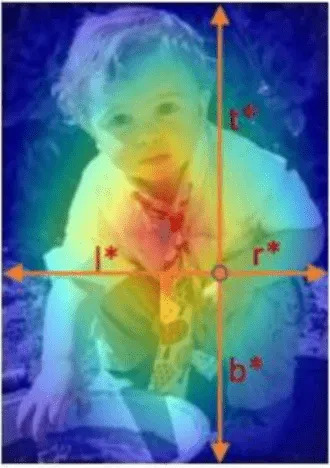

(2)使用 ATSS 进行目标采样，该方法提出了自适应训练样本选择方法，该方法根据目标的统计特征（方差和均值）自动划分正训练样本和负训练样本，弥合了基于锚的探测器与无锚探测器之间的差距。(3)使用 Generalized Focal Loss 损失函数执行分类和边框回归（box regression），该函数能够去掉 FCOS 的 Centerness 分支，省去这一分支上的大量卷积，从而减少检测头的计算开销。

为了达到轻量化的目的，作者在设计网络结构时，使用 ShuffleNetV2 1.0x 作为骨干网络，他去掉了该网络的最后一层卷积，并且抽取 8、16、32 倍下采样的特征输入到 PAN 中做多尺度的特征融合。

在FPN模块里，去掉所有卷积，只保留从骨干网络特征提取后的 1x1 卷积来进行特征通道维度的对齐，上采样和下采样均使用插值来完成。与 YOLO 使用的 concat操作不同，项目作者选择将多尺度的 Feature Map 直接相加，使整个特征融合模块的计算量变得非常小。

在检测头模块里，使用了共享权重的检测头，即对 FPN 出来的多尺度 Feature Map 使用同一组卷积预测检测框，然后每一层使用一个可学习的 Scale 值作为系数，对预测出来的框进行缩放。与此同时，使用了 Group Normalization（GN）作为归一化方式.FCOS 的检测头使用了 4 个 256 通道的卷积作为一个分支，也就是说在边框回归和分类两个分支上一共有 8 个 c=256 的卷积，计算量非常大。为了将其轻量化，项目作者首先选择用深度可分离卷积替换普通卷积，并且将卷积堆叠的数量从 4 个减少为 2 组。在通道数上，将 256 维压缩至 96 维，之所以选择 96，是因为需要将通道数保持为 8 或 16 的倍数，能够享受到大部分推理框架的并行加速。

最后，项目作者借鉴了 YOLO 系列的做法，将边框回归和分类使用同一组卷积进行计算，然后 split 成两份。最后，项目作者借鉴了 YOLO 系列的做法，将边框回归和分类使用同一组卷积进行计算，然后 split 成两份，这样就组成了nanodet网络。

作者把nanodet发布在github上，项目地址： [https://github.com/RangiLyu/nanodet](https://github.com/RangiLyu/nanodet)，下载代码和模型文件到本地，按照README文档运行一个前向推理程序。接下来，我阅读前向推理主程序demo.py文件，尝试理解在运行这个主程序时需要调用哪些函数和.py文件。在前向推理主程序demo.py文件，对一幅图片做目标检测是在Predictor类的成员函数inference里实现的，它里面包含了对输入图片做预处理preprocess，前向计算forward和后处理postprocess这三个步骤。Predictor类的定义如下图所示

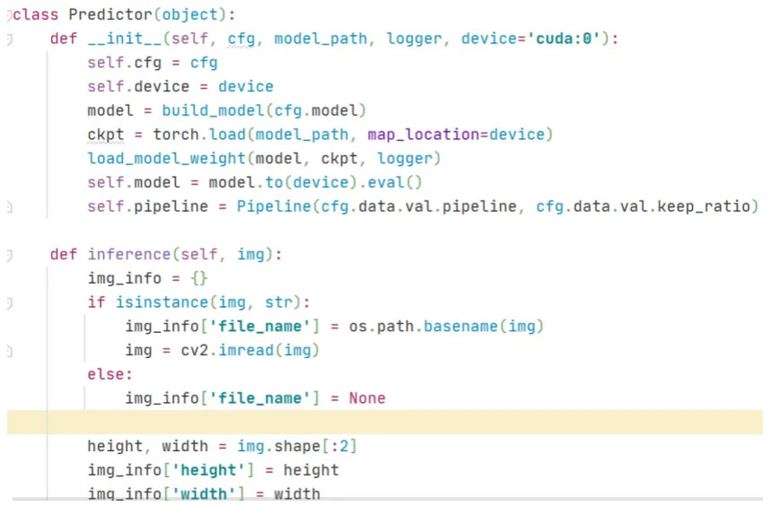

对输入原图做预处理，预处理模块是使用Pipeline类实现，对应的代码是

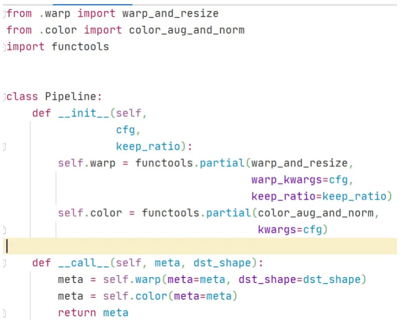

看到这段代码时，我有些懵逼了。第一次见到functools.partial这个模块，我百度查了一下它的作用是包装函数，接着看warp_resize函数，这个函数对应的代码很复杂，里面有多个if条件判断，调用了多个自定义函数。限于篇幅，在这里展示部分截图代码，如下图所示

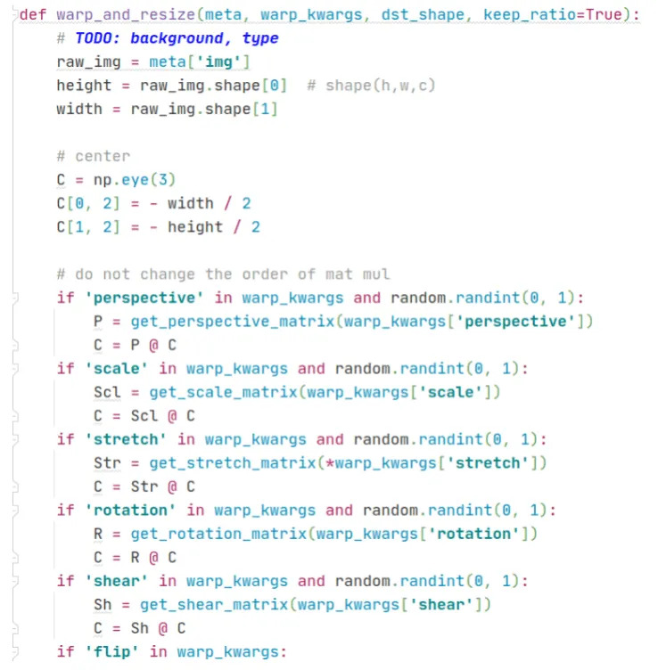

从代码不难猜测出warp_resize函数的作用是对原图做resize，于是我把warp_resize函数返回的图像做可视化并打印出图像的尺寸是高宽：320x320，可视化结果如下图所示。

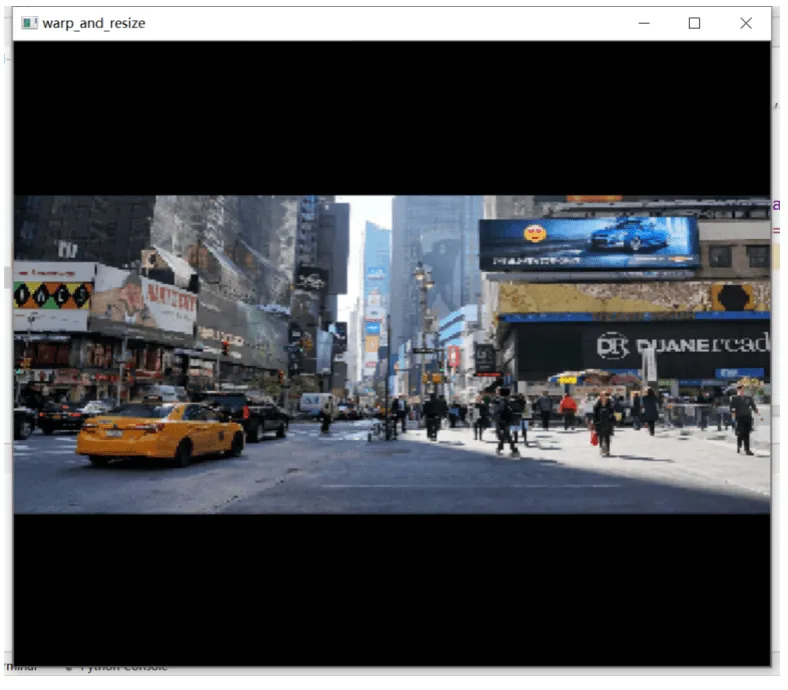

从图中可以看到，warp_resize函数是保持原图高宽比的resize，短边剩下的部分用黑色像素填充。这种功能在ultralytics的yolov3和yolov5代码仓库里有一个letterbox函数实现的，在letterbox函数使用opencv库里的resize和copyMakeBorder就可以实现保持高宽比的resize，这种方法简洁明了。接着我对warp_resize函数和letterbox函数对同一幅图片做保持原图高宽比的resize的结果比较。可视化结果如下，从视觉上看不出它们有何差异。把这两幅图的像素矩阵做减法比较，发现它们并不等于0，也是是说它们的像素值还是有差异的。

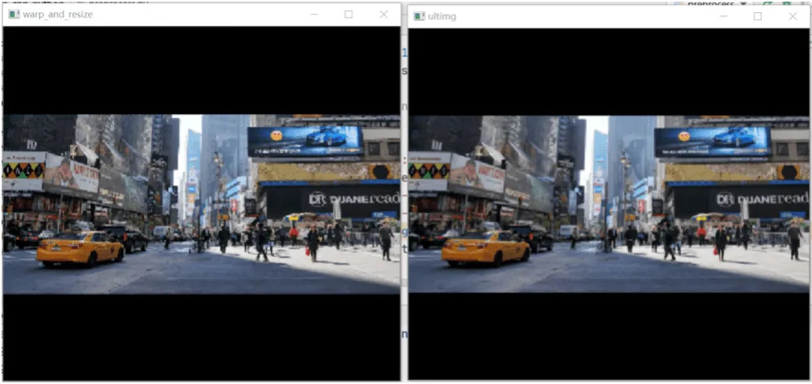

接着看预处理模块Pipeline类里的第二个函数color_aug_and_norm，代码截图如下。可以看出，这个函数的作用是对输入图片的RGB三通道分别做减均值除以标准差的操作，不过在最开始对img除以255,在最后对均值和标准差分别除以255，这三次除以255是完全没必要的，因为在最后一步 (img - mean) / std，分子分母可以约掉1/255，这和img,mean,std不做除以255这一步计算，直接(img - mean) / std是等价的。

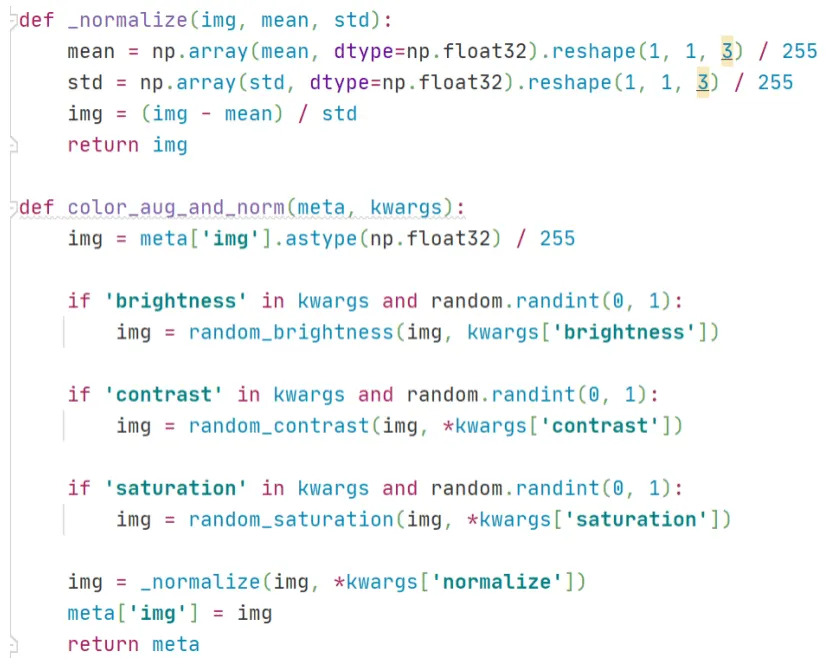

综上所述，在预处理模块Pipeline类包含了很多冗余的计算，图像预处理本身是一个简单问题，但是在官方代码里却把简单问题搞复杂化了。

官方代码仓库([https://github.com/RangiLyu/nanodet](https://github.com/RangiLyu/nanodet))里提供了基于 ncnn 推理框架的实现，基于mnn，libtorch,openvino的实现，但是没有基于Opencv的dnn模块的实现。于是我就编写一套基于Opencv的dnn模块的实现，程序里包含Python和C++两个版本的代码。

**地址是**：[ **https://github.com/hpc203/nanodet-opncv-dnn-cpp-python**](https://github.com/hpc203/nanodet-opncv-dnn-cpp-python)

在这套程序里，图像预处理模块沿用了ultralytics代码仓库里的letterbox函数使用opencv库里的resize和copyMakeBorder就可以实现保持高宽比的resize。此外，在网上有很多介绍nanodet网络结构的文章，但是在文章里没有对nanodet后处理模块做详细介绍的。因此，在编写这套程序时，我最关注的是nanodet的后处理模块，在nanodet网络输出之后，经过怎样的矩阵计算之后得到检测框的左上和右下两个顶点的坐标(x,y)的值的。接下来，我结合代码来理解后处理模块的运行原理。首先，原图经过预处理之后形成一个320x320的图片作为nanodet网络的输入，经过forward前向计算后会得到40x40，20x20，10x10这三种尺度的特征图（换言之就是原图缩小8倍，16倍，32倍），在程序代码里设断点调试，查看中间变量，截图如下：

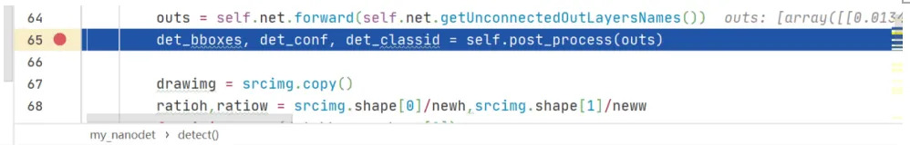

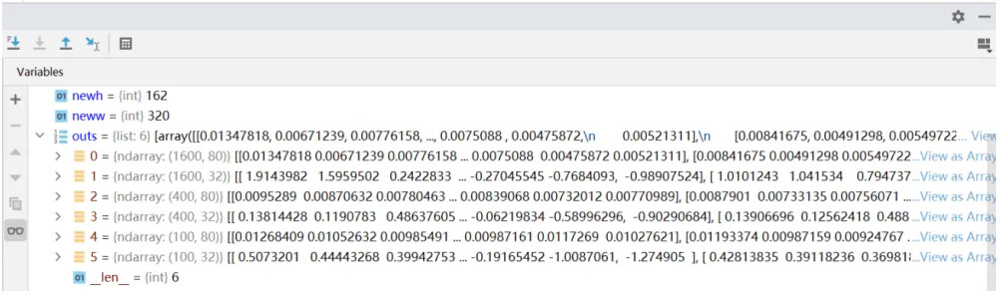

从上图可以看到，经过forward前向计算后，有6个输出矩阵。第1个输出的维度是(1600,80)，它对应的是40x40的特征图(拉平后是长度为1600的向量，也就是说一共有1600个像素点)里的每个像素点在coco数据集的80个类别里的每个类的置信度。第2个输出的维度是(1600,32)，它对应的是40x40的特征图(拉平后是长度为1600的向量，也就是说一共有1600个像素点)里的每个像素点的检测框的预测偏移量，可以看到这个预测偏移量是一个长度为32的向量，它可以分成4份，每份向量的长度为8，接下来的第3，4，5，6个输出矩阵的意义以此类推。

前面讲到过nanodet的特点是让神经网络学习feature map中每个位置到检测框的四条边的距离，接下来我们继续在程序里设断点调试，来理解这4份长度为8的预测偏移量是如何经过一系列的矩阵计算后得到到检测框的四条边的距离。代码截图如下：

从上图可以看到，把形状为(1600,32)的矩阵reshape成(6400,8)的矩阵bbox_pred，其实就等同于把每一行切分成4份组成新的矩阵，然后做softmax变换，把数值归一化到0至1的区间内。继续调试接下来的一步，代码截图如下：

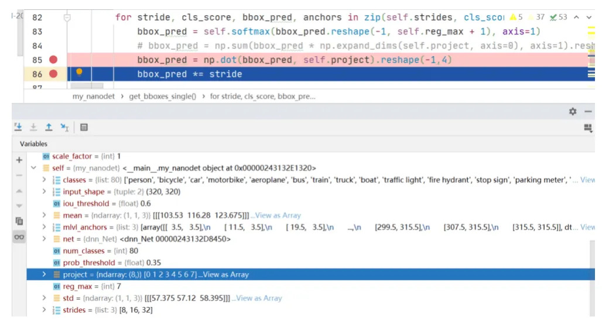

可以看到project是一个长度8的向量,元素值是从0到7。形状为(6400,8)的矩阵bbox_pred与向量project做乘法得到6400的列向量，然后reshape为(1600,4)的矩阵，接下来乘以缩放步长。这时候就得到的形状为(1600,4)的矩阵bbox_pred，它的几何意义就是40x40的特征图里的每个像素点到检测框的四条边的距离。有了这个值之后，接下来的计算就简单了，在此不做详细讲述，可以参阅我的代码。简单来说就是计算特征图的每个像素点在coco数据集里的80类里的最大score值作为类别置信度，然后把特征图的所有像素点的类别置信度从高到低排序，取前topk个像素点，然后根据上一步计算出的到检测框四条边的距离换算出检测框的左上和右下两个顶点的(x,y)值，最后做NMS去除重叠的检测框。为了更好的理解从nanodet输出特征图到最终计算出目标检测框的左上和右下顶点坐标(x,y)值的这个过程，我在草稿纸上画图演示，如下所示：

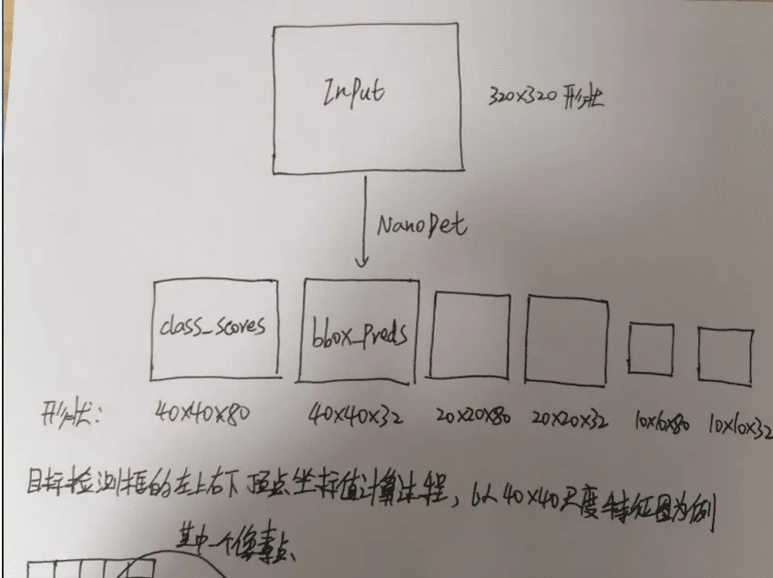

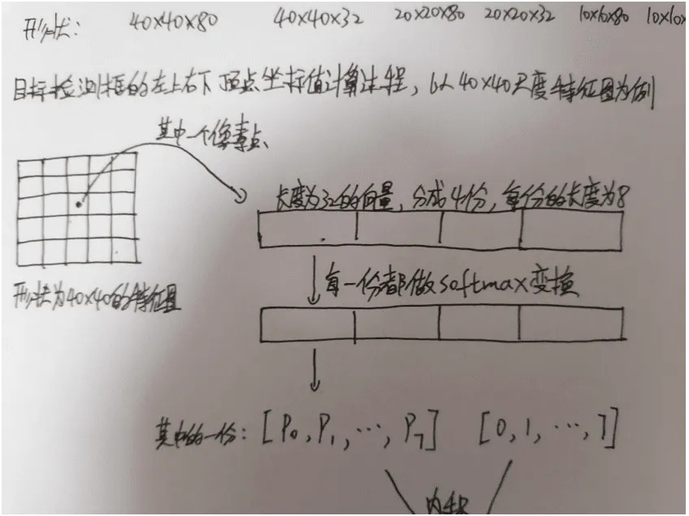

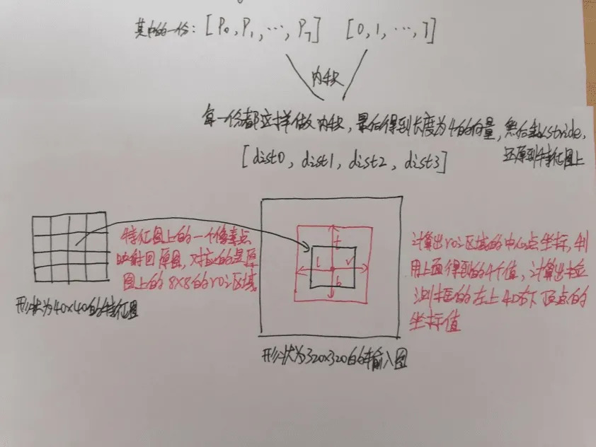

在编写完调用opencv的做nanodet目标检测的程序后，为了验证程序的有效性，从COCO数据集里选取几张图片测试并且与官方代码做比较，官方代码是用python编写的调用pytorch框架做目标检测的。结果如下，左边的图是官方代码的可视化结果，右边的图是opencv做nanodet目标检测的可视化结果。

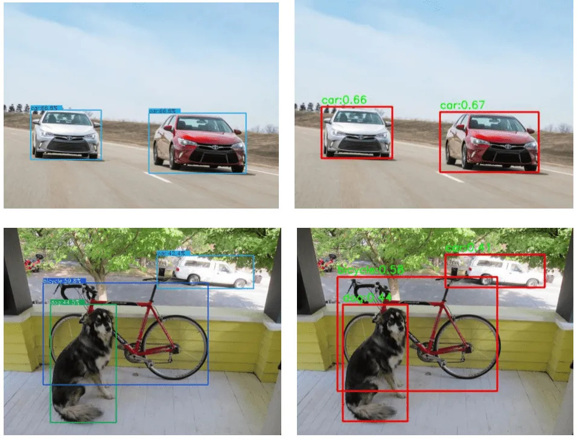

把官方代码和我编写的代码做了一个性能比较的实验，实验环境是ubuntu系统，8G显存的gpu机器。在实验中读取一个视频文件，对视频里的每一帧做目标检测，分别运行官方的调用pytorch框架做目标检测的python代码和我编写的调用opencv做目标检测的python代码，在terminal终端输入top查看这两个程序运行时占用的内存,截图如下。第一行是opencv做nanodet目标检测程序运行时占用的内存，第二行是官方代码运行时占用的内存，可以看到使用opencv做nanodet目标检测对内存的消耗明显要低于官方代码的pytorch框架做nanodet目标检测的。

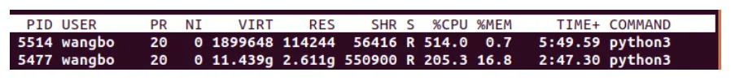

**Github传送门**：[**https://github.com/hpc203/nanodet-opncv-dnn-cpp-python**](https://github.com/hpc203/nanodet-opncv-dnn-cpp-python)