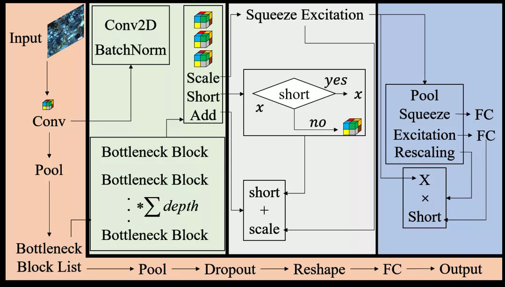
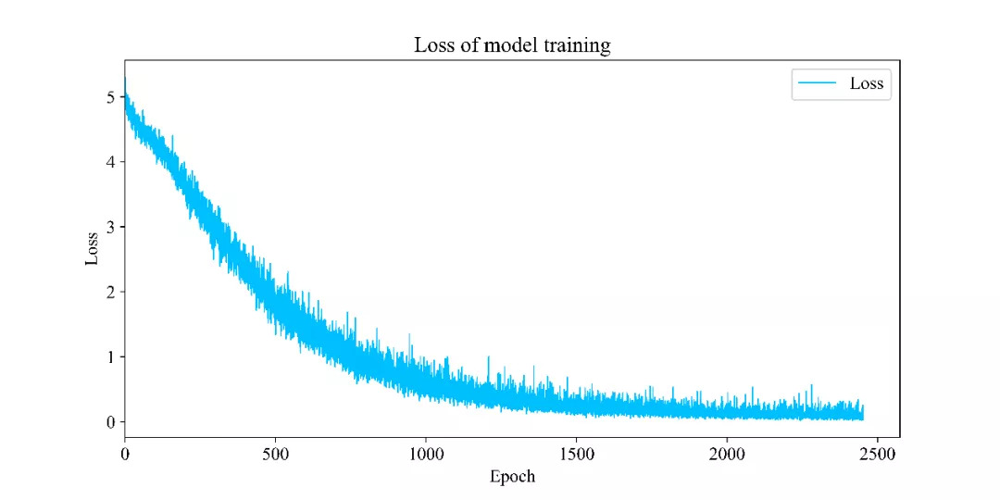
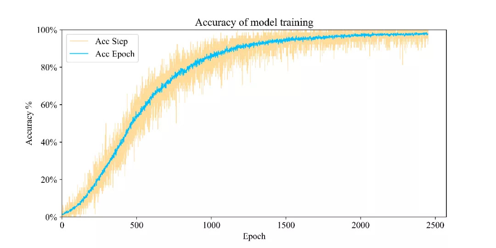
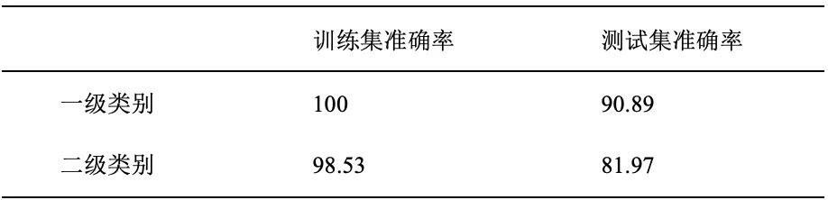
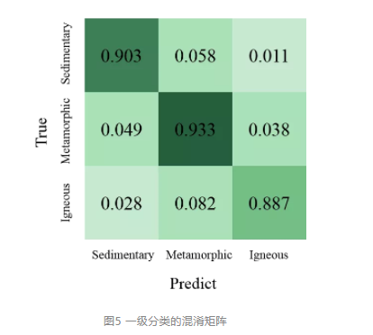
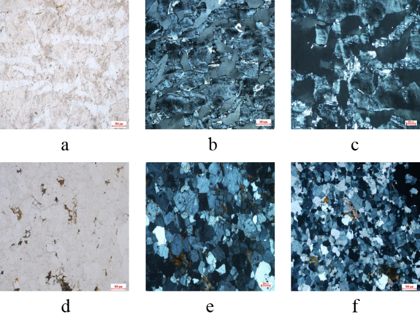

# 概述

## 行业背景与痛点

岩相分析是以岩石薄片的微观描述和分类为基础的研究工作，也是沉积和成岩研究的一项重要技术，对于油气勘探开发的工程实践具有基础性指导地位。通过薄片分析矿物的比例、分布、质地、孔隙空间、胶结成分等因素，给后续的油气田开发方案设计作为保障提供了更好、更准确的手段。

工程实践中，大多数岩相分析依赖大量的地质学家使用显微镜，进行岩石薄片的目视检查，标准规范和时间紧迫之间的矛盾日益突出。总体来说，存在三个核心痛点：第一，人类专家面临大量繁重的重复性劳动，精力与效率的平衡问题无法忽视。同时，多位岩石学家共同工作，可能会出现分析不一致的情况。第二，由于分布在世界各地的油田，其地质特征、发育机理等因素存在差异，因此还需要充分考虑跨源识别这一重要因素。第三，现有自动化识别方法对于岩相覆盖范围仅针对若干个特定区块的几种类型；同时也不具备迁移能力。

## 项目价值

为了解决上述问题，我们采用专业的深度学习框架——飞桨，自动识别单张薄片的耗时约为0.03秒，并且面对大规模的工区数据时，不存在精力不足的问题。不同地区的薄片跨源分布问题，也可以通过基于大规模训练的模型进行优化，最终得到高精度的预测模型，精确预测不同地层、不同区块的分布差异。针对现有自动化方法覆盖范围小的问题，我们采取了大规模的模型训练，将岩相的类型覆盖到90%以上的常见岩相类型，并且覆盖到95%以上地质专业要求掌握的范围。未覆盖的岩相由于样本稀缺的因素未被纳入分析，但在后续的研究过程中也可以通过迁移的方法来优化。应用本方法不仅可以完成跨源大规模层级岩相分析工作，还可以加速和量化各类地质任务，提供基础性迁移基础。

# 实验过程

## 数据准备与分析

南京大学[1] 数据集，囊括了三大类岩石中的90%以上的常见岩石类型，共105种岩石类型进行分析。数据集一共由2634张图片组成，实验以8:2的比例将数据集随机划分成训练集与测试集。

```
# 数据加载
import paddle 
import paddle.vision.transforms as T
def get_transforms():
    return T.Compose([
        T.Resize((224, 224)),
        T.ToTensor(),
        T.Normalize(mean=(0.485, 0.456, 0.406), std=(0.229, 0.224, 0.225))
    ])

def get_transforms_single():
    return T.Compose([
        T.Resize((224, 224)),
        T.ToTensor()
    ])


# 基本参数配置
train_parameters = {  
    "data_dir": "data/data57425",  # 训练数据存储地址  
    "num_epochs": 10,  
    "train_batch_size": 64, 
    "infer_img": 'data/data57425/sunflowers/14646283472_50a3ae1395.jpg',


    "mean_rgb": [85, 96, 102],  # 常用图片的三通道均值，通常来说需要先对训练数据做统计，此处仅取中间值  

    "input_size": [3, 224, 224],  
    "class_dim": -1,  # 分类数，会在初始化自定义 reader 的时候获得  
    "image_count": -1,  # 训练图片数量，会在初始化自定义 reader 的时候获得  
    "label_dict": {},  
    "train_file_list": "train.txt",  
    "eval_file_list": "eval.txt",
    "label_file": "label_list.txt",  
    "save_model_dir": "./save_dir/model",  
    "continue_train": True,        # 是否接着上一次保存的参数接着训练，优先级高于预训练模型  
    "image_enhance_strategy": {  # 图像增强相关策略  
        "need_distort": True,  # 是否启用图像颜色增强  
        "need_rotate": True,   # 是否需要增加随机角度  
        "need_crop": True,      # 是否要增加裁剪  
        "need_flip": True,      # 是否要增加水平随机翻转  
        "hue_prob": 0.5,  }
```

## 数据增强预处理模块

原始数据集的单张样本存储空间约为1M，在保证图像信息的条件下进行压缩，既能让图片不损失特征信息，也能充分提高每个批次所能加载的样本数量减小模型的训练开销。采用数据增强技术以增加模型的鲁棒性。图1说明了数据增强的几种方式：首先将图片缩放成指定尺寸以供网络进行加载；进行随机裁剪策略使得样本的各个局部都可以在训练过程中呈现，增强模型对于图片局部的识别能力；以概率触发模式进行旋转、亮度、对比度、饱和度的调整来模拟实验图片在不同情况下都可以进行识别。


使用缩放与随机裁剪来作为数据预处理方法。

```
# 随机改变亮度
def random_brightness(img, lower=0.5, upper=1.5):
    e = np.random.uniform(lower, upper)
    return ImageEnhance.Brightness(img).enhance(e)
# 对读入的图像数据进行预处理
def transform_img_batchs(img):#批处理图片使用
    # 读入的图像数据格式是[B,H, W, C]
    # 使用转置操作将其变成[B,C, H, W]
    #img=transformer(img)
    #img=image_augment(img)
    constant = cv2.copyMakeBorder(img, 32, 32, 72, 72,cv2.BORDER_CONSTANT, value=0)
    img = np.transpose(img, (0,3,1,2))

    img = img.astype('float32')

    # 将数据范围调整到[-1.0, 1.0]之间
    img = img / 255.
    img = img * 2.0 - 1.0
    return img


# 定义训练集数据读取器
def data_loader(imgs_name,train_class_dict,path_dir=train_dir, batch_size=10, mode = 'train'):
    # 将datadir目录下的文件列出来，每条文件都要读入
    def reader():
        if mode == 'train':
            random.shuffle(imgs_name)# 训练时随机打乱数据顺序
        batch_imgs = []
        batch_labels = []
        for name in imgs_name:
            filepath = os.path.join(path_dir, name)
            img = plt.imread(filepath)
            img = transform_img(img)
            label=train_class_dict[name[:4]]
            # 每读取一个样本的数据，就将其放入数据列表中
            batch_imgs.append(img)
            batch_labels.append(label)
            if len(batch_imgs) == batch_size:
                # 当数据列表的长度等于batch_size的时候，
                # 把这些数据当作一个mini-batch，并作为数据生成器的一个输出
                imgs_array = np.array(batch_imgs)
                labels_array = np.array(batch_labels).reshape(-1, 1)
                #images_aug = seq.augment_images(imgs_array)
                #images_aug=transform_img(imgs_array)
                #print(images_aug.shape)
                yield imgs_array, labels_array
                batch_imgs = []
                batch_labels = []

        if len(batch_imgs) > 0:
            # 剩余样本数目不足一个batch_size的数据，一起打包成一个mini-batch
            imgs_array = np.array(batch_imgs)
            labels_array = np.array(batch_labels).reshape(-1, 1)
            #images_aug = seq.augment_images(imgs_array)
            #images_aug=transform_img(imgs_array)
            #print(images_aug.shape)
            yield imgs_array, labels_array

    return reader
```

## 网络模块设计

为了提升模型的通道间特征信息能够在网络模型中充分的利用，MaSE-ResNext网络结构采用多模块嵌套设计，如图2。



图2 MaSE-ResNext网络结构

- 主线模块：

  输入样本后经过Conv模块，进行池化、 数量的BottleneckBlock层堆叠、池化、概率丢弃、重组特征形状、进入FC层、输出所属类型。

- Conv模块：

  二维卷积计算后，进行批归一化；

- BottleneckBlock：

  三次Conv模块堆叠、SE模块、Short模块、Add模块；

- SE模块：

  池化层、挤压层FC、激励层FC、Rescaling层；

- Rescaling层：

  将SE模块的输入值与Rescaling层的输入值进行矩阵乘法运算；

- Short模块：

  判断Short模块输入属性是否采用Short策略，若答案为“是”，则输出Short模块的输入值，若答案为“否”，则进行Conv模块计算并输出；

- Add模块：

  将Short模块与SE模块的输出值进行矩阵加法，并将其结果作为BottleneckBlock模块的返回值。

```
class BasicBlock(nn.Layer):
    expansion = 1

    def __init__(self,
                 inplanes,
                 planes,
                 stride=1,
                 downsample=None,
                 groups=1,
                 base_width=64,
                 dilation=1,
                 norm_layer=None):
        super(BasicBlock, self).__init__()
        # 判断是否为标准块
        if norm_layer is None:
            norm_layer = nn.BatchNorm2D

        if dilation > 1:
            raise NotImplementedError(
                "Dilation > 1 not supported in BasicBlock")
        # 定义计算操作
        self.conv1 = nn.Conv2D(
            inplanes, planes, 3, padding=1, stride=stride, bias_attr=False)
        self.bn1 = norm_layer(planes)
        self.relu = nn.ReLU()
        self.conv2 = nn.Conv2D(planes, planes, 3, padding=1, bias_attr=False)
        self.bn2 = norm_layer(planes)
        self.downsample = downsample
        self.stride = stride
    # 前向传播
    def forward(self, x):
        identity = x

        out = self.conv1(x)
        out = self.bn1(out)
        out = self.relu(out)

        out = self.conv2(out)
        out = self.bn2(out)
        # 下采样
        if self.downsample is not None:
            identity = self.downsample(x)

        out += identity
        out = self.relu(out)

        return out
# 定义瓶颈块
class BottleneckBlock(nn.Layer):

    expansion = 4

    def __init__(self,
                 inplanes,
                 planes,
                 stride=1,
                 downsample=None,
                 groups=1,
                 base_width=64,
                 dilation=1,
                 norm_layer=None):
        super(BottleneckBlock, self).__init__()
        if norm_layer is None:
            norm_layer = nn.BatchNorm2D
        width = int(planes * (base_width / 64.)) * groups
        # 定义计算操作
        self.conv1 = nn.Conv2D(inplanes, width, 1, bias_attr=False)
        self.bn1 = norm_layer(width)

        self.conv2 = nn.Conv2D(
            width,
            width,
            3,
            padding=dilation,
            stride=stride,
            groups=groups,
            dilation=dilation,
            bias_attr=False)
        self.bn2 = norm_layer(width)

        self.conv3 = nn.Conv2D(
            width, planes * self.expansion, 1, bias_attr=False)
        self.bn3 = norm_layer(planes * self.expansion)
        self.relu = nn.ReLU()
        self.downsample = downsample
        self.stride = stride
    # 前向传播

    def forward(self, x):
        identity = x

        out = self.conv1(x)
        out = self.bn1(out)
        out = self.relu(out)

        out = self.conv2(out)
        out = self.bn2(out)
        out = self.relu(out)

        out = self.conv3(out)
        out = self.bn3(out)
        # 判断是否下采样

        if self.downsample is not None:
            identity = self.downsample(x)

        out += identity
        out = self.relu(out)

        return out

# 定义主线模型

class MSRNet(nn.Layer):

    def __init__(self, block, depth, num_classes=751, with_pool=True,dropout_p = 0.4):
        super(MSRNet, self).__init__()
        layer_cfg = {
            18: [2, 2, 2, 2],
            34: [3, 4, 6, 3],
            50: [3, 4, 6, 3],
            101: [3, 4, 23, 3],
            152: [3, 8, 36, 3]
        }
        layers = layer_cfg[depth]
        self.num_classes = num_classes
        self.with_pool = with_pool
        self._norm_layer = nn.BatchNorm2D

        self.inplanes = 64
        self.dilation = 1

        self.conv1 = nn.Conv2D(
            3,
            self.inplanes,
            kernel_size=7,
            stride=2,
            padding=3,
            bias_attr=False)
        self.bn1 = self._norm_layer(self.inplanes)
        self.relu = nn.ReLU()
        self.maxpool = nn.MaxPool2D(kernel_size=3, stride=2, padding=1)
        self.layer1 = self._make_layer(block, 64, layers[0])
        self.layer2 = self._make_layer(block, 128, layers[1], stride=2)
        self.layer3 = self._make_layer(block, 256, layers[2], stride=2)
        self.layer4 = self._make_layer(block, 512, layers[3], stride=2)
        self.dropout = nn.Dropout(dropout_p) if dropout_p is not None else None
        self.batchnorm=nn.BatchNorm(2048)
        self.sigmoid = nn.Sigmoid()
        if with_pool:
            self.avgpool = nn.AdaptiveAvgPool2D((1, 1))

        if num_classes > 0:
            self.fc = nn.Linear(512 * block.expansion, num_classes)

    def _make_layer(self, block, planes, blocks, stride=1, dilate=False):
        norm_layer = self._norm_layer
        downsample = None
        previous_dilation = self.dilation
        if dilate:
            self.dilation *= stride
            stride = 1
        if stride != 1 or self.inplanes != planes * block.expansion:
            downsample = nn.Sequential(
                nn.Conv2D(
                    self.inplanes,
                    planes * block.expansion,
                    1,
                    stride=stride,
                    bias_attr=False),
                norm_layer(planes * block.expansion), )

        layers = []
        layers.append(
            block(self.inplanes, planes, stride, downsample, 1, 64,
                  previous_dilation, norm_layer))
        self.inplanes = planes * block.expansion
        for _ in range(1, blocks):
            layers.append(block(self.inplanes, planes, norm_layer=norm_layer))

        return nn.Sequential(*layers)


    def forward(self, x):
        x = self.conv1(x)
        x = self.bn1(x)
        x = self.relu(x)
        x = self.maxpool(x)
        x = self.layer1(x)
        x = self.layer2(x)
        x = self.layer3(x)
        x = self.layer4(x)

        if self.with_pool:
            x = self.avgpool(x)
        if self.dropout is not None:
            x = self.dropout(x)
        if self.num_classes > 0:
            x = paddle.flatten(x, 1)
            x1=self.batchnorm(x)
            x = self.fc(x1)
            #x= self.sigmoid(x)

        return x1,x
```

# 实验结果与分析

图3为模型训练过程中的损失函数，随epoch的增加有减小的趋势。虽然在部分训练阶段出现了损失，没有下降甚至还有上升的趋势，但模型最终通过深化样本学习，克服了局部优化的陷阱，从而使损失进一步降低。



图3 训练损失



图4 训练精度



表1 模型准确率

由于二级分类包含105个类别，其混淆矩阵太大。图5为三种主要岩石类型的一级分类混淆矩阵。



图5 一级分类的混淆矩阵

通过分析错误分类的特征可以看出，伟晶岩和麻粒岩的样品分布特征具有很高的相似性。从图6可以看出，伟晶岩（abc）和麻粒岩（def）的单偏振光照片均为淡白色，呈斑点状。产生这种错误的原因是具有区域块结构特征的蓝色交叉偏振图像造成一定程度的干扰，这种干扰有产生错误的趋势。经验丰富的专家可以通过观察图像的特定特征来区分这些相似性，而神经网络可能会根据相似的样本分布进行错误的识别。



图6 伟晶岩（abc）和麻粒岩（def）的误差分析

```
# 定义训练过程
iters_list=[]
train_acc_list=[]
train_loss_list=[]
val_acc_list=[]
triplet_loss_list=[]
val_acc=0
iters = 0

def train_pm(model, optimizer):
    # 开启GPU训练
    use_gpu = True
    paddle.set_device('gpu') if use_gpu else paddle.set_device('cpu')
    epoch_num = 140
    global iters_list
    global train_acc_list
    global train_loss_list
    global val_acc_list
    global triplet_loss_list
    global val_acc
    global iters
    for epoch in range(epoch_num):
        for batch_id, data in enumerate(triloss_loader()):
            model.train()
            x_data, y_data = data
            #print(x_data.shape,y_data.shape,y_data)
            img = paddle.to_tensor(x_data)
            label = paddle.to_tensor(y_data) #[32, 1]
            #print(img,label)
            # 运行模型前向计算，得到预测值
            feature2048,logits = model(img) #[32, 751]

            #triplet_loss=Trihard_loss(feature2048,label,num_identities=16,num_instances=4)
            #################
            triplet_loss=batch_hard_triplet_loss(feature2048, label, 0.8,64)
            ###################

            loss = F.softmax_with_cross_entropy(logits, label)
            #print(loss.shape)
            avg_loss = paddle.mean(loss)
            loss_all=avg_loss+triplet_loss
            #print('avg_loss: ',avg_loss,'avg_triplet_loss: ',avg_triplet_loss)
            acc = paddle.metric.accuracy(logits, label)
            avg_acc=paddle.mean(acc)
            if batch_id % 10 == 0:
                print("epoch: {}, batch_id: {}, 《classifyloss is: {}》,  《Triple_loss is:{}》,  《classify_acc is: {}》".format(epoch, batch_id, avg_loss.numpy(),triplet_loss.numpy(),avg_acc.numpy()))
                #print('P:',positive_loss,'N:',negtive_loss)
                log_writer.add_scalar(tag = 'train_acc', step = iters, value = avg_acc.numpy())
                log_writer.add_scalar(tag = 'train_loss', step = iters, value = avg_loss.numpy())
                log_writer.add_scalar(tag = 'triloss', step = iters, value = triplet_loss.numpy())
                log_writer.add_histogram(tag='logits',values=logits.numpy(),step=iters,buckets=5)
                log_writer.add_histogram(tag='feature2048',values=feature2048.numpy(),step=iters,buckets=30)
                iters += 10
                iters_list.append([iters])
                train_acc_list.append(avg_acc.numpy())
                train_loss_list.append(avg_loss.numpy())
                triplet_loss_list.append(triplet_loss.numpy())
                val_acc_list.append([val_acc])
            # 反向传播，更新权重，清除梯度
            loss_all.backward()
            #print('avg_loss.grad: ',avg_loss.grad,'triplet_loss.grad: ',triplet_loss.grad,'feature2048.grad: ',feature2048.grad,'loss_all.grad: ',loss_all.grad,'logits.grad: ',logits.grad)
            optimizer.step()
            optimizer.clear_grad()
        model.eval()
        accuracies = []
        losses = []
        for batch_id, data in enumerate(val_loader()):
            x_data, y_data = data
            img = paddle.to_tensor(x_data)
            label = paddle.to_tensor(y_data)
            # 运行模型前向计算，得到预测值
            feature2048,logits = model(img)
            #print(logits)
            #print('logits : ',logits.shape)
            # 计算sigmoid后的预测概率，进行loss计算
            pred = F.softmax(logits)
            loss = F.softmax_with_cross_entropy(logits, label)
            acc = paddle.metric.accuracy(pred, label)
            #print('pred = {},loss = {},acc = {}'.format(pred.shape,loss.shape,acc.shape))
            accuracies.append(acc.numpy())
            losses.append(np.mean(loss.numpy()))
        #accuracies=np.array(accuracies)
        val_acc=np.mean(accuracies)
        lossess=np.mean(np.array(losses).reshape([-1,1]))
        #print('accuracies = {},losses = {}'.format(accuracies.shape,losses.shape))
        print("$$-val>>>>>>  《loss is: {}》,  《acc is: {}》".format(lossess,val_acc))        
        paddle.save(model.state_dict(), 'palm.pdparams')
        paddle.save(optimizer.state_dict(), 'palm.pdopt')
```