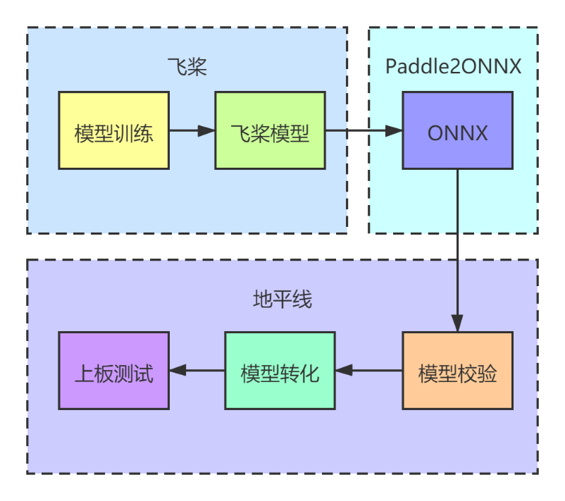
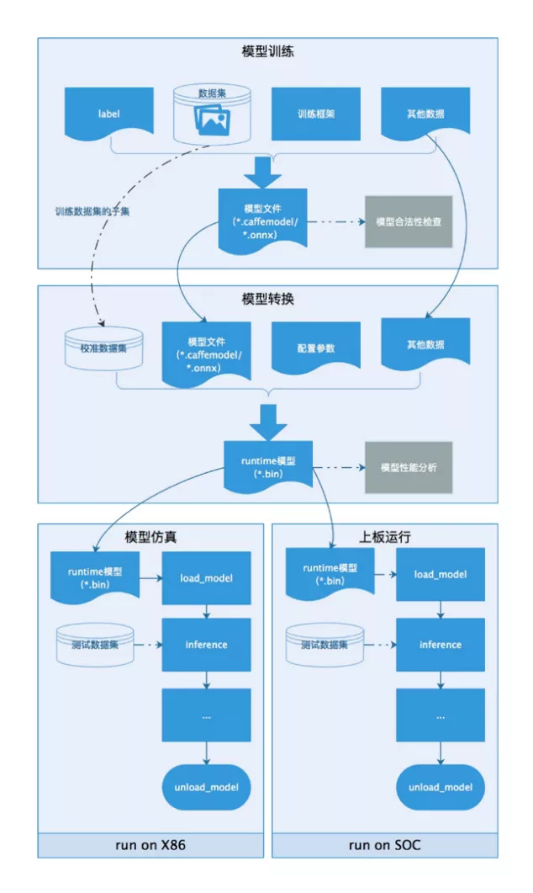
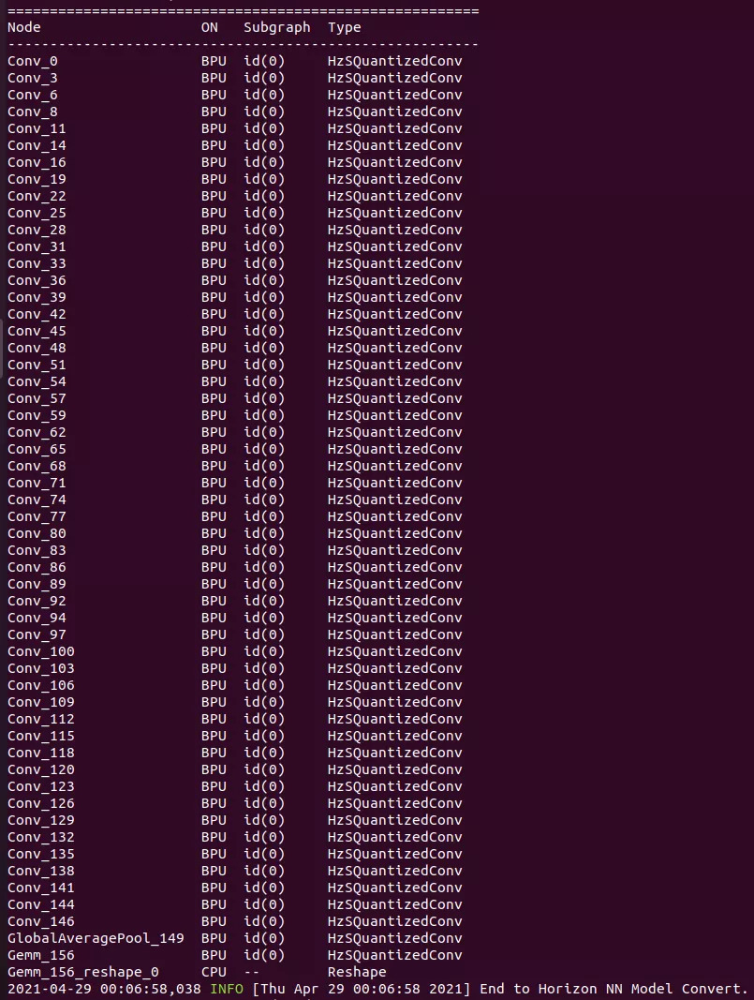
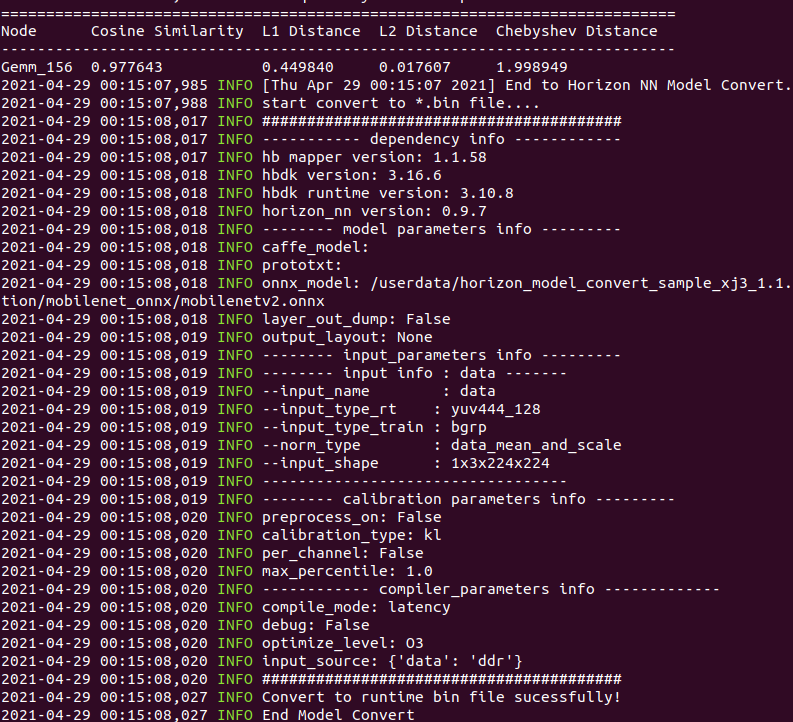
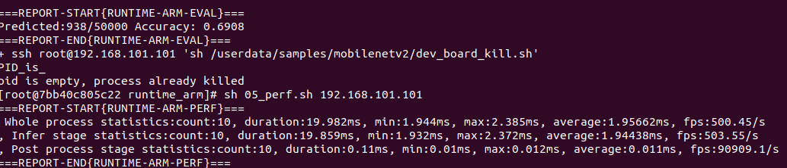

随着人工智能技术的发展，深度学习的运用越来越广泛，除了理论、算法、框架不断推陈出新以外，AI已经被运用在生活的方方面面。“云侧训练，端侧推理”便是人工智能运用的主要方向之一，相比GPU昂贵的价格，使用飞桨框架（AI Studio）进行模型训练，并通过地平线开发板进行推理部署，成为了经济有效，拥有着巨大潜力的方案。同时，端侧的推理部署，也不会产生隐私收集等负面问题。

# 开发板与开发工具介绍

本次部署使用旭日3开发板，简称X3。它是地平线针对 AIoT 场景，推出的新一代低功耗、高性能的 AI 处理器，集成了地平线最先进的伯努利2.0 架构 AI 引擎（BPU），可提供 5TOPS 等效算力。BPU 架构极大提升了对CNN 网络架构的支持效果，降低了 AI 运算对 DDR 带宽的占用率。

开发工具是地平线 “天工开物” AI 开发平台，极大简化算法开发与部署过程，降低 AI 产品的落地成本。

# Paddle2ONNX介绍

Paddle2ONNX支持静态图和动态图模型转为ONNX格式，在飞桨框架升级2.0后，框架已经内置paddle.onnx.export接口，用户在代码中可以调用接口以ONNX协议格式保存模型。此外，用户已经保存的飞桨模型，也可以通过Paddle2ONNX加载后进行转换。

Paddle2ONNX支持多达88个Paddle OP算子。在转换过程中，支持用户指定转换为ONNX 1到12任意版本的模型，提升模型的适配能力。

它覆盖CV和NLP领域主流模型，不仅支持PP-YOLO这样模型新星的转换，还开始支持ERNIE这样NLP领域的王牌！它们均已支持转为ONNX进行部署，有需求的同学快去试试吧，更多详情请参考Paddle2ONNX的Github！

# 开发流程

如下图1所示，通过飞桨框架训练好模型之后，使用Paddle2ONNX模块进行模型转化，通过地平线天工开物平台进行模型转化与校验，最终完成上板测试整个流程。



# 模型训练与转化

飞桨高阶API对基础API进行了封装，模型调用与数据预处理几行代码就可以搞定，建议大家多多使用。

本次教程使用mobilenetv2进行分类。数据预处理的时候，模型标签是从1-102，但是深度学习标签都是从0开始。修改的方法为：需要把标签数直接减去1，这样标签数据对齐到0-101，可以直接训练，否则会报错，标签索引超出！

使用百度的Paddle2ONNX工具进行转化，按照官方demo示例，加载模型，然后使用paddle.onnx.export接口进行转化。现在流行动态图，我们直接使用动态图操作方式进行。

```
import paddle 
from paddle.vision.datasets import Flowers
from paddle.vision.models import MobileNetV2,mobilenet_v2
from paddle.vision.transforms import ToTensor,Compose, Resize, ColorJitter

transform = Compose([Resize(size=[228,228]),ToTensor()])#预处理
train_dataset = Flowers(mode='train',transform=transform)
#标签转换为0-101
train_dataset.labels = train_dataset.labels-1  
test_dataset.labels = test_dataset.labels-1  

mobilenetv2 = MobileNetV2(num_classes=102) #创建模型
model = paddle.Model(mobilenetv2)#模型封装
model.prepare(paddle.optimizer.Adam(parameters=model.parameters()),
              paddle.nn.CrossEntropyLoss(),paddle.metric.Accuracy())
model.fit(train_dataset,eval_data=test_dataset,epochs=200,batch_size=64,
save_dir='Model/five',save_freq=1,verbose=1)
net = model.network#把模型从封装的Model中剥离出来
net.eval()# 将模型设置为推理状态
input_spec = paddle.static.InputSpec(shape=[1, 3, 224, 224], dtype='float32', name='image')
# ONNX模型导出
# enable_onnx_checker设置为True，表示使用官方ONNX工具包来check模型的正确性，需要安装ONNX（pip install onnx）
paddle.onnx.export(net, 'mobilenet_v2', input_spec=[input_spec], opset_version=10, enable_onnx_checker=True)
```

# 模型校验

成功得到ONNX模型之后，我们需要把ONNX模型转化为板端部署文件，地平线提供了天工开物工具链，可以有效地对ONNX模型进行验证并转化。

**部署第一步**，使用工具链对ONNX模型进行校验,校验不通过的模型目前无法上板部署，需要调整算子或提交地平线开发人员进行算子支持升级！！

工具链可在地平线生态社区获取：[https://developer.horizon.ai/resource](https://developer.horizon.ai/resource)



```
model_type="onnx"
onnx_model="../../../01_common/modelzoo/mapper/classification/mobilenet/mobilenet_v2.onnx"
output="./mobilenet_checker.log"
march="bernoulli2"
hb_mapper checker --model-type ${model_type} \
                  --model ${onnx_model} \
                  --output ${output} --march ${march}
```



图3 Check结果图

使用Checker 模型校验可以判断地平线BPU模块是否支持算子推理，这是模型上板的第一步。上图为校验结果，显示出算子的运行设备。

**第二步**是数据准备，从训练或测试集中选取50-100张图像作为校准图像。

**第三步**是使用makertbin工具把ONNX模型转化为半段推理的二进制bin文件。

```
config_file="./mobilenet_config.yaml"
model_type="caffe"
# build model
hb_mapper makertbin --config ${config_file}  \
                    --model-type  ${model_type}
```

Model-type为ONNX、Caffe等可选模型，config_file中包含了模型转化的各种参数，包括模型输入大小，节点名称，输入类型（此处非常重要，因为板端通常接入MIPI相机等，NV12的图像数据结构与训练使用的NCHW差别较大，大部分MIPI相机输入都需要增加转化节点），模型输出layout以及推理优先级（速度优先还是带宽优先）等，下图为转化推理文件的输出结果，模型的精度保持达到97.76%。



图4 量化模型输出图

# 推理测试

使用天公开物工具链，调用上板测试模块：

**构建应用：**

```
# parallel_process_num的设置，参考您的cpu配置，如果不设置这个环境变量，默认为单进程
cd samples/04_detection/01_yolov2/runtime_arm
sh 01_build.sh
```

**数据预处理**

```
# parallel_process_num的设置，参考您的cpu配置，如果不设置这个环境变量，默认为单进程
export PARALLEL_PROCESS_NUM=${parallel_process_num}
sh 02_preprocess.sh
```

处理好的图像将会用于后续的评测eval。

**将构建好的应用传到开发板**

```
sh 03_scp_to_board.sh ${board_ip}
```

执行这个命令，会将构建好的应用，通过scp，传输到开发板的 /userdata/samples/mobilenet 目录下。

若要执行单张图片的infer, 则可通过下面的代码操作远程登录开发板进行执行:

```
ssh root@${board_ip}
cd /userdata/samples/yolov2
sh dev_board_01_infer.sh
```

**执行评测**

```
sh 04_eval.sh ${board_ip}
```

该脚本会将图片传输至板上进行运行和评测, 此过程将持续很久.

**执行性能测试**

```
sh 05_perf.sh ${board_ip}
```

同时该操作也可从开发板上单独完成, 则可通过下面的代码操作远程登录开发板进行执行：

```
ssh root@${board_ip}
cd /userdata/samples/yolov2
sh dev_board_03_perf.sh
```



图5 速度验证与精度验证图

在测试集上获取70%左右的准确率，训练精度约为72.3%，保留了较高的精度，可以满足板端推理需求。

# 总结

飞桨高阶API可以快速有效地构建深度学习模型，地平线的天公开物开发板可以快速进行嵌入式开发部署，而且速度与精度都能得到有效的保证。百度飞桨和地平线的强强联合，进一步扩大了地平线芯片的算法生态，同时助力百度飞桨用户更好地进行多样化的AI部署。