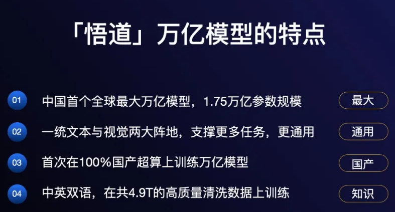
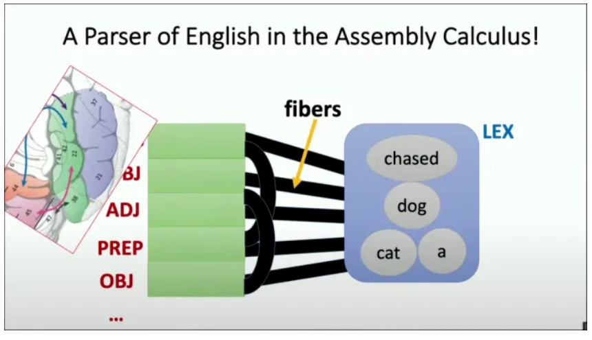
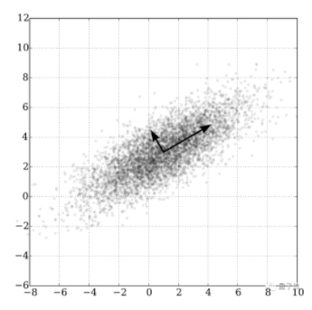
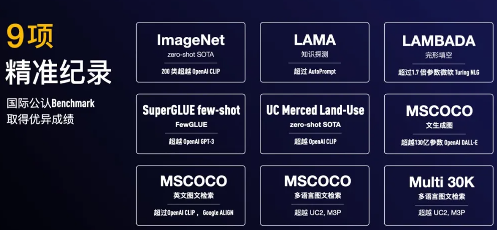
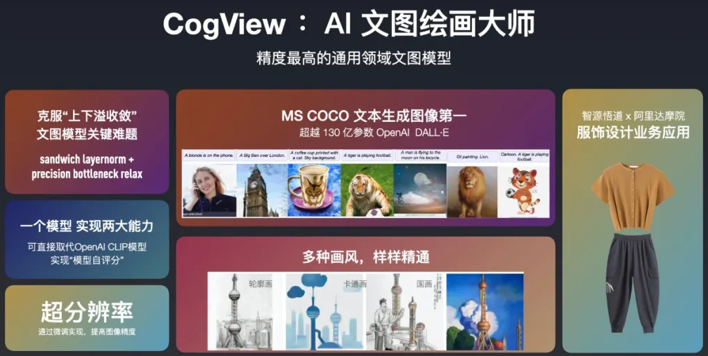
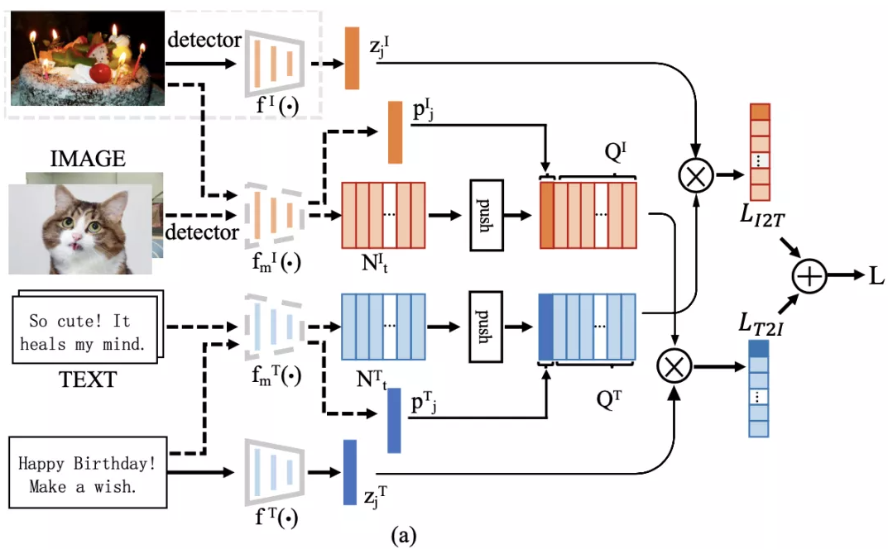
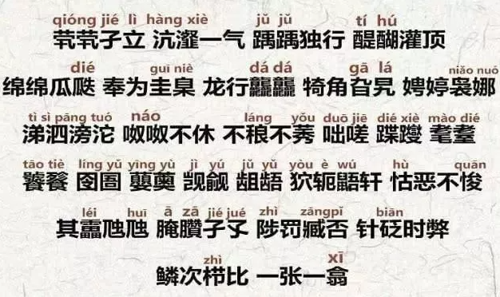
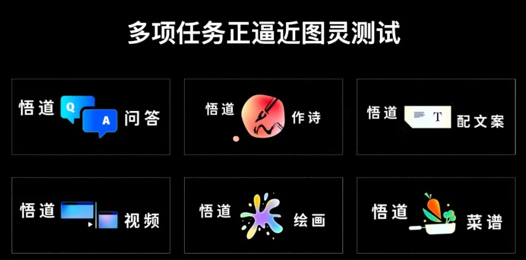
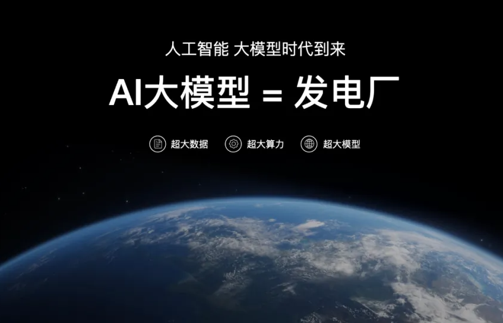

# 10倍GPT-3！全球最大预训练模型“悟道2.0”问世：9项世界第一，多项任务逼近图灵测试

**每天会对文章进行更新，每次更新一篇，采用阅后即焚模式，且看且珍惜，喜欢的话帮我点个star哈**

新一代人工智能已经迈向“炼大模型”的时代。这一切源于GPT-3的横空出世，这个具有1750亿的参数的通用预训练模型不仅带来了超乎想象的生成能力，更让人们看到了“超大模型”实现通用人工智能的潜力。

2021年1月，距离GPT-3问世不足一年，Google重磅推出Switch Transformer模型，将参数量提升到1.6万亿，成为人类历史上首个万亿级语言模型。然而，人们对预训练语言模型的想象远不止如此，随着算力的提升，大数据的涌现，越来越多学术机构和企业加入”炼大模型“的行列，在这场激烈的军备赛中，谁将成为下一位赢家？

6月1日，2021北京智源大会在中关村国家自主创新示范区会议中心如期拉开大幕，开幕式上，清华大学教授，智源研究院学术副院长唐杰重磅发布了超大规模智能模型“悟道2.0”。

经过近三个月的技术迭代，悟道2.0参数量达到1.75万亿，创下全球最大预训练语言模型记录。

唐杰教授表示，“悟道”超大模型智能模型旨在打造数据和知识双轮驱动的认知智能，让机器能够像人一样思考，实现超越图灵测试的机器认知能力。

“悟道”由智源研究院学术副院长、清华大学唐杰教授领衔，带领来自北大、清华、人大、中科院等高校院所，以及阿里等诸多企业的100余位AI专家共同研发，是国内首个超大预训练语言模型系统。

本次发布的“悟道2.0”实现了“大而聪明”，具备大规模、高精度、高效率的特点。

与悟道1.0相比，“悟道2.0”不仅在模型规模上实现了万亿级参数的跨越，还在世界公认的9项 Benchmark 上达到了世界第一，在多项基准测试中超越OpenAI GPT-3、DALL·E以及Google ALIGN等先进模型。

另外，悟道2.0完全基于国产神威超算实现万亿级规模训练，并且打破了原来只能用GPU训练的局限。

我们注意到，GPT-3、Turing-NLG等主流的超大预训练模型均出自科技企业，国内最大的预训练语言模型也为阿里研发的PLUG（270亿参数），悟道2.0的发布意味着，智源研究院成为了“大炼模型”的首家科研机构，并且在国内接棒企业成为了“炼大模型”的主力。

在本届峰会上，基于中文、多模态、认知三个方面，悟道2.0带来了哪些底层技术创新，为何悟道2.0参数能够在短时间内实现爆发式增长？大会还有哪些全新升级，接下来3位图灵奖得主，200位顶级专家就前沿科技将分享哪些真知灼见？下面我们来一一来揭晓答案。

## FastMoE，实现“万亿模型”的关键

悟道2.0成功实现万亿级突破，得益于FastMoE算法。

FastMoE的研发灵感来源于MoE（Mixture of Experts）。MoE一项在神经网络中引入若干专家网络（Expert Network）的技术，也是Google发布的1.5万亿参数预训练模型Switch Transformer的核心技术。

FastMoE在提升预训练模型参数量方面有着巨大的潜力。

如对于每个输入，MoE动态地由门网络选择k个专家网络进行激活，一般情况下，每个输入x激活的专家网络数量都很少，如512个专家网络可能只挑选两个。在运算量（FLOPs）不变的情况下，这有利于增加模型参数量。

在一项实验中，Google将MoE应用到基于Transformer的神经机器翻译的任务上，使用2048个TPU v3 cores花4天时间训练了一个6千亿参数的模型。

不过，MoE对Google分布式训练框架mesh-tensorflow和定制硬件TPU有较强的依赖性，这给其他人开源社区的使用和研究带来了不便。

智源研究院为此以MoE为原型研发了一种易用性强、灵活性好、训练速度快的FastMoE系统，它可以在不同规模的计算机或集群上支持不同的MoE模型。而且，相比MoE，有如下技术优势：

- 既可以作为PyTorch模块使用，也可以引入Gate变为MoE层。
- 支持将任意神经网络模块作为专家网络使用，仅需要修改MoE层的一个参数。
- 相比直接使用PyTorch实现的版本，提速47倍。
- 支持大规模并行训练

为了支撑这个万亿级模型，悟道2.0配备了国产超算GPU打造的高性能算力平台。唐杰教授表示，随着算力的不断提升，模型或许有一天能够达到与人脑突触量级相当的 100 万亿参数规模。当然模型越大，意味着更高的训练成本，GPT-3一次训练费用可达到了数千万美元。

在数据方面，智源研究院创建了全球最大中文语料数据库WuDaoCorpora，规模达3TB，超出之前最大的中文语料库CLUECorpus2020十倍以上。在悟道2.0中，WuDaoCorpora扩展了多模态数据集（90TB）和中文对话数据集，其数据规模达（181GB）。

参数量越大不代表模型性能一定越好。在悟道2.0中，40亿参数的多模态预训练模型CogView，在MS COCO数据集上比拥有130亿参数的DALL·E表现更好。因此，在大数据和算力的支持下，算法的性能更为重要。谷歌发布的Switch Transformer，虽然达到了万亿级规模，但其下游任务的精度并没有大幅度提升。

为了提高超大规模预训练模型的精度和效率，悟道2.0从模型、训练、微调、推理等环节对算法进行了全链路升级：

高效模型：首创纯非欧空间模型，50%参数量即可达到近似欧式模型的效果。

高效训练：首创预训练语言模型融合框架“知识继承”，可使训练时间缩短 27.3%，速度提升37.5%。它的核心思想是提取已有的小预训练语言模型模型蕴藏的“隐式”知识，并将其注入超大规模模型当中。

高效微调：首创基于检索的半监督少样本的微调算法Prompt，只要需训练0.2%数据即可达到完整数据训练90%的效果。

高效推理：首创低资源大模型推理系统，单机单卡GPU即可以进行千亿参数规模的模型推理。

## 悟道2.0创新算法，刷新9项纪录

如何将中文融入预训练模型，推动中文应用背景下的人工智能发展？如何实现图、文和视频等多模态信息之间理解与建模的统一？如何提升大规模预训练模型的语言理解能力？如何进一步实现对超长/复杂蛋白质序列的建模和预测？

围绕这些问题，悟道2.0创建文源、文澜、文汇、文朔四大预训练模型，经过一系列底层算法升级，在世界公认的9项 Benchmark 上达到了世界第一！

**GLM+CogView+Inverse Prompting—文汇**

在悟道2.0中，参数量达1.75万亿的超大规模预训练语言模型便是悟道·文汇，基于GLM+P-tuning+Inverse Prompting+CogView多项创新算法，文汇能够学习不同模态（文本和视觉领域为主）之间的概念，实现文生文、图生文以及图文生文等多项任务。

文汇是面向认知的万亿级多模态模型，旨在解决大规模自监督预训练模型不具有认知能力的问题。目前，1.75万亿级规模的文汇已经具备初级认知能力，并且在开放对话、知识问答、可控文本生成等认知推理任务上均有不错的表现。而这得益于四项算法创新：

首先是通用预训练框架GLM。GLM能够同时在分类、无条件生成和有条件生成三类NLP任务取得最优结果；在训练数据相同的前提下，其在SuperGLUE自然语言理解基准上的性能表现远超BERT；并且更擅长填空问题以及内容生成。

其次是P-tuning，一种用连续的向量来表示Prompt的方法，它解决了Prompt在少样本学习场景下容易过拟合的问题，即“通过连续向量输入，直接在连续空间里寻找Prompt的最优解。”

在知识探测任务（LAMA）上，不需要任何额外文本，P-tuning提取的知识可以达到超过60%的准确率，超越之前最好结果20个百分点。此外，P-tuning在少样本学习中优于包括PET和GPT-3在内的所有few-shot learning的SOTA方法。

第三是Inverse Prompting，它解决了预训练模型“答非所问”的难题，其核心思路是用生成的内容反过来以同样的模型预测原来的Prompt，从而保证问题与答案之间较强的关联性。

最后是CogView，通过40亿参数的Transformer模型和VQ-VAE图像分词器解决了跨模态理解的问题。类似于OpenAI 发布的DALL·E，CogView可以根据文本提示生成对应图像，不过其性能表现在MS COCO数据集上要优于DALL·E以及基于GAN的模型。

以上算法创新只是第一步，文汇的长期目标是从预测去构造决策，包括完全解决少样本问题，并通过对预训练和微调模式的创新，进一步接近认知目标。

**双塔预训练结构-文澜**

 “悟道·文澜是多模态多语言预训练模型。文澜2.0首次实现了7种不同的语言的生成和理解，包括中、英、法、德、捷克、日、韩。在中文公开多模态测试集AIC-ICC图像生成描述任务中，得分比冠军队高出5%；在图文互检任务中，比目前最流行的UNITER模型高出20%。另外，在图文检索和图像问答任务上均超过现有多模态多语言预训练模型。

不同于大多预训练模型，文澜模型独创性地采用了一种基于多模态对比学习的双塔结构（Bridging Vision and Language，BriVL），与常见的单塔架构相比，BriVL在图像和文本之间建立了“弱相关”假设，在图文互检任务中能够表现更好的性能。

重要的是，这种基于视觉-语言的弱相关假设也在一定程度上解决了大数据标注难题，如唐杰教授所说，“标注数据很稀缺，如今我们对数据规模的需求越来越大，对亿级数据进行标注几乎不可能实现。所以未来，弱相关的多模态训练是一个大趋势。”

为了弥补神经网络在表达上的损失，BriVL结构中引入了监督学习和对比学习。BriVL首先使用独立的语言和视觉编码器提取语言和视觉信息的特征向量，然后将这些向量传入到对比学习模块中进行训练。

采用这样的双塔结构，可以很方便地把编码器模块替换为最新的单模态预训练模型，从而可以持续增强模型表达能力。

此外，文澜还提出了基于 DeepSpeed 的多模态预训练算法，能够最大化的利用 GPU 和 CPU，并最优地支持跨模态对比学习。

**首创高效混合编码机制-文源** 

悟道·文源是以中文为核心的大规模预训练模型，具有识记、理解、检索、数值计算、多语言等多种能力。在开放域回答、语法改错、情感分析等20种主流中文自然语言处理任务中均优于同等参数量模型。

区别于其他模型，文源最大的创新之处在于采用了独特的信息编码方式。作为最复杂的语言体系之一，中文语料库中的生僻字、形近字、音近字为模型训练带来了诸多挑战。

智源研究院为此首创了一种基于字音和字形的混合高效编码机制，它与目前普遍使用的基于中文单字的编码方式相比具有更好稳定性。基于新型编码机制训练后得到的两大模型“说文”和“解字”，在文本分类，句对分类，阅读理解任务中的得分平均高于后者0.6个点。

另外，这种编码方式对于形近字和同音字等常见错别字场景也具有一定优势。比如，对于中文简体字的繁体字、异体字变种，基于字形的编码方式可以将复杂汉字拆解成更为常见的部首组合，帮助模型更好地理解复杂的异体字、罕见字。有实验数据显示，在数据集存在异体字噪声场景下，该模型优于中文单字编码机制最高18.8个点。

不仅仅局限于中文，文源也有向英文扩展的能力，并在一系列偏向实际应用层面的英文任务上超越了GPT-3。文源下一阶段的目标是尝试用跨语言模型将不同语言的专家模型连接到一起，实现模型的多语言扩展。

## 加速产业生态建设，迈向AGI

“悟道”的定位从一开始就很明确：从更加本质的角度进一步探索通用人工智能。

去年10月，智源研究院启动新型超大规模预训练模型研发项目正式启动，智源研究院院长黄铁军在会上表示，近年来人工智能的发展，已经从“大炼模型”逐步迈向了“炼大模型”的阶段，通过设计先进的算法，整合尽可能多的数据，汇聚大量算力，集约化地训练大模型，供大量企业使用，这是必然趋势。

目前，GPT-3等预训练语言模型提供了一条探索通用人工智能的可能路径，OpenAI、谷歌、Facebook等国际IT企业都在此持续加码，然而，随着Turing NLG、BERT、GPT-3、Switch Transformer等重磅成果不断被发布，以中文为核心的预训练模型仍寥寥无几，在此发展态势下，研发我国自主的大规模预训练模型势在必行。

与此同时，悟道启动以中文为核心的文源、基于多模态的文澜、面向认知的文汇、以及用于蛋白质预测的文溯四大预训练模型，其目标在于解决目前国际主流模型存在的前沿问题。

我们知道，虽然GPT-3在多项任务中表现出色，写小说、做图表、写代码统统不在话下，但它并没有通过图灵测试。它最大的问题是没有常识，不具备认知能力。 此外，它在处理开放对话、基于知识的问答、可控文本生成等复杂的认知推理任务上，也与人类智能有较大差距。

基于此，悟道·文汇希望从更本质的认知层面去探索通用人工智能的潜力。

悟道·文澜尝试通过多模态解决现实场景的需求。随着自然语言处理、计算机视觉以及语音识别等人工智能技术日益成熟，如何实现大规模落地成为人们必须思考的问题。而面对复杂多变的现实场景，“多模态”成为了前沿技术走向产业应用的下一个突破口。

今年OpenAI打破语言与视觉的界限，推出文本生成图像模型DALL·E 和 CLIP达到SOTA性能；谷歌推出多语言多模态模型MUM，显著提高了搜索效率。

然而以上成果只是一个开端，人工智能模型在文本、图像、音频、视频等不同数据类型之间的跨模态理解上仍面临不小的挑战。

悟道·文溯则旨在通过前沿技术加速推动电子信息、生物医药等基础科学科的科学研究进程。人工智能技术在解决重大科学问题上表现出了巨大的潜力，尤其是蛋白质预测领域，去年DeepMind公司研究人员研发的AlphaFold，将蛋白质结构预测的准确度提高到了原子水平，解决了困扰科学界近50年的重大难题。

在此背景下，悟道尝试以基因领域认知图谱为指导，通过超大规模预训练模型解决超长/复杂蛋白质序列的建模和预测问题。

在悟道2.0中，文源、文澜、文汇、文溯均在标准测试中达到了世界领先水平。悟道在研发的同时，智源研究院也在同步探索其生态建设模式。随着悟道2.0的发布，其产业应用进程也进一步加快。

在开幕式上，智源研究院学术副院长唐杰教授现场与21家企业举办了合作签约仪式，围绕悟道2.0的产业应用，与美团、小米、快手、搜狗、360、寒武纪、好未来、新华社等21家企业达成了战略合作。悟道2.0将以开放API（应用程序接口）的形式为这些企业提供服务。 

此外，智源研究院还与新华社合作将悟道模型应用于新闻智能化转型，这是新闻领域0到1 的突破。在新闻领域，悟道模型能够处理新闻下游任务， 包括新闻内容处理、图文生成、传播优化等，还具备接近人类的图文创意能力，可以作诗、 问答、创意写作等。

智源研究院副院长唐杰教授在会上表示，悟道2.0后续将支持智源研究院牵头成立独立的模型商业化运营公司， 并将面向个人开发者、中小创新企业、行业应用企业、IT领军企业等不同主体，分别提供模型开源、API（应用程序编程接口）调用、“专业版”大模型开发、大模型开发许可授权等多种形态的模型能力服务，赋能AI技术研发。

可以预见，以智源2.0为代表的大模型将成为一个AI未来平台的起点，成为类似“电⽹”的基础建设，为社会源源不断供应智⼒源。

