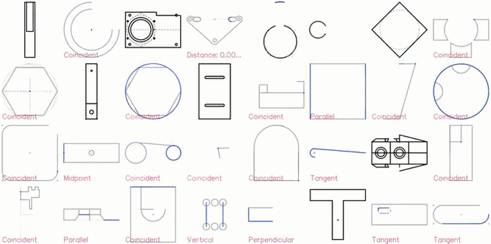

# 本周AI热点回顾：傅里叶变换取代Transformer，GPU上快7倍、TPU上快2倍；DeepMind新模型自动生成CAD草图

**每天会对文章进行更新，每次更新一篇，采用阅后即焚模式，且看且珍惜，喜欢的话帮我点个star哈**

## 傅里叶变换取代Transformer自注意力层，谷歌这项研究GPU上快7倍、TPU上快2倍

来自谷歌的研究团队表明，将傅里叶变换取代 transformer 自监督子层，可以在 GLUE 基准测试中实现 92% 的准确率，在 GPU 上的训练时间快 7 倍，在 TPU 上的训练时间快 2 倍。

Transformer 自 2017 年推出以来，其架构就开始在 NLP 领域占据主导地位。Transformer 应用的唯一限制之一，即 Transformer 关键组件的巨大计算开销–一种自注意力机制，这种机制可以根据序列长度以二次复杂度进行扩展。

基于此，来自谷歌的研究者建议用简单的线性变换替代自注意力子层，该线性变换「混合」输入 token，以较小的准确率成本损失显著的提高了 transformer 编码器速度。更令人惊讶的是，研究者发现采用标准的、非参数化的傅里叶变换替代自注意力子层，可以在 GLUE 基准测试中实现 92% 的 BERT 准确率，在 GPU 上的训练时间快 7 倍，在 TPU 上的训练时间快 2 倍。

论文链接：[https://arxiv.org/pdf/2105.03824.pdf](https://arxiv.org/pdf/2105.03824.pdf)

该研究的主要贡献包括：

- 通过用标准的非参数化傅里叶变换代替注意力子层，FNet 在 GLUE 基准测试中实现 92% 的 BERT 准确率，在 GPU 上的训练时间快 7 倍，在 TPU 上的训练时间快 2 倍。
- 仅包含两个自注意子层的 FNet 混合模型在 GLUE 基准上可达到 97％的 BERT 准确率，但在 GPU 上的训练速度快近 6 倍，而在 TPU 上则是 2 倍。
- FNet 在「Long Range Arena」基准评估中，与所有的高效 transformer 具有竞争力，同时在所有序列长度上拥有更少的内存占用。

Transformer 自注意力机制使得输入可以用高阶单元表示，从而可以灵活地捕获自然语言中各种语法和语义关系。长期以来，研究人员一直认为，与 Transformer 相关的高复杂性和内存占用量是不可避免的提高性能的折衷方案。但是在本论文中，Google 团队用 FNet 挑战了这一思想，FNet 是一种新颖的模型，在速度、内存占用量和准确率之间取得了很好的平衡。

## 借助Transformer，DeepMind新模型自动生成CAD草图，网友：建筑设计要起飞了

深度学习的灵活性恰好适合于复杂的 CAD 设计，DeepMind 的研究者基于 CAD 草图与自然语言建模的相似性，提出了自动生成 CAD 草图的机器学习模型。

在制造业中，CAD 的应用十分广泛。凭借着精准、灵活、快速的特性，CAD 已经取代了纸笔画图，并且不再只是应用于汽车制造、航空航天等领域，哪怕小到一个咖啡杯，生活中几乎每个物件都由 CAD 画图建模。

CAD 模型中最难制作的部件之一就是高度结构化的 2D 草图，即每一个 3D 构造的核心。尽管时代不同了，但 CAD 工程师仍然需要多年的培训和经验，并且像纸笔画图设计的前辈们一样关注所有的设计细节。下一步，CAD 技术将融合机器学习技术来自动化可预测的设计任务，使工程师可以专注于更大层面的任务，以更少的精力来打造更好的设计。

在最近的一项研究中，DeepMind 提出了一种机器学习模型，能够自动生成此类草图，且结合了通用语言建模技术以及现成的数据序列化协议，具有足够的灵活性来适应各领域的复杂性，并且对于无条件合成和图像到草图的转换都表现良好。

论文链接：[https://arxiv.org/pdf/2105.02769.pdf](https://arxiv.org/pdf/2105.02769.pdf)

具体而言，研究者开展了以下工作：

- 使用 PB（Protocol Buffer）设计了一种描述结构化对象的方法，并展示了其在自然 CAD 草图领域的灵活性；
- 从最近的语言建模消除冗余数据中吸取灵感，提出了几种捕捉序列化 PB 对象分布的技术；
- 使用超过 470 万精心预处理的参数化 CAD 草图作为数据集，并使用此数据集来验证提出的生成模型。事实上，无论是在训练数据量还是模型能力方面，实际的实验规模都比这更多。

CAD 草图展示效果图如下：

对于 DeepMind 的这项研究，网友的评价非常高。用户 @Theodore Galanos 表示：「非常棒的解决方案。我曾使用 SketchGraphs 作为多模态模型的候选方案，但序列的格式和长度太不容易处理了。等不及在建筑设计中也使用这种方法了。」

## 为了医疗AI，他们做出了一个“违背祖师爷”的决定

搞深度学习的人，应该感谢“祖师爷”Geoffrey Hinton在2012年的尝试。因为Hinton团队使用了GPU进行AI运算加速，让神经网络AlexNet的实现成为可能，开启了深度学习大爆发的时代。Hinton彻底带火了GPU，带火了以计算机视觉为主的医疗AI。连Hinton本人也对AI辅助医疗技术将会迅速成熟充满了信心。但是，Hinton可能万万没想到，现在搞医疗AI的人，尤其是落地部署和使用医疗AI的人，却做出了一个违背“祖师爷”的决定：

用CPU来做医学影像领域的辅助诊断推理。

那么，问题来了，在GPU原本擅长的领域，CPU的能力真的可以胜任吗？

事实证明，只要软硬件配合得当，CPU一样可以实现出色的AI应用效果，尤其是进行准确、快速的AI推理。性能优化到位的话，在这方面的表现就可与GPU相媲美。 当然，CPU也仅仅是AI计算硬件中的一种，而非唯一的选择。可它越来越受到医疗AI领域的青睐，必然有更为深刻的原因：那便是惠民。

虽然已经有了很多实例，目前仍然有许多人对CPU做AI抱有疑虑。而这些疑虑，主要集中在计算速度和生态系统这两点上：但英特尔，早已为CPU在AI行业的应用，做好了软硬件两手准备。一方面，针对AI应用的算力和数据加速，英特尔早从数年前就开始布局，从硬件架构上对AI推进了三方面的优化：

- 在2017年发布的第一代至强可扩展处理器上，导入支持AVX-512高级矢量扩展技术，让CPU单位时间内能处理更多浮点运算任务，用以加速高精度的AI应用；
- 在2019年发布的第二代至强可扩展处理器上，基于AVX-512技术扩展出了英特尔深度学习加速（DL Boost）技术，支持INT8加速，主攻推理加速；
- 2020年发布的面向四路和八路服务器的第三代至强可扩展处理器时，为这项技术增添了BF16加速能力，从而兼顾推理和训练的加速；
- 在2019年推出傲腾持久内存，兼具接近DRAM内存的高性能，以及DRAM内存所不具备的容量、价格和数据非易失优势，让基于CPU的AI系统可以将更大体量的数据缓存在距离CPU更近的地方，加速训练和推理。

如今看来，用CPU做AI，确实没啥可担心的——甚至在医疗AI行业，这还是个更好的选择。

大概，就连当年积极将GPU引入医疗AI行业的Hinton，也没预料到会是这幅景象：如今的CPU，正在医疗AI领域大放异彩。

## 双方互GAN，不如来试试群体博弈？更快更强更自由 | ICLR 2021

AI诞生之初，很长一段时间都停留在个体智能阶段，即面向“识别出图像中的内容”、“听懂一段语音”、“预测蛋白质的3D结构”这类目标单一的任务。但随着技术发展，AI开始逐渐与其他智能群体产生交互，走向更加复杂的应用场景。比如在2019年，DeepMind训练的游戏类AI就在星际争霸中超越了99.8％的活跃玩家，达到了最高的 Grandmaster段位。

这是一种以博弈论为机器学习模型的思路。沿着这种思路，DeepMind的几位研究者提出了一种名为EigenGame的理论，重新定义了PCA（主成分分析，Principal Component Analysis）方法。

### “Eigen”与“Game”

“Eigen”意为特征。也是论文题目中所提到的PCA方法的核心概念。

PCA是ML领域里用于数据降维的经典方法。目的是在尽可能不丢失原数据信息的前提下，将高维数据映射（压缩）到低维空间，得到剔除了原有特征冗余信息的新特征。

在目标数据集的数据属性过多，数据量过大的时候，模型训练和计算的性能可能受到很大影响。这时，就需要用到PCA进行数据降维。而“Game”则意为博弈论*（Game Theory）*，是一种研究理性决策者之间的冲突与合作的数学模型。纳什均衡（Nash equilibrium）作为博弈论的一个重要概念，指每个参与人在获取信息不完全的情况下，做出了针对其他参与人策略的最优反应，比如经典的囚徒困境。

### 当博弈论遇上机器学习

其实，博弈论的思想一直存在于很多机器学习的探索过程中，不管是经典的 SVM，还是大火的 GAN，这些模型的背后都有博弈论的影子。

最初提出“博弈机器学习”这一概念的刘铁岩博士曾这样说过：

什么才是人工智能？想要解决这个问题，首先需要为「智能」提出一个定义。如果说过去对于个体智能的研究为计算机赋予了智商（IQ）的话，那么社会智能则对应着人工智能的情商（EQ）。

博弈论的引入让AI在过去只与环境交互的基础上，又学会了如何与其他智能体打交道。而当EigenGame这种与多智能群体交互的算法出现时，其意义就不仅是更多更快的数据运算。按照既非随机，也非理性和对立的人类的行为规律去训练建模，那么AI就有了更多解决问题的新角度，也能在广告竞价、社交媒体、众包管理、交通疏导等多个领域中得到更广泛的应用。

或许，博弈论会是连接机器学习走向人和社会的一个桥梁。

