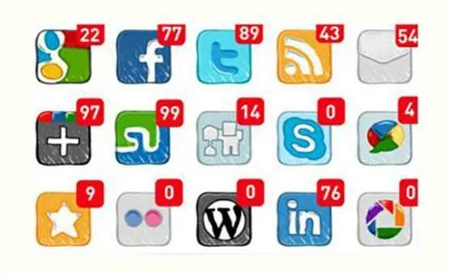
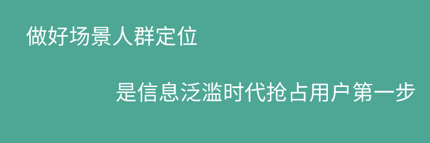
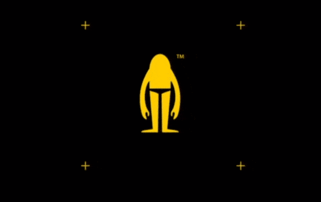
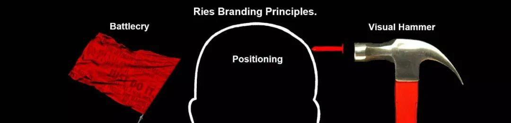
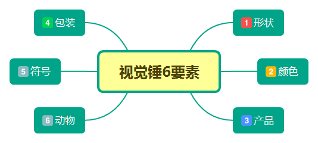
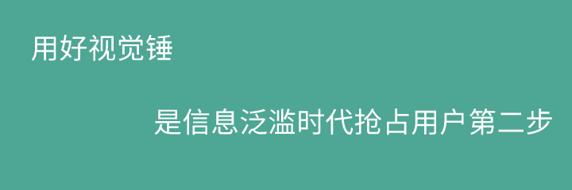
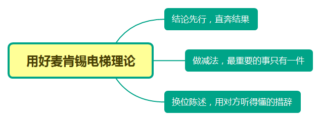
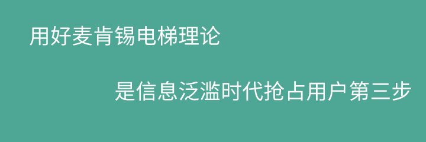

如今随着互联网科技的发达，我们每天接触到的信息越来越多，在碎片化的时间中，用户应该如何应对这些信息？又如何在一大堆信息里面把你的信息记住？本文作者分享了三种关于信息投放的方式，我们一起来了解一下。

据科特勒咨询数据统计，2020年中国一线城市消费者每天平均会接触到3000多条信息。

除去工作8小时、休息8小时，3000多个信息如何在可支配的8小时里突围？进入用户的法眼，值得我们深入思考。

关于信息泛滥，先看几组数据。

手机装载程序152个，关注的公众号815个，微信书架1045本书单，浏览器文件夹12个包含收藏链接573个，知乎1172个关注，这些应用、媒介、书单，都是经过自己筛选留存下来的信息。

面对超负荷的信息，如何能抢占用户注意力？引起注意植入心智？分享3个步骤。

## 场景人群定位，不打无准备之仗

一个商品，在进入市场之前，你得想好了卖给谁，在什么场景下去卖？她们常活跃的场所在哪里？

一篇文章，在触达到用户之前，你得想好谁在看，在什么环境下观看，他们常打开文章场景在哪里？

只有把人群和场景想通透，能更好的打磨一款产品，能知道自己和目标群体需求的差距，能知道推进方向，能有预期的直击靶心。

场景人群定位，是做减法的过程，在偌大群体里找到你想要的一撮人就足够。

举个栗子：喜欢钓鱼的朋友都知道，不同品种的鱼是需要不同的饵料、不同的设备，不同的环境下展开。如：钓鲢鳙的饵料就很难钓到草鱼，同样，钓大鱼的钩很难在小鲫鱼出没的鱼塘里有所斩获。

关于定位，就是在顾客的心智中建立优势位置，从而获得顾客的优先选择。在信息泛滥的海洋里，只有你的信息定位足够明显，才能大概率被目标群体关注。

举个栗子：卡娃微卡音乐相册可能很多年轻用户不知道这个产品，就算知道的也不会用，第一反应是很low。但是你知道吗？

这个产品在中老年群体里渗透率极高，传播UV过亿。那可是长辈们炫耀的社交货币，不亚于各种萌宠表情包在年轻人的心理地位。

人们的心智就像一道屏障，无形中对信息进行筛选，将大部分信息拒之门外。只会接收与先前的知识、经验相吻合的信息。

弱水三千，我只取一瓢饮。梦寐以求的10+的传播，在10亿+的网民群体里，真的仅算一瓢而已。

“和谁？在什么场景下吻合？”想得更通透一点。做好场景定位，是信息泛滥时代抢占用户第一步。

## 视觉锤，让用户自发联想

艾·里斯提到：“定位是一个语言概念，是钉子，将这个钉子钉入消费者心智的工具，就是视觉锤。”视觉锤，首先是对视觉产生刺激，通过设计的差异化，抢夺顾客的注意力，抢夺认知资源。

信息泛滥时代，文字很弱，他们不容易被记住，缺乏可信度。而且，用户是懒惰不愿意思考。

文字，需要通过海马体转码，翻译成行为动作较慢，反射弧较长；而视觉图片视频，则直接通过杏仁核翻译成用户的感触和情绪，转码动作快，反射弧短。

几年前提到男士内衣品牌，你首先想到是什么？七匹狼？南极人？柒牌？很熟悉但似乎又很分散。

2016年开始，一个新锐品牌杀出重围，Bananain蕉内。成为近10年来国内估值最高的内衣品牌。这个新锐品牌在视觉锤上做做了功课，简直面面俱到。

Ｌogo形状像一个穿内裤的“猿人”，代表回归本源，还是一个抽象的“内”字；

VI颜色取自香蕉的黄色，一目了然；

产品，不断强化无感标签内衣；

包装上每个系列数字后两位，都能从元素周期表中找到渊源，组成大自然的基本元素，多了一份神秘；

符号上香蕉造型，和男士内衣冥冥之中有些故事；

猿人的动物，也让品牌动物园里多了一个新朋友。

最值一提的是，按元素周期表做包装盒，不同款式和颜色都有对应盒子，对于一个收纳爱好者，甚至都舍不得扔掉。

包装被培养成社交货币，犹如一支品牌强心剂注入用户心里。

一款产品，共有六个方面视觉锤：分别是形状、颜色、产品、包装、符号、动物。

形状：圆形、方形、星形、箭头等。麦当劳的M是形状的代表，后来升级品牌名“金拱门”，进一步加深视觉锤印象，让M和拱门更巨化。

颜色：单色总比多色好，两种颜色都很难记，三种颜色几乎不可能被记住。支付宝的蓝色，从线上logo蓝到饿了么，到线下hello单车蓝；美团的黄色，从产品黄到骑手制服，到线下美团单车黄。

产品：是真切满足消费者个性化的表达，情感化的诉求。各大车企家族式进气格栅，江小白的个性化表达瓶身，都是产品烙印。

包装：心理学角度，消费者喜欢“更好”的东西，而不是“不同”的东西；但从营销法则看，真正有效的不是“更好”，而是“不同”。和产品呼应与众不同，融入颜色和形状，再次攻入心智。

符号：眨眼间就能让人想到它的含义，符号也是Logo的另一种表达。成功的符号代表太多，如被上帝咬了一口的苹果，扁平化对勾的Nike等。

动物：代表品牌个性和底层心智。有个段子说得好，中国互联公司就是个动物园。天猫是猫，京东是狗，腾讯是企鹅，百度是熊，搜狐是狐狸，美团是袋鼠，搜狐是狐狸，迅雷是蜂鸟。每种动物背后都有品牌的魂，如：猫的挑剔预示天猫选品标准，严苛；袋鼠的敏捷预示着美团配送效率，快。

过载的信息海洋里，瞬时的冲击，和差异化的视觉能瞬间刺激用户，夺取眼球。提升品牌认知，视觉锤是比语言钉更好的选择，能让用户减少文字转码的过程，通过杏仁核调动瞬时记忆。

信息海洋里想怎么能被记住？被瞬间发现？用好视觉锤，是信息泛滥时代抢占用户第二步。

## 麦肯锡电梯理论，30秒表达

麦肯锡要求员工在最短的时间内把结果表达清楚，凡事要直奔主题、直奔结果。

麦肯锡认为，一般情况下人们最多记得住一二三，记不住四五六，所以凡事要归纳在3条以内。这就是流传甚广的“30秒钟电梯理论”。

同样是做减法，用户的时间是稀缺有限，没有耐心听任何品牌长篇大论，只有在30秒内锁定用户的注意力，才有可能往下看、继续了解的可能。

图文来看，单链接的打开率，月度完成率；短视频来看，同样类别视频的点击率，完播率。都和前30秒急切关联。

内容再好，前30秒没有冲击到用户的痒点和痛点，没有唤醒用户的兴趣，一切白搭。这就好比AARRR漏斗理论里的第一个A，第一个A没做到位，压根不存在后面的ARRR。

怎么能用好麦肯锡电梯理论呢？

第一、结论先行。直奔结果，不要说不痛不痒的细节。正如金字塔原料，30秒时间，只需展示塔尖；如果3分钟，可延伸到塔腰；如果3小时，则可展开到塔底加上细节填充。

第二、最重要的事只有一件。一篇文章，或者一个视频，只做一个观点陈述。

第三、用对方听得懂的措辞。同样的一件事情，听众不同理解信息程度也大不相同。用对方能听懂的话术、场景去陈述，能让对方产生关联想象，这样能最短时间能达到同频。

元气森林从饮料红海市场里杀出重围，靠什么？

有人说是产品、有人说是渠道、有人说是价格。

也许元气森林的理解是，深入理解你的目标用户，并围绕这一部分目标用户的需求，量身定做一款优秀产品！不断重复“0糖0脂0卡”，极短时间内吸引到你。

所有卖点，都是由三个0展开，结论告诉你，喝我不会增加热量。

当你想喝碳酸饮料时候，0卡的气泡水忽然就让你放弃了可乐和雪碧。

当你想喝酸梅汤的时候，0糖的酸梅汤气泡水让你喝了一份心安。

重复次数多了，用户有条件反射，只要是元气森林饮料没热量随便喝，喝了不长胖，没心理负担。可见短时间的关键表达，加上重复的威力真不容小觑。

在用户没有耐心的时代，怎么让用户更快知道你？用好麦肯锡电梯理论，30秒内完成冲击就足够。