随着货运行业的完备与市场环境的变化，生鲜电商迎来了发展机遇。不过，农业生鲜电商若想实现长久发展，品牌建立、口碑营销、线上线下购物渠道完善、供应链服务体系的搭建等因素都将必不可少。本篇文章里，作者针对农业生鲜电商如何发展做了一定分析，一起来看一下。

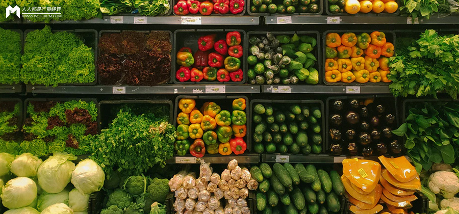

# 农业产品困境

## 供销链路长

传统农产品常见均是从发货地、经过运输、多级批发商经传送达卖场。

## 农产品损耗大

经过长条运输的农产品，到消费者的手里农产品已经损耗大半。

## 农民收益低

经过多级分销，农产品末端质量难保证，导致农民的收益大幅降低。

## 批发商利润低

层层分销，批发商的利润也非常低。

## 消费者成本高

消费者除了支付农产品费用，还承担部分分销费用。

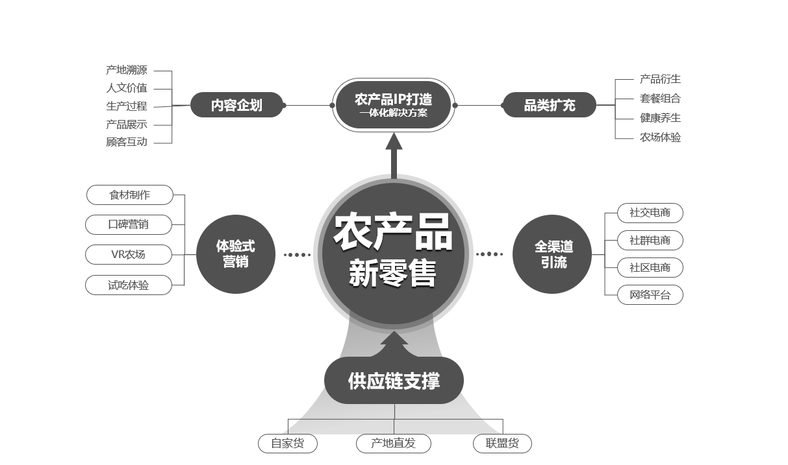

# 发展机遇

## 政策支持，扶持农业产品

2017年两会提出大力扶持农产品电子商务的发展，培育农产品电商领军企业，带动各区域特色产业发展。

## 消费结构升级，追求高体验

随着生活质量的提升，人们越来越重视消费体验和品质，重视精神价值以及与品牌精神的深度。

## 农村电子商务发展

农村电商的快速发展，拓宽了农产品的渠道发展，依靠互联网平台，让地产优质农产品可以网上销售，足不出户卖向全国。

## 技术创新，促进规模化

随着互联网发展，农业生产效率逐渐提高，种植规模化，采用现代化采摘、浇灌、加工，农民有好东西卖不出好价钱，城市居民找不到好农产、消费信任度差。

农产品新零售首先需打造产品IP，通过与专业机构合作赋能，输出产品背后的人文价值、产地溯源以及制作过程等，建立顾客信任。

然后，通过全渠道获取目标客户，借助社交电商、社群电商、社区电商、线上网络平台等聚集客流，开展试吃体验与口碑营销，为顾客产地直发更新鲜更优质的农产。

# 打造农业产品IP

输出产品背后的人文价值，产地溯源及制作过程等，提升顾客信任度；打造农产品IP，从扩充品类及内容企划入手。

通过与专业机构合作赋能，输出产品背后的产地溯源、人文价值、生产全称、产品展示、顾客互动等，进行差异化产品、人格化品牌。

打造“从甜头到餐桌”的概念，让消费者能看到从种植到收割、加工运输、再到市集合餐桌的全部过程，感受每个农产品背后的故事，建立顾客信任，增强粘性，培养品牌忠诚度。

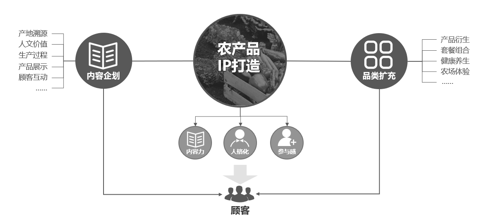

# 全渠道获取客户

## 借助社交电商、社群电商、社区电商、线上网络平台等聚集客流

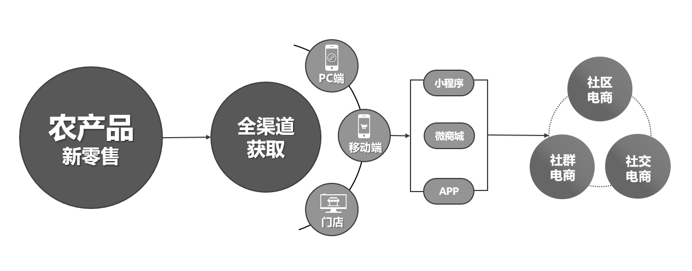

## 全渠道获取客户——线上平台

借助小程序、微商城、APP等线上平台，以及PC网店，全面拓客，并将各个渠道的顾客数字化。

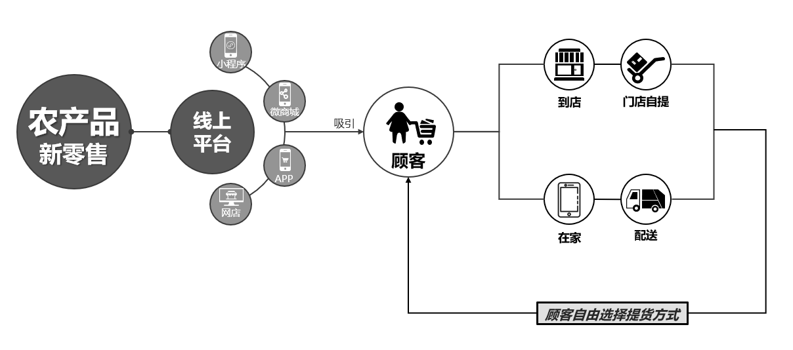

## 全渠道获取客户——线下平台

通过数字化将传统门店升级换代，为农产开辟自营体验店、合作外店以及社区加盟店，快速、精准、有效传播农产品牌，提升顾客服务体验，融合线上多渠道，实现全渠道销售。

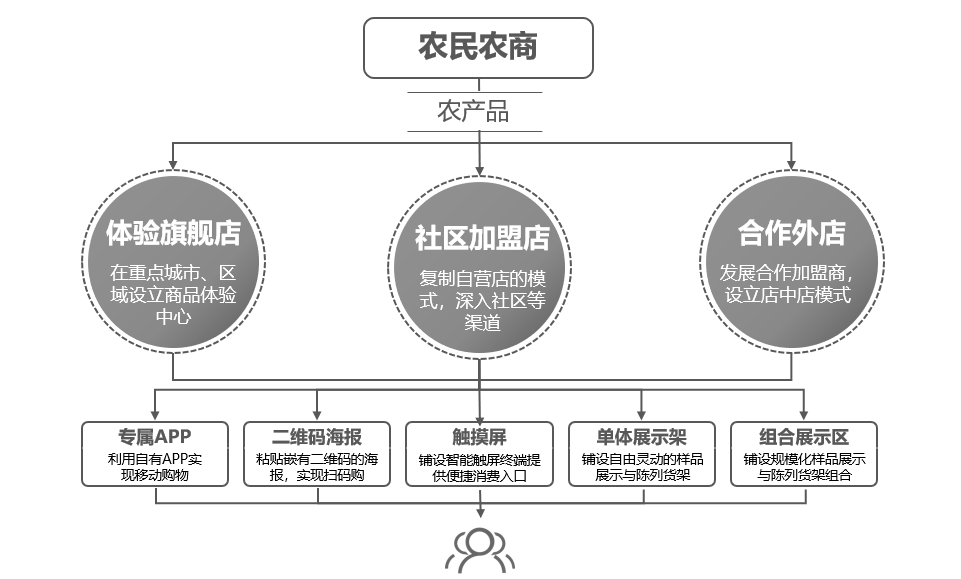

## 全渠道获取客户——社区电商

在社区开设实体店，通过吸引到店、服务到家、共享空间等社区营销，将实体店销售范围扩大。

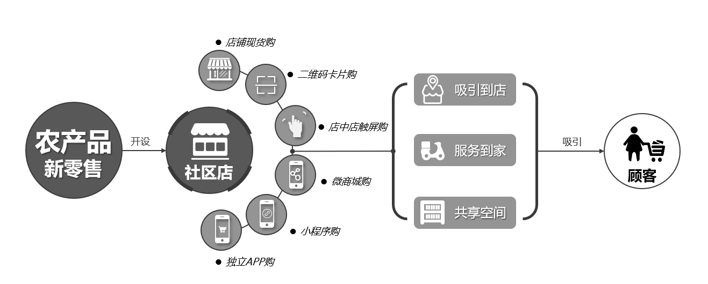

## 全渠道获取客户——社交电商

实体店具有天然的信任优势，通过导购建立人与人之间的链接产生信任，将商品、服务等内容传播出去，产生裂变式营销。

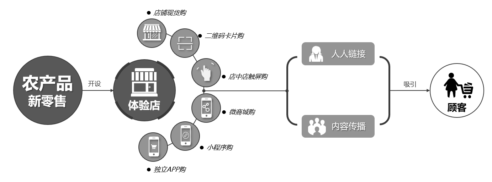

## 全渠道获取客户——社群电商

在同一个店消费的人群一定有共同属性，将这些有共同属性的人聚集在一起形成社群，通过活动交流、知识发布、互动分享等激发他们的需求，从而获得效益。

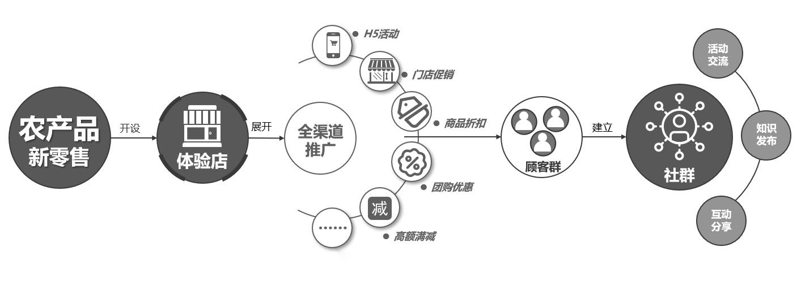

# 营销

## 开展试吃体验与口碑营销，为顾客产地直发更新鲜更优质的农产

## 体验式营销——口碑营销

通过线上线下开展各类体验活动进行口碑营销，通过顾客自己分享社交圈，吸引其他顾客参与。增进顾客粘性，培养品牌忠诚度。

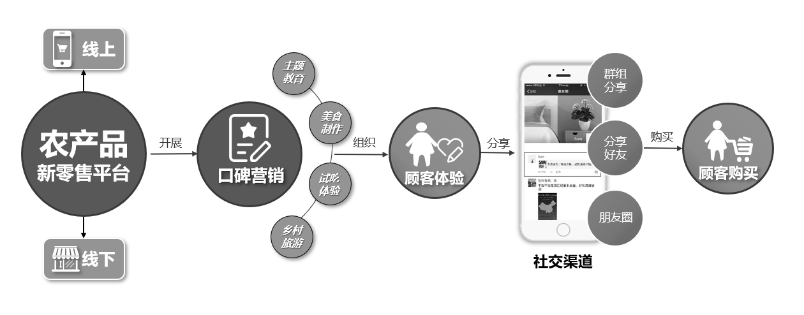

## 体验式营销——试吃体验

在线上和线下，通过试吃体验式营销吸引顾客，将沉淀下来的顾客全面数字化，促进下单和复购。

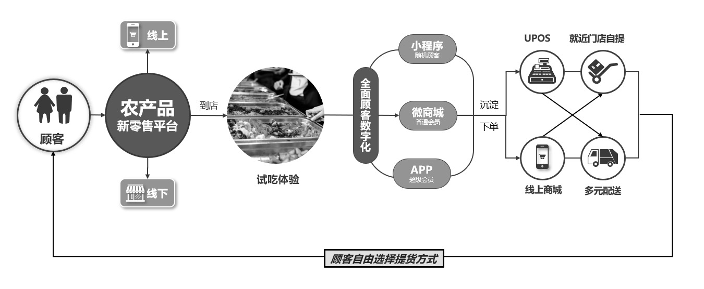

## 体验式营销——乡村旅游

农产地可开展乡村旅游，借助农产品零售平台，发布乡村旅游咨询、活动预约、民宿预订，提供乡村旅游产品在线销售和购买等服务。实现乡村旅游线上与线下无缝接轨，丰富顾客体验。

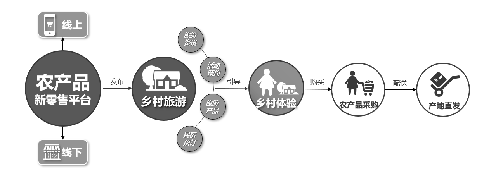

## 生鲜电商需完善配送、升级服务

**与顾客建立强关系实现随时随地购物。**受创业、投资、巨头的影响，生鲜电商近几年的渗透率快速增长，但网经社电子商务研究中心网络零售部主任、高级分析师莫岱青表示，生鲜电商的渗透率低于服装、 家电电商，依然有增长空间。

此次疫情让生鲜电商再次处于“风口”，可看作是一次“检验”，促使生鲜电商的在商品、供货渠道、配送、服务等环节更加完善，需要线上线下的融合改造，才让顾客可以随时随地买到想要的商品。商家需要社会化的顾客管理系统+生鲜门店O2O系统，让商家和顾客建立起强关系，实现随时随地购物。

商家可以利用**社区团购**，发展社区便利店、快递站、物业作为团长自提点，发起拼团，集中配货到团长，配送给社区居民；也可利用**消费创客模式**，利用社交裂变、创客分销去获客，更大范围吸引分销员，利用熟人圈子获客。

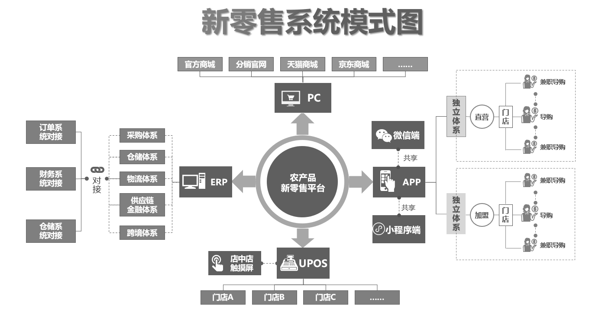