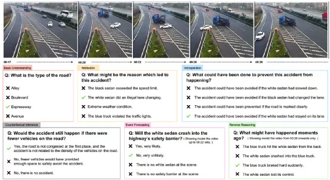
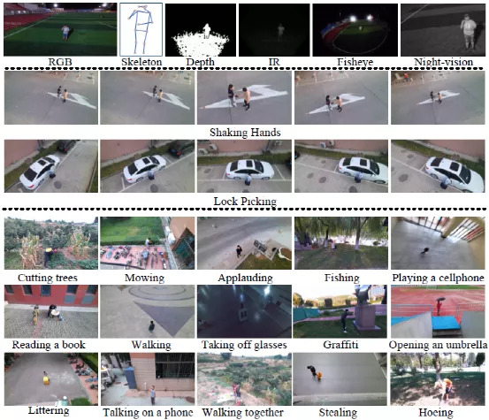

ICCV2021 “多模态视频分析与推理比赛”开放注册。此次比赛提供四项分任务竞赛：

- 视频问答(Video Question Answering)；
- 基于骨架的动作识别(Skeleton-based Action Recognition)；
- 基于鱼眼视频的动作识别(Fisheye Video-based Action Recognition)；
- 行人重识别(Person Re-Identification)。

第一个视频问答的比赛是基于最新的VideoQA数据集：SUTD-TrafficQA。这个数据集重点关注基于交通事件的视频推理，包含了6个非常有挑战性的推理任务。SUTD-TrafficQA 包含有10,080个真实场景的视频和62,535个人工标注的问题。下图是SUTD-TrafficQA数据集中的一个例子。

另外三个竞赛（基于骨架的动作识别，基于鱼眼视频的动作识别和行人重识别）是基于最新的，有挑战性的基于无人机视角的视频理解数据集，UAV-Human。UAV-Human重点关注从无人机视角来理解推理人类行为，包含了67,428个视频样本，6种不同的模态，4个人类行为理解任务和119个视频主题。下图包含UAV-Human数据中的多种样例。

下面是本次比赛的时间安排表：

| 比赛报名开放                 | 2021.05.20 |
| ---------------------------- | ---------- |
| 训练数据发布                 | 2021.06.09 |
| 测试数据发布                 | 2021.06.13 |
| 结果提交开放以及比赛报名结束 | 2021.06.25 |
| 结果提交关闭                 | 2021.07.05 |

欢迎大家参加比赛，获胜队伍将会被邀请到ICCV2021 Workshop介绍自己的工作。有关本次比赛的更多详细信息，请访问网站：

https://sutdcv.github.io/multi-modal-video-reasoning