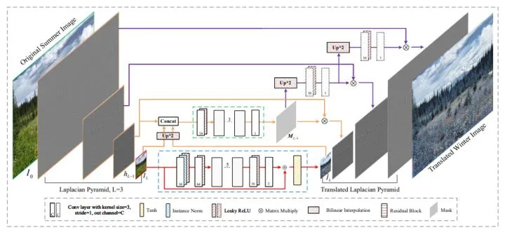
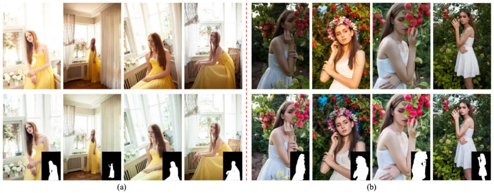
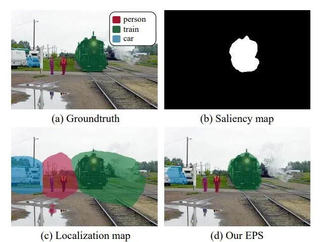
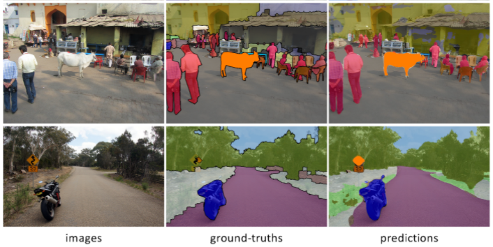
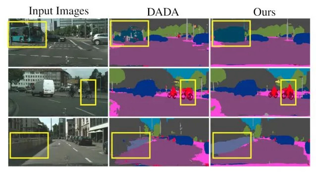
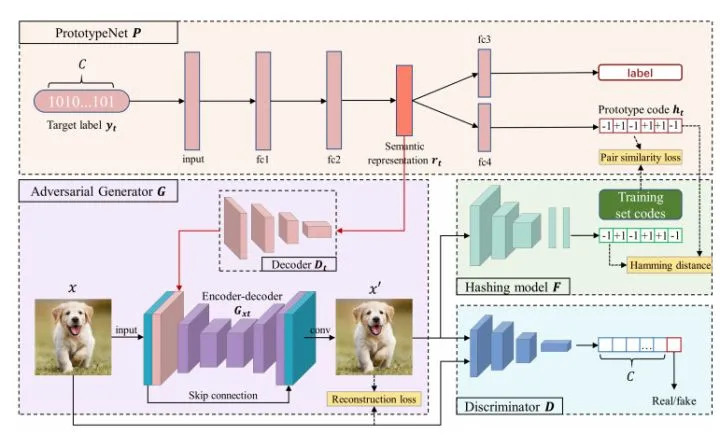
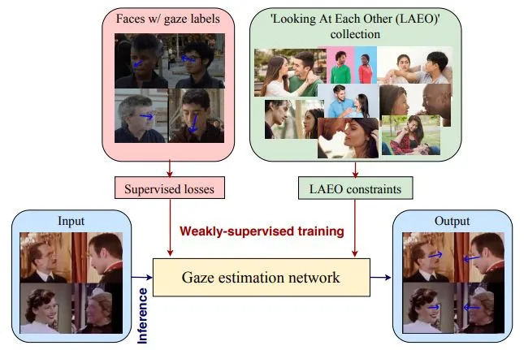
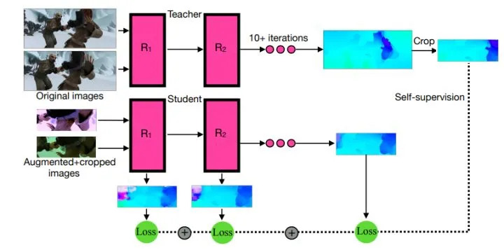

CV君一直在整理 CVPR 2021 论文：

https://github.com/52CV/CVPR-2021-Papers

本文分享几篇近期值得关注的 CVPR 2021 的开源论文，包括图像到图像翻译、全景分割、语义分割、域适应、图像检索、无监督学习，以及一篇关于首次对从人们相互注视的图像/视频中学习弱监督的三维视线范式（LAEO）的研究。

相信其中有些工作肯定会让你大开眼界。

# High-Resolution Photorealistic Image Translation in Real-Time: A Laplacian Pyramid Translation Network

来自香港理工大学&阿里达摩院

作者称是首个在 4K 分辨率图像上实时实现逼真 I2IT（图像到图像翻译） 的工作。其次，在轻量级和快速的推理模型，仍然在转换能力和逼真度方面在逼真的I2IT应用上实现了可比或优越的性能。定性和定量的结果都表明，所提出的方法与先进的方法相比表现良好。

- 论文链接：https://arxiv.org/abs/2105.09188
- 项目链接：https://github.com/csjliang/LPTN

标签：图像到图像翻译

# PPR10K: A Large-Scale Portrait Photo Retouching Dataset with Human-Region Mask and Group-Level Consistency

来自香港理工大学&阿里达摩院

与一般的人像照片修饰任务不同，portrait photo retouching（PPR）的目的是提高一组外观扁平的人像照片的视觉质量，有其特殊的实际要求，如 human-region priority（HRP）和 group-level consistency（GLC）。HRP 要求对更多关注 human regions（人体区域），GLC 则要求将一组人像照片修饰成一致的色调。而在现有的一般照片修饰数据集上训练的模型，很难满足 PPR 的这些要求。

为了促进这一高频任务的研究，作者在本次工作中构建了一个大规模的 PPR 数据集：PPR10K，并称这是首个此类相关的数据集。PPR10K 共包含 1,681 个组和 11,161 张高质量的原始人像照片。以及人类区域的高分辨率分割掩码。每张原始照片都由三位专家进行修饰，并对每组照片进行精心调整，使其色调一致。作者定义了一套评估 PPR性能的客观指标，并提出了学习具有良好 HRP 和 GLC 性能的 PPR 模型的策略。而 PPR10K 数据集为研究自动 PPR 方法提供了一个很好的基准，实验证明，所提出的学习策略能够有效地提高修饰性能。

- 论文链接：https://arxiv.org/abs/2105.09180
- 项目链接：https://github.com/csjliang/PPR10K

标签：portrait photo retouching+数据集

# Railroad is not a Train: Saliency as Pseudo-pixel Supervision for Weakly Supervised Semantic Segmentation

来自延世大学&成均馆大学

现有的使用图像级弱监督的弱监督语义分割（WSSS）研究的局限性有：sparse object coverage（稀疏的对象覆盖），不准确的对象边界，以及来自非目标对象的共同出现的像素。

本次工作所提出方案：提出 Explicit Pseudo-pixel Supervision（EPS），通过结合两个弱监督从像素级反馈中学习；图像级标签通过 localization map，以及来自现成的显著检测模型提供丰富边界的 saliency map 来提供目标身份。作者进而又设计一种联合训练策略，可以充分利用两种信息之间的互补关系。所提出方法可以获得准确的物体边界，并摒弃共同出现的像素，从而显著提高 pseudo-masks 的质量。

结论：实验结果表明，所提出方法通过解决 WSSS 的关键挑战而明显优于现有方法，并在 PASCAL VOC 2012 和MS COCO 2014 数据集上取得了新的 SOTA。

- 论文链接：https://arxiv.org/abs/2105.08965
- 项目链接：https://github.com/halbielee/EPS

# Exemplar-Based Open-Set Panoptic Segmentation Network

来自首尔大学&Adobe Research

该文先是定义开放集全景分割（OPS）任务，并通过深入分析其固有的挑战，利用合理的假设使其可行。通过重新组织 COCO 构建一个全新的 OPS 基准，并作为 Panoptic FPN 的变种展示其基线的性能。EOPSN 是基于典范理论的开放集全景分割框架，在检测和分割未知类别的例子方面被实验证明是有效的。

- 论文链接：https://arxiv.org/abs/2105.08336
- 项目链接：https://github.com/jd730/EOPSN
- 主页地址：https://cv.snu.ac.kr/research/EOPSN/

标签：全景分割+开放集

# Learning to Relate Depth and Semantics for Unsupervised Domain Adaptation

来自苏黎世联邦理工学院

提出一种在 UDA 背景下进行语义分割和单目深度估计的新方法。亮点如下：Cross-Task Relation Layer（CTRL），为域对齐学习一个联合特征空间；该联合空间编码特定任务的特征和跨任务的依赖关系，显示对UDA有用；semantic refinement head（SRH）有助于学习任务的关联性；深度离散技术有利于学习不同语义类别和深度级别之间的独特关系；iterative self-learning（ISL）方案通过利用目标域的高置信度预测，进一步提高模型的性能。

在三个具有挑战性的 UDA 基准上，所提出的方法始终大幅超越先前的工作。

- 论文链接：https://arxiv.org/abs/2105.07830
- 项目链接：https://github.com/susaha/ctrl-uda

标签：域适应

# Prototype-supervised Adversarial Network for Targeted Attack of Deep Hashing

来自哈工大(深圳)&鹏城实验室&港中文&深圳市大数据研究院&电子科技大学&Koala Uran Tech

该文提出一个用于灵活的 targeted hashing attack（定向哈希攻击）的 prototype-supervised adversarial network（ProS-GAN），包括一个 PrototypeNet，一个生成器和一个判别器。实验证明，ProS-GAN 可以实现高效和卓越的攻击性能，比最先进的深度哈希的定向攻击方法具有更高的可迁移性。

- 论文链接：https://arxiv.org/abs/2105.07553
- 项目链接：https://github.com/xunguangwang/ProS-GAN

标签：图像检索+对抗攻击

# Weakly-Supervised Physically Unconstrained Gaze Estimation

来自英伟达&罗切斯特理工大学&Lunit Inc

本次工作所探讨的问题是从人类互动的视频中进行弱监督的视线估计，基本原理是利用人们在进行 "相互注视"（LAEO）活动时存在的与视线相关的强烈的几何约束这一发现。通过提出一种训练算法，以及为该任务特别设计的几个新的损失函数，可以从 LAEO 标签中获得可行的三维视线监督信息。在两个大规模的 CMU-Panoptic 和 AVA-LAEO 活动数据集的弱监督下，证明了半监督视线估计的准确性和对最先进物理无约束的自然 Gaze360 视线估计基准的跨域泛化的显著改善。

- 论文链接：https://arxiv.org/abs/2105.09803
- 项目链接：https://github.com/NVlabs/weakly-supervised-gaze

标签：CVPR 2021 Oral+视线估计

# SMURF: Self-Teaching Multi-Frame Unsupervised RAFT with Full-Image Warping

来自谷歌&Waymo

SMURF 是一种用于无监督学习光流的方法，在所有的基准上提高了 36% 到 40%（相比之前最好的方法UFlow），甚至超过了一些有监督的方法，如 PWC-Net 和 FlowNet2。该方法是将有监督光流的结构改进，即RAFT 模型，与无监督学习的新思路相结合，包括一个序列感知的自监督损失，一个处理帧外运动的技术，以及一个从多帧视频数据中有效学习的方法，同时仍然只需要两帧推理。

- 论文链接：https://arxiv.org/abs/2105.07014
- 项目链接：https://github.com/google-research/google-research/tree/master/smurf

标签：无监督学习