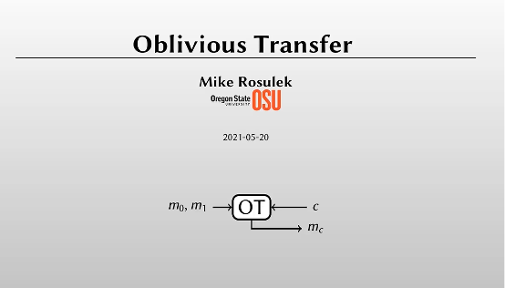
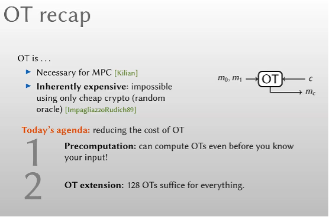
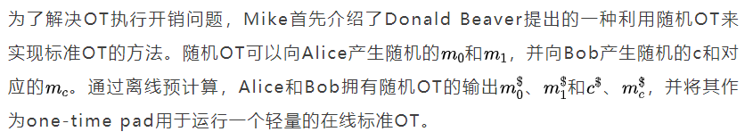
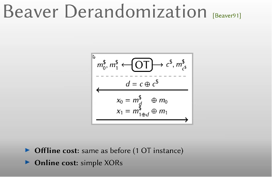
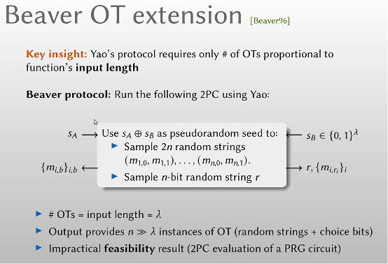
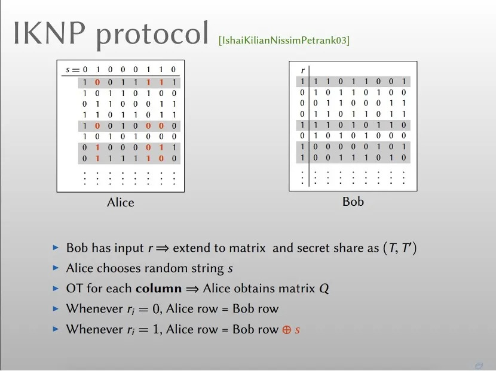
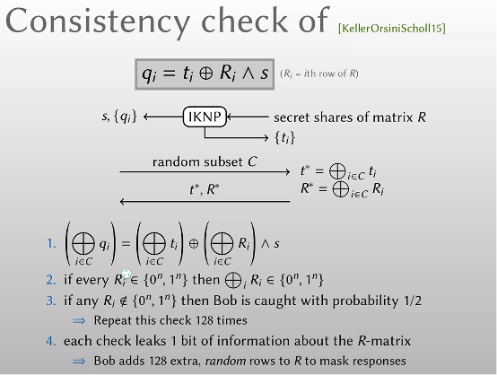
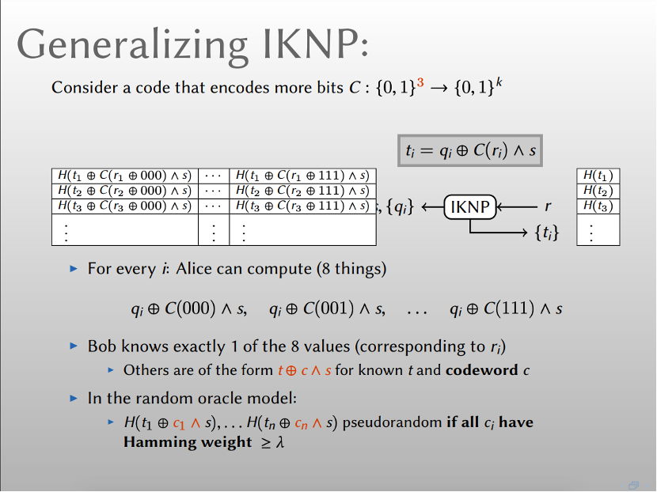

# 前言

5月21日上午九点半，由上海期智研究院和上海市数据隐私安全计算企业重点实验室联合推出的第四期密码学学术讲座于线上正式举办，本期讲座继续邀请到美国俄勒冈州立大学Mike Rosulek副教授介绍不经意传输协议及其扩展，报告题目为《Oblivious Transfer and Extension》。此次讲座吸引了国内来自密码学及相关领域的专家学者，科研人员及高校师生约130余人参加。

# 本次讲座主要内容

不经意传输协议（Oblivious Transfer，OT），是一种可保护隐私的两方通信协议，能使通信双方以一种选择模糊化的方式传送消息。它是密码学中的基础协议，因此不经意传输协议常常作为设计其他密码协议的基本板块，例如安全多方计算、零知识证明等。

不经意传输的概念是由Rabin于1981年首先提出，原始协议中发送方发送秘密消息m，接收方以1/2概率成功获取该消息。1985年Even等人提出2取1不经意传输协议，该协议中发送方有两个秘密消息m1和m2，接收方选择并且恢复其中的一个秘密消息，发送方无法知道接收方选择的是哪一个秘密消息。随后人们又提出了n取1、n取m等其他形式的不经意传输协议。但是不经意传输协议的执行开销非常大，我们无法仅通过对称密码学操作将其实现。

本期讲座中Mike围绕不经意传输协议展开，主要内容有：预计算OT，OT的扩展等。

Mike首先带领大家回顾了不经意传输协议以及其面临的执行开销问题。一次OT需要执行一次公钥密码操作，但是公钥加密的开销通常远大于对称加密的开销。后面介绍了几项为减少OT执行开销所进行的工作。

接下来Mike介绍了不经意传输的扩展。1996年，Beaver依据混合加密构想提出了第一个非黑盒方式的不经意传输扩展协议，可以执行少数基础OT协议（传统的基于公钥加密算法的OT协议）来构造大量的OT 协议。Beaver提出的协议需要使用电路计算复杂的伪随机发生器，在实际中也不高效，然而扩展协议的思想具有重要的影响。

基于OT扩展协议的思想，Ishai等人在2003年提出了以黑盒方式构造的OT扩展协议，将基础OT协议和随机预言模型相结合，把少量基础OT的计算代价通过对称加密操作均摊到大量的OT操作，该协议可以同时满足实用性和安全性需求，具有重要的意义并得到很广泛的应用。

随后，Mike介绍了Keller等人在2015年的一项工作，即针对恶意敌手存在时保护IKNP协议的安全，方法是引入一个相容性检验。最后Mike介绍了IKNP协议的推广：n取1 OT 。Kolesnikov和Kumaresan 13年的工作展示了编码论观点下的IKNP协议。通过选择一个线性码，可以实现8取1的OT。

自由讨论环节，Mike耐心地为在线观众解答了一系列密码学相关问题。

上海期智研究院与上海市数据隐私安全计算企业重点实验室联合举办的密码学学术讲座为从事密码学研究的科研人员及密码学爱好者提供了高水平的学习交流平台，敬请期待下一期讲座。