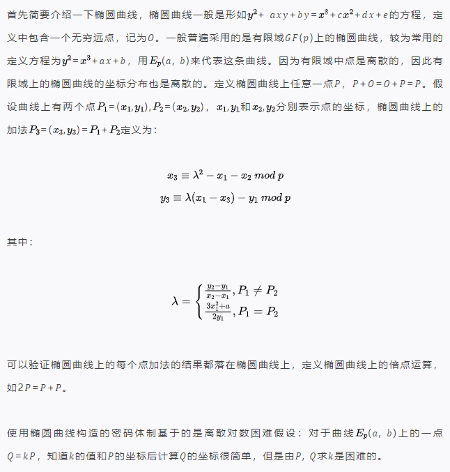
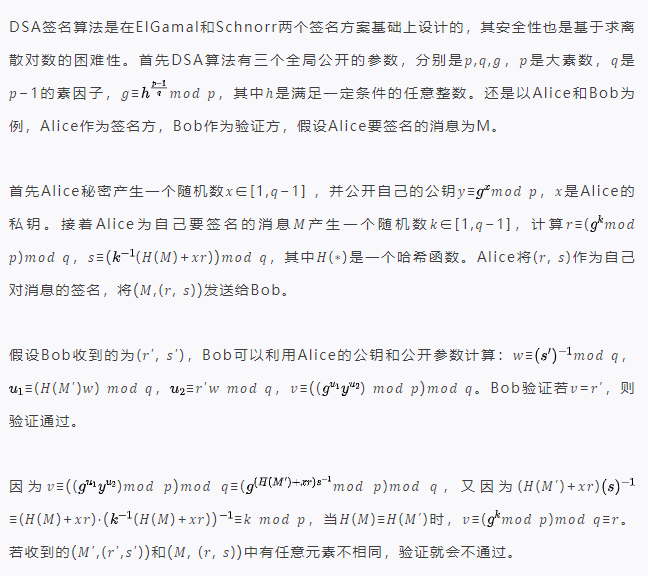
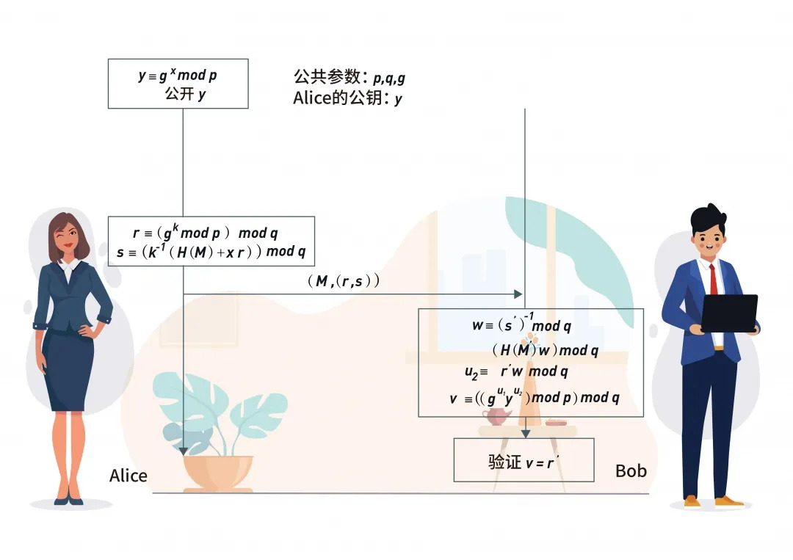
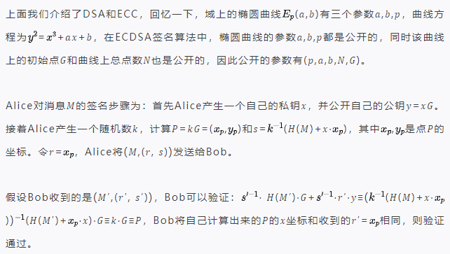
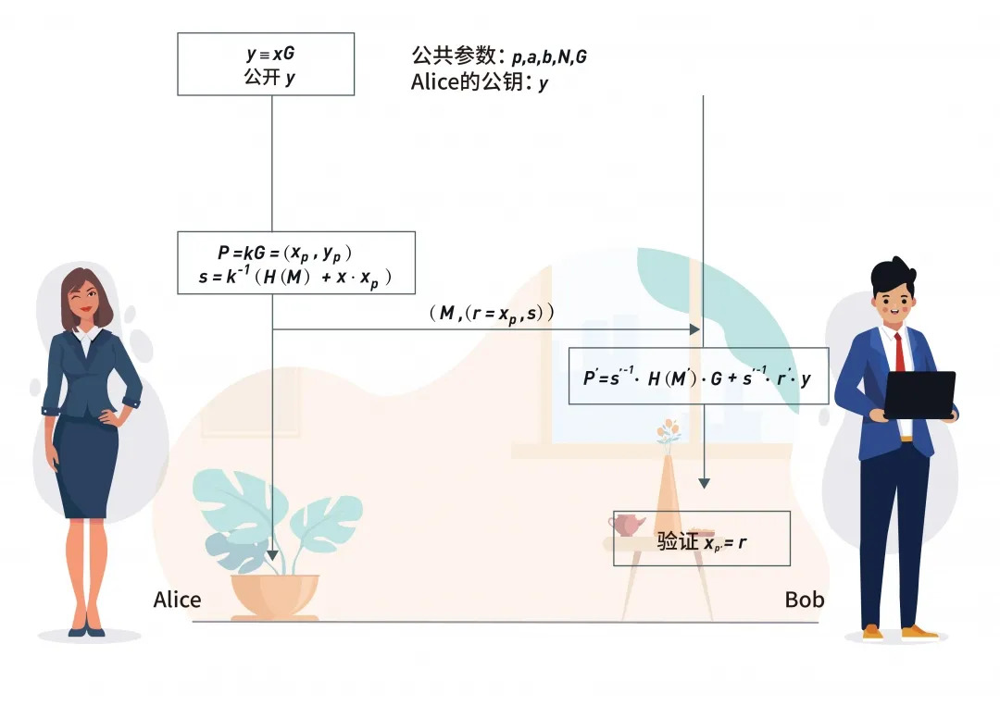

# 前言

**隐私计算笔谈系列**是矩阵元联合知名密码学学者共同推出的密码学科普系列文章，旨在普及密码学与隐私计算，让密码学触手可及。

## ECDSA多方签名

本期我们将介绍一种多方的椭圆曲线数字签名算法（*Elliptic Curve Digital Signature Algorithm，ECDSA*），在介绍ECDSA之前，我们先简要介绍一下需要用到的背景知识：椭圆曲线密码体制（*Elliptic Curve Cryptography, ECC*），数字签名算法（*Digital Signature Algorithm, DSA*），以及将ECC和DSA结合起来的ECDSA。

### 椭圆曲线

### 数字签名算法

图1：DSA签名算法

### ECDSA

图2：ECDSA签名算法