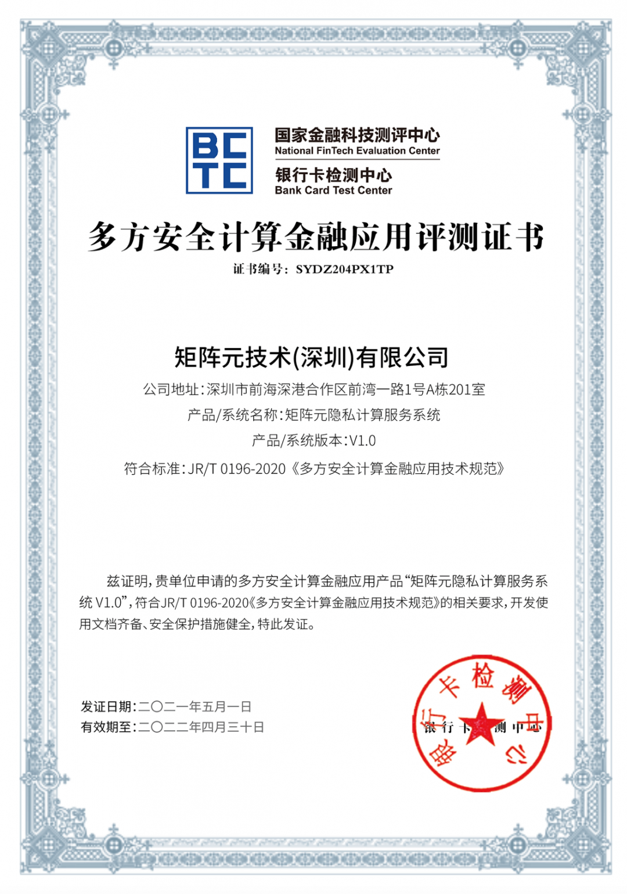

近日，矩阵元自主研发的「矩阵元隐私计算服务系统」通过国家金融科技测评中心检测并获得测评证书，成为首批通过测评的厂商之一。据检测报告显示，系统在技术要求、安全要求、性能要求三大模块评测中的表现均满足国家金融科技标准要求，展现了良好的产品力，可进一步助力金融行业客户迈向数字化与智能化。

本次评测由国家金融科技测评中心主持相关工作，测试基于中国人民银行发布的《多方安全计算金融应用技术规范》（JR/T 0196—2020）金融行业标准。测评指标包含基础特性、计算能力、计算性能、产品安全四个领域数十项指标，83个检测项。据检测结果显示，**矩阵元隐私计算服务系统符合相关技术规范与行业标准，产品安全性、健壮性、稳定性与性能指标均获充分认可，满足支持丰富的业务场景与商业化应用需求。**

**矩阵元隐私计算服务系统是基于安全多方计算(MPC)打造的企业级隐私计算服务系统，通过本地化软硬件一体化服务与开放平台相结合的方式，实现企业间的数据价值交易协作，是充分保护企业数据隐私安全的有效工具。**

该系统提供快速便捷的企业级部署、维护支持，充分满足金融行业各类应用场景，并能在数据隐私保护与计算性能上满足监管审计与商用要求，可以面向多样化的客户与合作伙伴提供基于数据安全流动的解决方案，助力企业数字化赋能。

以联合机器学习为例，各参与方可以在保证自身隐私数据不离开各自私有域的前提下，完成联合建模；各参与方也可以在一方持有隐私数据，一方持有模型，且互相不希望对方获得各自的数据或模型的前提下，完成模型的安全预测。

未来，矩阵元将继续发挥隐私计算与区块链技术和产业结合的领先优势，深耕数字化时代的新型公共基础设施领域，实现数据要素的多项赋能与产业合作，为客户、合作伙伴提供基于数据安全流动的一体化解决方案，真正实现数据大规模的合规流通与融合应用，助力客户发现新的业务商机与经济增长点，完成数字产业化转型升级。

